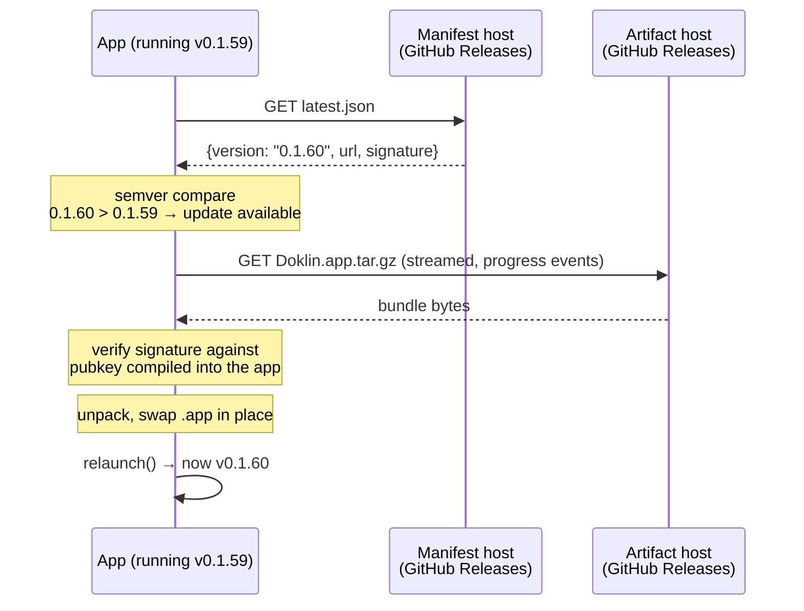
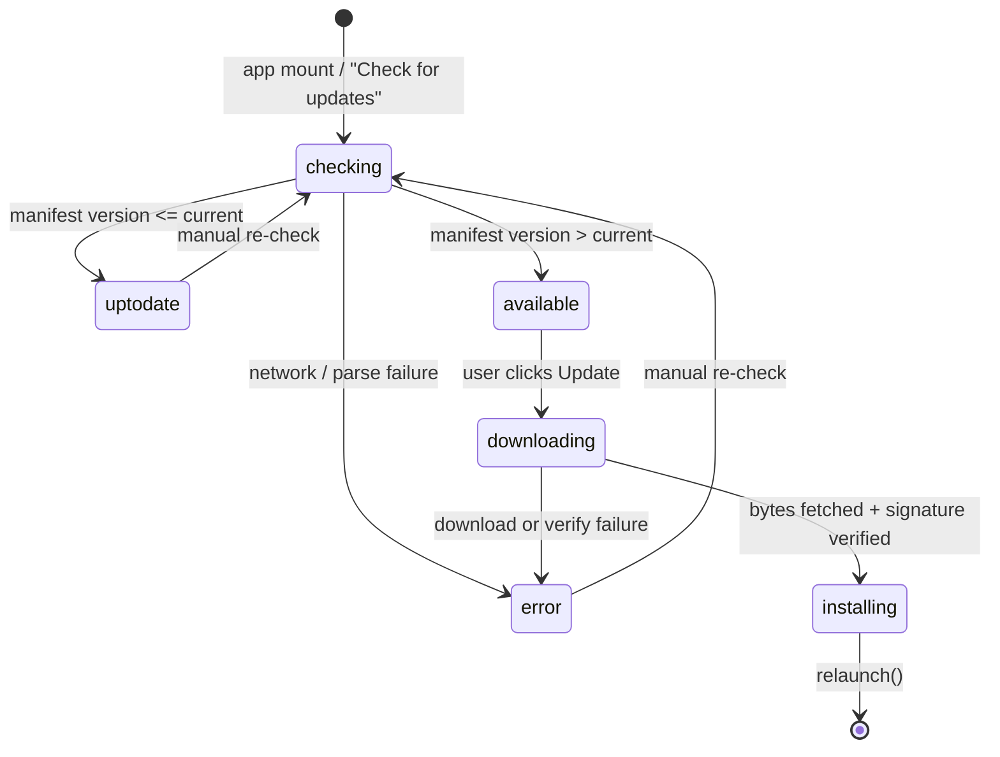

# One-click in-app updates — spec & porting guide

How Doklin checks for a new version and installs it with a single click, written
so it can be lifted into any other Tauri desktop app. Part 1 is the generic
spec (what the pieces are and why); part 2 is the concrete Doklin wiring; part 3
is a copy-paste checklist for a new app.

**Companion doc.** This is the *consumer* half of the story — what a running app
does. The *producer* half — how CI builds, signs, notarizes and publishes the
release the app updates to — is
[docs/release-pipeline.md](release-pipeline.md), and this doc defers to it for
anything CI-side: job structure, the Apple signing chain, the full secrets
table, and the failure playbook.

**The update backend is GitHub Releases, not Cloudflare.** (Cloudflare shows up
elsewhere in Doklin — the share/sync Worker + R2 bucket — but nothing in that
stack is involved in updating the app.) If you *do* want a Cloudflare-hosted
update manifest for a future app — private repo, custom analytics, staged
rollout — see the [appendix](#appendix--hosting-the-manifest-on-cloudflare-instead).

---

## Part 1 — The generic spec

### The shape of the thing

Four moving parts, and the whole design falls out of them:

| Part | Doklin's choice | What it does |
| --- | --- | --- |
| **Update manifest** | `latest.json` on the GitHub "latest" release | A small JSON file the app polls: what the newest version is, and where its bundle lives |
| **Update artifact** | `Doklin.app.tar.gz` + `.sig` | The new app, compressed, plus a detached signature |
| **Signing keypair** | minisign keypair from `tauri signer generate` | Private key lives in CI secrets and signs the artifact; public key is compiled into the app and verifies it |
| **Client** | `@tauri-apps/plugin-updater` + `plugin-process` | Fetches manifest → compares semver → downloads → verifies → swaps bundle → relaunches |

The security property that makes one-click safe: **the app only installs bytes
signed by a key you control.** A compromised CDN, a hijacked release asset, or a
MITM on the download still can't ship code to your users, because the signature
check happens client-side against a pubkey baked into the running binary.



### Two signing chains, don't conflate them

This trips people up. A signed-and-notarized macOS app still needs a *second*,
independent key for updates:

- **Apple Developer ID + notarization** — makes the *installer* (`.dmg`) open
  without a Gatekeeper warning. Apple's chain, Apple's cert.
- **Updater signing key (minisign)** — makes the *in-app update* trustworthy.
  Yours, generated locally, unrelated to Apple.

You need both. The updater key is the one you generate once per app and must
never lose — see [the gotchas](#gotchas-paid-for-the-hard-way) for why that's
unrecoverable rather than merely annoying.

### Client state machine

Six phases. Every UI affordance is a function of the current phase, which keeps
the view dumb and the logic testable.



- `checking` — querying the manifest
- `uptodate` — no newer release
- `available` — newer release exists, not yet installing (carries version + release notes)
- `downloading` — fetching + verifying (carries `progress ∈ [0,1]`)
- `installing` — bundle swapped, about to relaunch
- `error` — carries a human-readable reason

### UX rules worth copying

1. **Check quietly on launch.** No modal, no "you're up to date!" popup. A
   silent check on mount, and the result is folded into an existing surface.
2. **The one click is literally one click.** The button reads *"Update to v0.1.60
   & Restart"* — it names the version and it promises the restart. Clicking it
   downloads, verifies, installs and relaunches with no further prompts.
3. **Surface availability passively.** A small dot on the settings gear. The user
   discovers the update when they happen to look, and is never interrupted.
4. **Progress in place.** The same menu row becomes `Downloading… 43%` with a
   thin progress bar under it. No separate window.
5. **Always show the current version.** A subtle status line: `v0.1.60 · Up to
   date`, `Current: v0.1.59` when an update is pending, `Restarting…` while
   installing.
6. **Always offer the manual escape hatch.** On `error`, add a *"Download
   manually…"* item that opens the releases page in the browser. Auto-update
   *will* fail for someone (corporate proxy, read-only install location, disk
   full) and a dead end is the worst outcome.
7. **Manual re-check is always reachable** — the same row is a *"Check for
   updates"* button in `uptodate` / `error`, disabled while `checking`.

### Release pipeline requirements

Whatever CI you use, it must, in one run, for one version number:

1. **Decide the version** and stamp it into *every* file that carries one, so the
   manifest version, the binary's reported version, and the tag can't drift.
2. **Build** the app.
3. **Sign for the OS** (Developer ID + notarize + staple on macOS).
4. **Sign for the updater** — produces the `.sig` next to the artifact.
5. **Publish** the artifact, the human-download installer, and a freshly
   generated manifest to a stable, publicly fetchable location.

Step 1 is the one people underrate — see
[version drift](#gotchas-paid-for-the-hard-way). Doklin's implementation of all
five is [docs/release-pipeline.md](release-pipeline.md).

### Manifest format (Tauri v2 static)

```json
{
  "version": "0.1.60",
  "notes": "Automatic update to Doklin v0.1.60. See the releases page for details.",
  "pub_date": "2026-08-12T09:14:02Z",
  "platforms": {
    "darwin-aarch64": {
      "signature": "<contents of the .sig file, inline>",
      "url": "https://.../releases/download/v0.1.60/Doklin.app.tar.gz"
    }
  }
}
```

- `version` — bare semver, no `v` prefix. Compared against the running app's version.
- `notes` — surfaced to the user (Doklin uses it as the update button's tooltip).
- `platforms` keys are `{target}-{arch}`: `darwin-aarch64`, `darwin-x86_64`,
  `linux-x86_64`, `windows-x86_64`. **A platform key that isn't listed simply
  never sees updates** — which is exactly how Doklin retired Intel: arm64-only
  manifests mean old universal installs go quiet rather than break.
- The manifest is served from a *stable* URL (`releases/latest/download/...`),
  but the `url` inside it points at the *pinned tag* — so a manifest can never
  hand out a mismatched artifact.

The endpoint may contain template variables Tauri substitutes at request time:
`{{current_version}}`, `{{target}}`, `{{arch}}`. Useful for a dynamic server
(see the [appendix](#appendix--hosting-the-manifest-on-cloudflare-instead));
unnecessary for a static file.

---

## Part 2 — Doklin's implementation

### Files

| File | Role |
| --- | --- |
| [src/updater.ts](../src/updater.ts) | `useUpdateCheck()` — the whole client state machine |
| [src/App.tsx](../src/App.tsx) (`SettingsMenu`) | The Updates section of the settings popover + gear badge |
| [src/App.css](../src/App.css) | `.settings-option--update`, `.settings-update-bar`, `.settings-update-status`, `.settings-fab-badge` |
| [src-tauri/tauri.conf.json](../src-tauri/tauri.conf.json) | `plugins.updater` (pubkey + endpoint), `bundle.createUpdaterArtifacts` |
| [src-tauri/capabilities/default.json](../src-tauri/capabilities/default.json) | `updater:default`, `process:default` |
| [src-tauri/src/lib.rs](../src-tauri/src/lib.rs) | Registers both plugins under `#[cfg(desktop)]` |
| [.github/workflows/release.yml](../.github/workflows/release.yml) | Bump → build → sign → notarize → manifest → publish |

### The client

[`src/updater.ts`](../src/updater.ts) is one hook, ~120 lines, no dependencies
beyond the two plugins. It exposes the six-phase state plus `check()` and
`install()`:

```ts
const upd = await check();              // null when up to date
// ...
await upd.downloadAndInstall((ev) => {  // Started | Progress | Finished
  // accumulate ev.data.chunkLength against ev.data.contentLength
});
await relaunch();                       // process plugin
```

Two details worth keeping when you port it:

- **The `Update` handle is stashed in a ref**, not in state. `install()` needs the
  exact object `check()` returned; putting it in state would make `install`
  depend on a render cycle.
- **Progress is accumulated manually.** The `Progress` event gives you a
  *chunk* length, not a running total — you sum chunks against the
  `contentLength` from `Started`. `contentLength` can be absent (chunked
  transfer), hence the `total ? done / total : 0` guard.

### The UI

Everything lives in the **settings gear popover**, under an `Updates` section
divider — no dedicated dialog, no menu bar item.

```
┌─────────────────────────────────┐
│ … Appearance …                  │
│ ─────────────────────────────── │
│ Updates                         │
│ ⬇ Update to v0.1.60 & Restart   │  ← phase: available
│ ▓▓▓▓▓▓▓░░░░░░░░░░░              │  ← phase: downloading
│ v0.1.59 · Up to date            │  ← status line, always present
│   Download manually…            │  ← phase: error only
└─────────────────────────────────┘
                            ⚙•       ← gear + badge dot
```

The single row is a three-way switch on phase:

| Phase | Row renders as |
| --- | --- |
| `available` | Primary-styled button, `Update to v{latest} & Restart`, tooltip = release notes |
| `downloading` / `installing` | Non-interactive row: `Downloading… 43%` / `Installing…`, `aria-live="polite"` |
| everything else | `Check for updates` button (label `Checking…` + disabled while checking) |

The status line beneath it is derived straight from the phase — `Current: v0.1.59`
when an update is pending, `Restarting…` while installing, `v0.1.59 · Couldn't
check` on error (with the full error as the `title` tooltip), `v0.1.59 · Up to
date` otherwise.

The gear's badge dot lights on `phase === "available"` and the `aria-label`
becomes `Settings — update available`. (In Doklin the same dot is also shared
with an unrelated "your self-hosted share backend is out of date" signal — see
[share-worker/README.md](../share-worker/README.md#updating-a-deployed-worker).
Nothing in this document depends on that; the dot is a plain boolean.)

### Configuration

`src-tauri/tauri.conf.json`:

```json
{
  "plugins": {
    "updater": {
      "pubkey": "dW50cnVzdGVkIGNvbW1lbnQ6IG1pbmlzaWduIHB1YmxpYyBrZXk6…",
      "endpoints": [
        "https://github.com/boat-builder/doklin/releases/latest/download/latest.json"
      ]
    }
  },
  "bundle": {
    "createUpdaterArtifacts": true
  }
}
```

`createUpdaterArtifacts: true` is what makes `tauri build` emit the
`.app.tar.gz` + `.sig` alongside the `.dmg`. With it on, the build **fails**
unless `TAURI_SIGNING_PRIVATE_KEY` is present — a good failure, it means you
can't accidentally ship a release with no updater artifact.

`src-tauri/capabilities/default.json` — both plugins are permission-gated:

```json
{ "permissions": ["…", "updater:default", "process:default"] }
```

Miss `process:default` and the update installs but the relaunch throws, leaving
the user on the old version until they quit manually.

`src-tauri/src/lib.rs` — registered under `#[cfg(desktop)]`:

```rust
builder = builder
    .plugin(tauri_plugin_updater::Builder::new().build())
    .plugin(tauri_plugin_process::init());
```

### What the release pipeline has to hand it

Full pipeline: [docs/release-pipeline.md](release-pipeline.md). Only three of
its outputs are load-bearing for the updater, and each maps to a requirement
from Part 1:

| Pipeline step | Why the updater needs it |
| --- | --- |
| The `bump` job stamps one version into every file that carries one, asserting after each | The version the app *reports* and the version the manifest *advertises* must be the same number, or the semver compare misfires — see [version drift](#gotchas-paid-for-the-hard-way) |
| `TAURI_SIGNING_PRIVATE_KEY` is set during `tauri build` | Produces the `.sig` — without it, `createUpdaterArtifacts` fails the build rather than shipping an unsigned artifact |
| The publish step generates `latest.json` (inlining the `.sig`, pinning the artifact URL to the tag) and marks the release `make_latest` | `make_latest` is what makes the stable `releases/latest/download/latest.json` endpoint resolve to this build |

Secrets, including which are Apple-team-level versus per-app, are tabulated in
[release-pipeline.md § Secrets](release-pipeline.md#6-secrets). The one rule worth
repeating here: **the updater keypair is per app.** The six Apple secrets are
shared across every app on the team; a fresh minisign key per app keeps a leak
in one project from becoming a code-execution vector in another.

---

## Part 3 — Porting checklist for a new app

**One-time setup**

1. Add the deps:
   ```bash
   pnpm add @tauri-apps/plugin-updater @tauri-apps/plugin-process
   ```
   In `src-tauri/Cargo.toml`, `tauri-plugin-process = "2"` is a plain
   dependency, but per Tauri's guidance `tauri-plugin-updater` is
   **desktop-gated** — it goes in a target block, matching the `#[cfg(desktop)]`
   registration in step 5:
   ```toml
   [target.'cfg(any(target_os = "macos", windows, target_os = "linux"))'.dependencies]
   tauri-plugin-updater = "2"
   ```

2. Generate the updater keypair (once, per app — back it up somewhere you won't
   lose it):
   ```bash
   pnpm tauri signer generate -w ~/.tauri/<app>.key
   ```

3. Put the **public** key + endpoint in `tauri.conf.json` under
   `plugins.updater`, and set `bundle.createUpdaterArtifacts: true`.

4. Add `"updater:default"` and `"process:default"` to
   `src-tauri/capabilities/default.json`.

5. Register both plugins in `lib.rs` under `#[cfg(desktop)]`.

6. Add `TAURI_SIGNING_PRIVATE_KEY` (the private key file's contents) and
   `TAURI_SIGNING_PRIVATE_KEY_PASSWORD` to your CI secrets, alongside the Apple six.

**Client**

7. Copy [`src/updater.ts`](../src/updater.ts) verbatim; change `RELEASES_PAGE`.

8. Render the Updates section wherever your app's settings live — the three-way
   phase switch, the status line, the error-only manual-download item, and the
   badge dot on whatever opens it.

**CI**

9. Follow [release-pipeline.md § Reusing this for a new app](release-pipeline.md#8-reusing-this-for-a-new-app)
   — it has the per-app edit checklist for `release.yml` (artifact names, bundle
   paths, the `Cargo.lock` crate-name stamp, which steps to delete). The only
   parts this doc cares about are that the workflow stamps one version
   everywhere and emits a `latest.json` whose `platforms` key matches your
   build's target triple.

**Verify before you rely on it**

10. Release `0.0.1`, install the `.dmg`, then release `0.0.2` and confirm the
    running `0.0.1` sees it and updates. Test the failure path too: point the
    endpoint at a 404 and check you land in `error` with the manual-download
    fallback rather than a hang.

11. Sanity-check the manifest by hand:
    ```bash
    curl -sL https://github.com/<org>/<repo>/releases/latest/download/latest.json | jq
    ```

### Gotchas paid for the hard way

Update-specific ones. For build/signing/notarization symptoms — Gatekeeper
prompts, `stapler validate` failures, releases polluted with `dist/` assets,
Apple holding a submission past the 6-hour job ceiling — see
[release-pipeline.md § Failure playbook](release-pipeline.md#7-failure-playbook).

- **Version drift is the #1 cause of "update does nothing."** If the binary
  reports a different version than the manifest advertises, you get either no
  update or a permanent update loop. The stamp step must cover every file that
  carries a version, with an assert per file.
- **The app must be able to write its own bundle.** An app run from inside a
  mounted `.dmg`, or installed somewhere the user can't write, fails at the swap
  step. This is the single most common real-world `error` phase — hence the
  mandatory manual-download fallback.
- **A wrong `platforms` key fails silently.** `darwin-aarch64` vs
  `darwin-x86_64` — the app doesn't error on a manifest with no entry for its
  triple, it just reports "up to date" forever.
- **Dropping a platform is silent by the same mechanism, and that's deliberate.**
  Removing `darwin-x86_64` doesn't break existing Intel installs — they simply
  stop seeing updates, which is how Doklin retired Intel. Announce it in release
  notes; nothing in the app will.
- **A pubkey that doesn't match the signing key fails silently too.** Nothing in
  CI compares `plugins.updater.pubkey` against the `TAURI_SIGNING_PRIVATE_KEY`
  secret, so the release looks perfect and every install rejects it. Suspect this
  first when a *newly configured* app has never successfully updated.
- **Losing the private key is unrecoverable.** Installed copies only accept
  artifacts signed by the pubkey they were built with. Back it up outside CI.

---

## Appendix — Hosting the manifest on Cloudflare instead

GitHub Releases is the right default for a public repo: free, no infra, stable
URLs. Switch to a Cloudflare Worker + R2 when you need something it can't do —
**a private repo** (release assets require auth, which the updater can't
provide), staged rollouts, per-user channels, or download analytics.

The client side doesn't change at all. Only the endpoint does:

```json
"endpoints": ["https://updates.<yourapp>.com/{{target}}/{{arch}}/{{current_version}}"]
```

The Worker:

```js
export default {
  async fetch(req, env) {
    const [, target, arch, current] = new URL(req.url).pathname.split("/");
    const latest = JSON.parse(await env.RELEASES.get("latest.json").then(r => r.text()));
    const platform = latest.platforms[`${target}-${arch}`];
    // 204 = "no update" — the dynamic-manifest counterpart of an absent entry.
    if (!platform || !isNewer(latest.version, current)) return new Response(null, { status: 204 });
    return Response.json({
      version: latest.version,
      notes: latest.notes,
      pub_date: latest.pub_date,
      url: platform.url,          // an R2 public URL, or a signed one
      signature: platform.signature,
    });
  },
};
```

Notes:

- A dynamic endpoint returns the **flat** shape above (no `platforms` map) and
  **HTTP 204** for "up to date" — that's what makes `check()` resolve `null`.
- CI changes from "publish to a GitHub Release" to "`wrangler r2 object put` the
  tarball + manifest." Everything else — the bump, the signing, the two chains —
  is identical.
- **The minisign signature check is unchanged and still the security boundary.**
  Your Worker is a distribution mechanism, not a trust anchor; a compromised
  Worker still can't ship code your key didn't sign.
- Staged rollout falls out of this cheaply: hash the requester's IP or a client
  id and return 204 to the cohorts you haven't reached yet.
