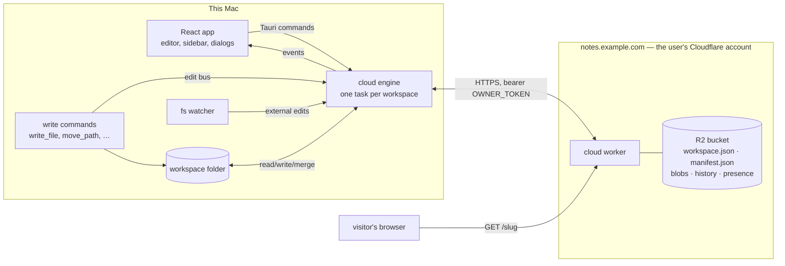

# Cloud — one domain per workspace: design & plan

Doklin's "backend" grew by accretion: a way to share one file became a way to
share a folder, then a place visitors could comment and edit, then a private
sync target, then a thing several domains could be at once. Each step was
reasonable; the sum is four copies of "what is published where", two write
paths to the cloud, a 5 000-line worker that embeds the whole editor, and
three deploy routes across three dialogs. This document starts over.

The short version:

- A **workspace** (the folder Doklin opens) connects to exactly **one domain**,
  and a domain holds exactly **one workspace**. The binding is recorded in
  the cloud (the worker refuses a second workspace) and on disk (a hidden
  marker in the folder). Connecting means: the whole folder is backed up and
  kept in sync, on every machine that holds it.
- **One writer.** A single Rust engine per workspace owns every byte that
  goes to or comes from the cloud. It is fed by the app's own writes (an
  in-process edit bus), by the filesystem watcher (external tools), and by a
  poll. The frontend never speaks HTTP; it sends the engine commands and
  listens to its events.
- **Publishing is a flag, not a push.** Every file is already in the cloud,
  so "share this page" is one record in the workspace manifest: *slug →
  file*. The worker renders public pages straight from the synced files —
  markdown, boards, properties, table widths, html renditions — with the
  same pure modules the desktop uses. Nothing is re-pushed, fingerprinted,
  or reconciled; a public page is exactly as fresh as the sync.
- **Public only.** Access codes, roles, the web editor, web comments and the
  invite/join machinery go away. What stays is a read-only page on your
  domain, with `noindex`, that says what the file says.
- **Agent + wrangler is the only setup route.** The app mints the owner
  token, writes the prompt, the agent runs wrangler, one `ENDPOINT:` line
  comes back, the app verifies and connects. Same for updating the worker
  and for tearing it down.

Everything below is the reasoning, the exact formats, the module layout, what
is deleted, and a phased plan where every phase leaves `main` shippable.

---

## 1. Why start over

What the current shape gets wrong — each of these is a *structural* problem,
not a bug:

| Today | Consequence |
| --- | --- |
| "What is published" lives in **four places**: `localStorage` (`doklin:shares` / `doklin:collections`), the sync manifest (`shares` / `collections`), the worker's `pages/<id>.json` records, and `sharesRef` in `App.tsx` | The 250-line *mirror effect* and the 230-line *reconcile pass* in `App.tsx` exist only to keep them agreeing. Fingerprints, `pushedRev`, `wsSynced`, `missingSince`, `boardDirs`, pending-unshare queues — all bookkeeping for that disagreement |
| **Two write paths** to the cloud: the Rust engine (sync) and the frontend's `fetch` (pages, OG images, site config, access codes, comment pools) | The registry is keyed by absolute path, so every rename, delete, undo, draft promotion and paste in `App.tsx` carries a share-registry insert (~260 lines inside a dozen editor-critical functions) |
| **Connections are global, workspaces are local.** A "backend" can host pages from any workspace; a workspace can sync to any backend; there is a default backend, a per-workspace override, and a per-page choice | Pages published from unsynced folders, pages on a different backend than their workspace, `wsStampFor` deciding who may manage a page — every dialog has a domain picker |
| The worker embeds the **whole editor** (2.6 MB of a 3 MB ceiling) to give comment/edit sessions the desktop experience | Every shell fix is a worker version bump and a redeploy nag; the bundle ceiling decides what can ship |
| Three deploy routes × three dialogs (setup, update, teardown), a dashboard-paste path, a generated shell script in the app data dir | Three times the copy to keep true, and a naming-hazard essay in every one |

What the current code gets *right*, and this design keeps:

- **The sync algorithm** (`src-tauri/src/sync.rs`): a per-workspace manifest
  updated by compare-and-swap on its R2 etag, immutable content-addressed
  blobs, three-way text merge against a locally kept base, conflict copies,
  rename detection by content, tombstones with TTL, a mass-delete valve,
  per-file history that rolls into an archive, blob GC, presence. It is the
  right shape for "a folder of text files, several machines, no server
  logic", and it has a 19-test two-device matrix against an in-memory
  backend. The engine's *edges* change (what feeds it, what it owns); its
  cycle does not.
- **The page renderer** in the worker: `marked` with the app's own CSS,
  light/dark, mermaid hydration, table column widths, boards and properties
  rendered server-side without JavaScript, the folder TOC.
- **The setup hand-off skeleton** (`docs/self-hosted-backend-flow.md` §6 and
  the appendix): fetch the artifact, establish credentials, verify before
  mutating, the config file verbatim, deploy with the failure named, verify,
  one line back.
- **The version handshake**: one integer in the worker source, parsed out of
  the bundled code by the app, `/api/meta` behind auth, "unknown is not
  outdated".

---

## 2. Vocabulary

- **Workspace** — the folder Doklin opens (the sidebar's root). The unit of
  sync and of publishing. Drafts are not in a workspace.
- **Domain** — a hostname (`notes.example.com`, or a `workers.dev` address)
  serving one Cloudflare Worker in front of one R2 bucket. Called "domain"
  in the UI even when it is a subdomain. "Backend" disappears from code and
  copy.
- **Connected** — a workspace that has a domain. Connected ⇒ backed up and
  in sync. Not connected ⇒ purely local; nothing can be published.
- **Device** — one installation of Doklin (`cloud.json` mints an id + a name
  on first run). Several devices can hold one workspace.
- **Engine** — the Rust task that syncs one workspace with its domain.
- **Manifest** — the one mutable object in the bucket: every file's path,
  revision and content hash, plus the **public map**.
- **Public page** — an entry in the public map: a slug, and the file or
  folder it exposes at `https://<domain>/<slug>`.
- **Owner token** — the secret the app generates at setup and the worker
  holds as its `OWNER_TOKEN` secret. The only credential that exists today;
  invites (later) mint per-person tokens beside it.

---

## 3. The rules

These are the invariants the code is built to keep. If a change breaks one,
the change is wrong.

1. **One domain ⇄ one workspace.** The worker's `workspace.json` is created
   with create-only semantics; a second create answers 409 and the app
   offers *join* (pull the existing workspace), never a second binding. The
   folder's hidden marker records the same pair.
2. **The engine is the only writer.** No frontend code holds the token after
   setup, no frontend code calls the worker. Publishing, history, wipe, the
   version probe — all engine commands.
3. **The manifest is the only truth about what is public.** The frontend's
   view of the public map is the engine's status event, nothing else. No
   `localStorage` registry.
4. **A public page is a rendering of synced files.** The worker never stores
   page content of its own; it reads blobs. Therefore a page can never be
   staler than the sync, and never fresher.
5. **Disk is the source of truth for content** (unchanged from today): the
   engine merges, never clobbers; overlapping edits become a conflict copy
   beside the file; deletions go to the Trash.
6. **The API only grows; an old worker fails legibly.** One version integer,
   parsed from the bundled source, probed behind auth; a too-old worker
   turns into an "update the worker" state, not an error.
7. **No accounts, no dashboard, no terminal for the user.** The app writes
   the prompt; an agent runs wrangler; the app verifies.

---

## 4. Architecture at a glance



Three parties, two contracts:

- **Engine ⇄ worker**: the sync API (manifest CAS, blobs, history, presence)
  plus three small admin routes (meta, bind, wipe). JSON over HTTPS, bearer
  auth.
- **UI ⇄ engine**: Tauri commands in, events out. Typed in one file
  (`src/cloud.ts`), mirrored by serde structs in Rust.

The visitor's contract is just URLs.

---

## 5. The cloud side — `cloud-worker/`

A new folder replaces `share-worker/`. The worker is written in TypeScript
(vite bundles it anyway, and it imports the app's pure TS modules), bundled
to one readable file, published on every release at

```
https://github.com/boat-builder/doklin/releases/latest/download/doklin-cloud-worker.js
```

### 5.1 Resources and names

One domain = one worker + one bucket + one secret, named from the domain so
two setups can never collide and a new-style deploy can never overwrite an
old `doklin-share-*` stack (which keeps serving its old links until the user
deletes it):

| Domain | Worker | Bucket | Endpoint |
| --- | --- | --- | --- |
| `notes.example.com` (a zone on the same account) | `doklin-notes-example-com` | `doklin-notes-example-com` | `https://notes.example.com` |
| free `workers.dev`, chosen name `sherin-notes` | `doklin-sherin-notes` | `doklin-sherin-notes` | `https://doklin-sherin-notes.<account>.workers.dev` (the agent reports it) |

Secret: `OWNER_TOKEN` (32 random bytes, hex; the app generates it).
R2 binding: `DATA`. `wrangler.toml`, verbatim, is part of the prompt (§7.4).

### 5.2 R2 layout

```
workspace.json              {id, name, createdAt, createdBy: {deviceId, deviceName}}
                            — the binding. Written once with create-only semantics.
manifest.json               the workspace manifest (v2, §6.6) — CAS by etag
blobs/<fileId>/<hash>       immutable file content, addressed by (a prefix of) its sha256
history/<fileId>.json       deep revision archive (entries rolled out of the manifest's hist)
presence.json               {devices: {<deviceId>: {name, path?, ts}}} — TTL'd, best effort
auth/tokens/<sha256>.json   {id, name, email?, role, createdAt, lastSeenAt}   ← empty until invites exist
auth/invites/<sha256>.json  {email, role, createdAt, expiresAt}               ← empty until invites exist
```

Nothing public is stored here: public pages are *rendered* from `blobs/`.
(Compare today's `site.json`, `pages/*.json|.png|.comments.json`,
`auth/gate-key.json`, `sync/<ws>/…` — all gone or folded in.)

### 5.3 API

All `/api/*` routes require `Authorization: Bearer <token>` and answer JSON.
Every request also carries `x-doklin-device: <deviceId>` (attribution for
presence/`by`) and `x-doklin-client: <app version>` (diagnostics).

```
GET    /api/meta                     {version, features, workspace: {id, name, createdAt, createdBy} | null}
                                     — liveness + credential + "is this domain bound" in one call
POST   /api/workspace                bind: body {name} → 201 {id, name, manifestEtag}
                                     409 {workspace} when already bound (never overwrites)
GET    /api/workspace                {id, name, createdAt, createdBy, files, bytes}
GET    /api/poll                     {manifestEtag, presence} — the cheap 15 s poll
GET    /api/manifest[?since=<etag>]  manifest + x-manifest-etag (304 when unchanged)
PUT    /api/manifest                 header x-base-etag required; 412 + current etag on a lost race;
                                     body validated (schema version, paths, caps, slug rules, one root)
GET    /api/blobs/<fid>              {blobs: [{hash, size, uploaded}]} (GC)
GET    /api/blobs/<fid>/<hash>       the bytes
PUT    /api/blobs/<fid>/<hash>       store bytes (immutable; a re-PUT of the same hash is a no-op)
DELETE /api/blobs/<fid>/<hash>       garbage-collect an unreferenced revision
GET    /api/history/<fid>            {version, entries}
PUT    /api/history/<fid>            replace the archive (advisory, size-capped)
PUT    /api/presence                 body {name?, path|null}
POST   /api/admin/wipe               owner; body {"confirm":"wipe"} — erase everything, batched;
                                     repeat until remaining:false. Frees the domain for a new binding.
```

Reserved for invites (§8.1), not built now: `POST /api/auth/join` (no auth;
email + code ⇒ token), `GET/POST/DELETE /api/auth/invites`,
`GET/DELETE /api/auth/tokens`.

Public (no auth, GET/HEAD only):

```
GET /                          the root page if the public map names one, else a minimal landing
                               (workspace name + "Download Doklin")
GET /<slug>                    a published file: rendered markdown — or its html rendition, when a
                               sibling <stem>.html is in the workspace, with the MD/HTML pill
GET /<slug>?v=md               the markdown rendering explicitly
GET /<slug>/raw                the html rendition verbatim (served into a sandboxed iframe)
GET /<slug>/og.png             the site's static OG image
GET /<dirSlug>                 a published folder: its table of contents
GET /<dirSlug>/<rel/path>      a note inside a published folder (path relative to the folder,
                               `.md` dropped, segments percent-encoded) — Notion-style nested URLs
GET /__web/<tag>/mermaid.js    the standalone mermaid module (immutable, content-tagged)
robots.txt, favicon.ico, apple-touch-icon.png
```

Every public page carries `<meta name="robots" content="noindex">`, as today.

### 5.4 Auth

- `OWNER_TOKEN` compared by SHA-256 in constant time (as today). Role `owner`.
- `auth/tokens/<sha256(token)>.json` — per-person tokens minted by invites,
  role `member`. Empty set today; the lookup exists so the invite feature is
  an addition, not a change. Members may sync and publish; only the owner
  may bind, wipe, invite, or revoke.
- No cookies, no gate, no sessions, no rate limiter for visitors — there is
  nothing to unlock.

### 5.5 The binding

`POST /api/workspace` writes `workspace.json` with `onlyIf: {etagDoesNotMatch: "*"}`
(R2's create-only put; today's test fake already models it). A second call
gets `409 {workspace}`. That is the whole cloud-side mapping: **a domain is
bound iff `workspace.json` exists**, and the only thing that removes it is
`POST /api/admin/wipe`. `GET /api/meta` reports the binding so the setup
dialog can tell "fresh domain" from "already holds *Notes*, created on
Sherin's iMac" before doing anything.

### 5.6 Public rendering — from synced files

This is the part that removes the most code, so it is worth being precise.

**The reader** (`cloud-worker/src/workspace.ts`) is the worker's view of the
synced tree:

- `manifest()` — `head(manifest.json)` for the etag (one Class B op), the
  body fetched only when the etag differs from the isolate's memoized copy.
- `fileAt(path)` / `file(fid)` → `{fid, path, hash}`; `blob(fid, hash)` →
  text.
- `children(dir)` — every markdown file under a path (for TOCs).
- `storeAt(dir)` — `store.jsonl` plus the frontmatter head of every card in
  the folder (capped, like `read_store`), so a board can be derived.
- `meta(stem)` — the `<stem>.meta.jsonl` sidecar, for table column widths.

**The renderer** is today's, ported: `renderPageMarkdown` (marked + the
`<colgroup>` from `tcols` + boards + the properties table), `renderPage`
(chrome, theme CSS, `noindex`, OG meta, the MD/HTML pill, the "back to the
folder" crumb), `renderTocLevel` / `renderTocCards`, `boardHtml`, the mermaid
hydration script, favicons. What changes is *where its inputs come from*:

| Input | Today | New |
| --- | --- | --- |
| Markdown | pushed by the app, comments expanded then stripped by the worker | read from the blob; comment markers stripped with the same `criticMarkup.ts` the desktop uses (bodies never leave the sidecar) |
| Frontmatter → properties table | split off by the app, sent as `props` | split off by the worker with `src/store/frontmatter.ts`, coloured by the card's own `store.jsonl` |
| Boards / tables in ` ```kanban ` / ` ```table ` fences | snapshotted by the app (`store/publish.ts`), sent as `boards`, fingerprinted, re-pushed when the store changes | derived in the worker from `storeAt(dir)` with `src/store/board.ts` (`boardSnapshot`) — the same derivation the tab and the embed use, so the three can't disagree; a board changing re-renders on the next view |
| Table column widths | sent as `tcols` | read from the synced `.meta.jsonl` with `src/metaFile.ts` |
| Html rendition | pushed as `html` | the sibling `<stem>.html` blob, when the manifest has one |
| Folder TOC | an explicit `items` list pushed by the app | `children(dir)`, grouped by directory as today |
| OG image | rendered on a canvas in the app and pushed | one static PNG embedded in the worker; `og:title` / `og:description` carry the page's words |

The pure modules the worker bundles from `src/` — `store/frontmatter.ts`,
`store/storeFile.ts`, `store/board.ts`, `store/embedConfig.ts`,
`store/rank.ts`, `metaFile.ts`, `criticMarkup.ts`, `tableWidths.ts` — are
exactly the ones `verify-harness/store.test.mjs`, `metafile.test.mjs` and
`tablewidths.test.mjs` already pin. Nothing that touches Tauri or React
enters the worker.

**Caching.** A render is a handful of R2 reads (a board with 200 cards is
200). The worker caches rendered responses in `caches.default` under a
synthetic key `https://cache.doklin/<manifestEtag><pathname><search>`,
`max-age` one day, filled with `ctx.waitUntil`. A manifest change gives every
URL a new key, so a page is never served stale past one `head`; old entries
age out. Steady state per public request: one `head`, one cache hit.

**Slugs and paths.** A slug is `^[a-z0-9][a-z0-9-]{2,63}$`, not in
`{api, __web, raw, og.png, robots.txt, favicon.ico, apple-touch-icon.png,
join}`. Nested paths under a folder slug resolve `dir.path + "/" + rest +
".md"` (and the exact path, for non-`.md` files the folder holds, which
serve with their content type). A note that is both inside a published
folder and published on its own answers at both URLs; the crumb on the
nested one points at the folder.

**Links between notes.** A relative link (`[plan](./plan.md)`) in a public
page is rewritten to the target's public URL when the target is public
(inside the same folder share, or published on its own) and left as plain
text otherwise — the same rule today's board card links follow.

### 5.7 Version, update, wipe

- `const WORKER_VERSION = 1;` restarts the counter in
  `cloud-worker/src/version.ts` — a separate file so the app's build can read
  the integer without bundling the worker (§7.1). `WORKER_FEATURES` starts
  as `["sync", "publish", "boards", "wipe"]`.
- The engine probes `/api/meta` on start and after every reconnect and
  reports `workerVersion` in its status; the frontend compares with the
  bundled integer and shows the update badge. A worker that receives a
  manifest with a schema version it does not know answers `426`, which the
  engine reports as phase `worker-outdated` — the one case where sync
  pauses until the worker is updated.
- `POST /api/admin/wipe` stays exactly as today (batched, owner-only,
  repeat until done); it is the erase step of teardown and the only way to
  free a domain.

### 5.8 Size and tests

Without the embedded app shell the bundle is marked + CSS + the store
modules + the mermaid module (~1 MB gzipped, the mermaid module being most of
it) — comfortably inside the 3 MB free-plan ceiling. CI prints the size.

`cloud-worker/test/run.mjs` (plain node, the in-memory R2 fake ported from
today's `share-worker/test/run.mjs`, the worker compiled in-process through
vite the way `verify-harness/*.test.mjs` compile modules) covers: auth, meta,
bind-once, manifest CAS races and validation, blobs, history, presence, wipe,
and the public renderer — a file page, an html-rendition page, a folder TOC,
a nested path, a board and a table fence derived from a store, a card's
properties, table widths from the sidecar, comment stripping, link
rewriting, `noindex`, the cache key changing with the manifest, and 404s for
unpublished paths.

---

## 6. The engine — `src-tauri/src/cloud/`

### 6.1 Responsibilities

One `Engine` task per connected workspace, owning:

1. sync (the cycle, unchanged in substance from `sync.rs`),
2. the public map (queued ops folded into the manifest it publishes),
3. history reads and revision fetches (for the History panel),
4. presence,
5. the domain probe, bind, join, resume, disconnect and wipe flows,
6. reporting: one status event that is the frontend's entire model.

And the **single-writer rule**: it is the only code that holds a token or
opens a connection to the worker.

### 6.2 Module layout

`sync.rs` (3 527 lines in one file) is ported, not rewritten, into a module
whose files match the concepts above:

```
src-tauri/src/cloud/
  mod.rs        the manager (one engine per root), Tauri commands, events, cloud.json, the marker
  engine.rs     Engine<R>: cycle, apply_remote, stage_local, build_manifest, fold_public, commit
  manifest.rs   wire types: Manifest v2, ManifestFile, Tombstone, HistEntry, PublicEntry, Presence
  remote.rs     the Remote trait; HttpRemote; probe / bind / join helpers
  merge.rs      three-way merge, conflict copies (today's merge_texts + conflict_copy_path)
  scan.rs       scan_local, hashing, the exclusion rules (shared with lib.rs's tree walk)
  bus.rs        the edit bus (§6.4)
  tests.rs      FakeRemote + the two-device matrix (19 ported tests + the new ones in §10)
```

`lib.rs` keeps `mod cloud;` and the command registrations; `sync.rs` and
`delete_share_config` are deleted.

### 6.3 Local files

`<app_data_dir>/cloud.json` — one machine-local file replacing `share.json`
and `sync.json`:

```json
{
  "version": 1,
  "device": { "id": "d-7f3k…", "name": "Sherin's MacBook Pro" },
  "workspaces": [
    {
      "root": "/Users/sherin/Notes",
      "domain": "notes.example.com",
      "endpoint": "https://notes.example.com",
      "wsId": "w-9m2q…",
      "name": "Notes",
      "token": "<hex>"
    }
  ]
}
```

Rules: one entry per `root`, one per `domain`; parsed by shape (a malformed
file reads as "nothing connected"); the token lives here and nowhere else
(the Keychain is a later refinement — the file is what today's `share.json`
already is).

`<root>/.doklin/cloud.json` — the marker, no secrets:

```json
{ "domain": "notes.example.com", "wsId": "w-9m2q…" }
```

It is hidden, so the tree walk, search and the sync scan already ignore it
(`is_hidden_or_ignored`). It makes the folder self-describing: a machine
that opens a folder carrying a marker with no matching `cloud.json` entry
is offered *resume* (§6.8), and a folder that already carries a marker for
domain A cannot be connected to domain B.

`<app_data_dir>/cloud/<wsId>/state.json` + `base/` — the engine's state
(last applied manifest + etag, per-file synced state, queued public ops)
and the merge bases, as today under `sync/<ws>/`.

### 6.4 Inputs: the edit bus, the watcher, the poll, commands

The engine wakes on four things and does one of two: a *cycle* (full
reconcile) or a *poll* (etag + presence).

1. **The edit bus** — new. Every write the app makes already goes through a
   Rust command: `write_file`, `write_frontmatter`, `write_body`,
   `create_card`, `create_file`, `create_dir`, `move_path`, `copy_path`,
   `trash_file`, `restore_trashed`. Each ends with `cloud::touched(&app,
   &path)`: an unbounded `mpsc` send to the manager, routed to the engine
   whose root contains the path. The engine keeps a dirty set and settles
   **1.5 s** after the last touch (autosave is already debounced 600 ms
   upstream) — an edit reaches the cloud about two seconds after the
   keystroke, instead of today's five-plus.
2. **The filesystem watcher** (external editors, git, Finder) — as today: a
   recursive `notify` debouncer, settling **5 s**.
3. **The poll** — every 15 s: `GET /api/poll`; a changed etag triggers a
   cycle; presence rides along.
4. **Commands** — `SyncNow`, `Pause`, `ConfirmDeletes`, `SetActivity`,
   `Publish`/`Unpublish`/`SetRoot`, `History`, `Shutdown`.

The dirty set is a *hint about when*, never a substitute for the scan: the
cycle still walks the whole tree and decides from content what changed
(that is what makes rename detection and external edits correct). A hint
only shortens the settle.

### 6.5 The cycle — kept

`cycle()` is today's, verbatim in substance:

1. fetch the manifest since our etag;
2. `apply_remote` — downloads, renames, tombstoned deletions to the Trash,
   three-way merges where both sides moved, conflict copies where they
   overlap;
3. `scan_local` + `stage_local` — modified / new / moved / vanished, the
   mass-delete valve (>30 % of files gone ⇒ hold and ask);
4. `build_manifest` (revisions, history rollover, tombstone TTL, path
   dedupe) and `fold_public` (§6.6);
5. upload blobs (idempotent), then CAS the manifest; on a lost race,
   refetch and go again (4 attempts).

Tunables, caps, GC and presence stay as they are. The port's only
behavioural changes: the schema version becomes 2, the share/collection
sections become the public map, and status reporting is keyed by root.

### 6.6 The manifest (v2) and the public map

```json
{
  "version": 2,
  "name": "Notes",
  "seq": 812,
  "files": {
    "f-3kq8…": { "path": "Projects/plan.md", "rev": 7, "hash": "9c1e…", "size": 4310,
                  "mtime": 1757000000000, "by": "Sherin's MacBook Pro",
                  "hist": [ { "r": 6, "h": "…", "s": 4211, "t": …, "b": "…" } ] }
  },
  "tombstones": { "f-old…": { "path": "Scratch.md", "rev": 3, "ts": …, "by": "…" } },
  "public": {
    "k7m2p9qx": { "kind": "file", "file": "f-3kq8…", "path": "Projects/plan.md",
                  "by": "Sherin's MacBook Pro", "at": 1757000000000 },
    "roadmap":  { "kind": "dir",  "path": "Projects/Roadmap", "title": "Roadmap",
                  "desc": "What we're building this quarter", "by": "…", "at": … },
    "home":     { "kind": "file", "file": "f-77a1…", "path": "Home.md", "root": true, "by": "…", "at": … }
  }
}
```

- Keyed by **slug**. A file entry references the **fileId** (so a rename
  carries the share for free) and keeps a `path` snapshot (so a deleted-and-
  recreated file at the same path can be re-bound). A folder entry is keyed
  by path; a folder rename is re-pointed by the engine when every file it
  held moved to one new prefix in one cycle.
- `root: true` on at most one entry makes it the page at `/`.
- **Publishing offline** works: the engine queues `public_ops` in its state
  (persisted, as today's `share_ops`) and folds them into the next won CAS.
  `fold_public` is today's `apply_share_state` with its three passes
  (re-point renamed paths, re-bind dead entries, apply pending ops) plus the
  folder re-point.
- **A public entry outlives its file** (today's semantics, kept on purpose):
  a deleted file's page 404s while the file is gone, comes back if the file
  does (restore from Trash, `git checkout`), and the Published list shows
  the entry as "file missing" with a *Stop* button. Stopping is explicit.
- **Slugs**: random 8 characters from the unambiguous alphabet by default;
  a custom slug is validated locally and checked for uniqueness against the
  manifest — instantly, no network. Two devices racing the same custom slug
  resolve like path dedupe: the loser's entry gets a suffix and its device
  is told.
- The worker validates the map on `PUT` (slug grammar, reserved words,
  references resolve to a file or a directory prefix present in `files`, at
  most one root) so a corrupted device can never publish garbage.

### 6.7 Commands and events — the frontend contract

Commands (`src/cloud.ts` wraps each in a typed function):

```
cloud_status()                                    -> CloudStatus[]      one per connected workspace
cloud_probe(endpoint, token)                      -> Probe              {workerVersion, workspace|null}
cloud_connect(root, endpoint, token, name)        -> wsId               bind + initial upload (progress events)
cloud_join(endpoint, token, destParent)           -> root               download into a fresh folder
cloud_resume(root, endpoint, token)               -> wsId               marker matches: adopt this folder in place
cloud_disconnect(root)                                                  forget locally; files stay; cloud stays
cloud_sync_now(root) · cloud_pause(root, bool) · cloud_confirm_deletes(root)
cloud_set_activity(path | null)                                         presence ("editing Projects/plan.md")
cloud_publish(path, {slug?, title?, desc?})       -> slug               file or folder; queued op
cloud_unpublish(slug) · cloud_set_root(slug | null)
cloud_history(path)                               -> Revision[]         manifest tail + archive
cloud_revision(path, hash)                        -> string             one revision's text
cloud_wipe(root)                                  -> purged             owner; then the domain is free
```

Events:

```
cloud-status          CloudStatus (the whole model, on every change)
cloud-applied         {root, paths}       sync wrote these files — refresh the tree, reload open tabs
cloud-conflict        {root, path, by, conflictPath}
cloud-pending-deletes {root, count, total, paths}
cloud-progress        {root, kind: "upload"|"download", done, total}
```

`CloudStatus`:

```ts
type CloudStatus = {
  root: string; domain: string; endpoint: string; wsId: string; name: string;
  phase: "idle" | "syncing" | "offline" | "paused" | "pending-deletes"
       | "revoked" | "worker-outdated" | "error";
  lastSyncMs: number | null; error: string | null; pendingDeletes: number;
  workerVersion: number | null;
  public: { slug: string; kind: "file" | "dir"; path: string; title: string | null;
            by: string; at: number; alive: boolean; root: boolean }[];
  presence: { deviceId: string; name: string; path: string | null; ts: number }[];
};
```

The frontend keeps this array in state and derives everything from it: the
sidebar's cloud dot and "Alice is editing" chips, the published badges
(`public` paths and folder prefixes), the Share popover's state for the
active document, the Published pages list, the update badge, the
pending-deletes prompt.

### 6.8 Flows

**Connect** (first machine):

```mermaid
sequenceDiagram
  participant U as User
  participant A as App (wizard)
  participant E as Engine
  participant W as Worker
  U->>A: Cloud… → Connect a domain; types notes.example.com
  A->>A: mint OWNER_TOKEN; build the agent prompt (§7.4)
  U->>U: runs the prompt in Claude Code; agent deploys; prints ENDPOINT
  U->>A: pastes the endpoint
  A->>E: cloud_probe(endpoint, token)
  E->>W: GET /api/meta
  W-->>E: {version, workspace: null}
  E-->>A: fresh domain, worker v1
  U->>A: Connect & upload (N files)
  A->>E: cloud_connect(root, endpoint, token, name)
  E->>W: POST /api/workspace {name}
  W-->>E: 201 {id, manifestEtag}
  E->>W: PUT blobs… ; PUT /api/manifest (x-base-etag)
  E->>E: write cloud.json + <root>/.doklin/cloud.json; spawn the engine
  E-->>A: cloud-progress…, cloud-status(idle)
```

**Already bound** — the probe returns `workspace: {name, createdBy, …}` and
the wizard says so: *"notes.example.com already holds **Notes** (created on
Sherin's iMac, 12 days ago)."* The choices are **Download it here** (join
into a chosen parent folder — the second-Mac flow) or, when the open folder
carries a marker with that `wsId`, **Resume syncing this folder**. There is
no "bind anyway".

**Join** (second machine): endpoint + token → `cloud_join` downloads the
manifest and blobs into `<parent>/<name>` (four in flight, progress events),
writes the marker and `cloud.json`, spawns the engine, and the app opens the
folder as a workspace.

**Resume in place** — the marker's `wsId` matches; the engine starts with
empty state, so every local file reads as new and every remote file as new:
`stage_local` already adopts a remote fileId for a path that exists in the
manifest, and the merge machinery owns any content difference on the next
cycle. This is the recovery path for "reinstalled Doklin" and "restored the
folder from a backup".

**Disconnect** — stop the engine, drop the `cloud.json` entry and the
engine state; the folder and the marker stay (so resume is one click), the
cloud stays.

**Teardown** — `cloud_wipe` (erases the bucket through the worker, which
frees the domain), then the teardown prompt (`wrangler delete`, `r2 bucket
delete`), then disconnect.

**Token rotation** — later, if needed: `secret put OWNER_TOKEN` via a prompt,
then paste the new token into the Cloud panel; the engine reloads.

### 6.9 History

`cloud_history(path)` and `cloud_revision(path, hash)` do what `sync.ts`'s
`fetchFileHistory` / `fetchRevisionContent` do today, from inside the
engine (it already holds the manifest; the archive and the blob are one
request each). `HistoryPanel.tsx` keeps its UI and its two exits (restore in
place, save as a new document) and calls these commands instead of `fetch`.

---

## 7. The app

### 7.1 What remains of the frontend's cloud code

- `src/cloud.ts` — the types in §6.7, one `invoke` wrapper per command,
  `BUNDLED_WORKER_VERSION` from `virtual:cloud-worker-version` (a build-time
  virtual module in `vite.config.ts` that reads the integer out of
  `cloud-worker/src/version.ts` — parsed, never mirrored, and the 2.6 MB
  worker string no longer rides in the app). No `fetch` anywhere.
- App.tsx: a `cloudStatuses` state fed by `cloud-status`, a
  `cloudForWorkspace` memo, listeners for the five events, the dialog
  open-states, and the callbacks below. Roughly 150 lines where there are
  3 200 today.

### 7.2 Surfaces

| Surface | Replaces | What it does |
| --- | --- | --- |
| **Cloud panel** (`CloudPanel.tsx`; gear → *Cloud…*, and the cloud dot in the sidebar header) | `CloudSync`, `Backends`, `BackendTeardown` | Not connected: one button, *Connect a domain…*, and *Open a workspace from a domain…*. Connected: the domain, the phase line ("Synced 2 min ago" / offline / paused / revoked / "this Mac's changes are waiting on the worker update"), who else is here, the pending-deletes confirmation, *Sync now*, *Pause*, *Published pages…*, *Update the worker…* (badge when behind), *Disconnect this Mac*, and a danger zone: *Delete everything on notes.example.com…* (wipe → teardown prompt → disconnect) |
| **Setup wizard** (`CloudSetup.tsx`) | `ShareSetup`, `ConnectBackend`, the browser and terminal tabs | §6.8: domain (own subdomain or a `workers.dev` name), the prompt with the token, paste the endpoint, probe, then *Connect & upload* / *Download here* / *Resume* |
| **Worker update** (`WorkerUpdate.tsx`, rewritten) | itself | One card (`v3 → v5`), one agent prompt (no secret; deploy over the same name), *Check again*. No script, no dashboard route |
| **Publish popover** (`PublishMenu.tsx`, the title-bar pill) | `ShareMenu` (1 130 lines, four views) | The pill reads *Publish* / *Published*. Inside: the link, copy, open, an editable slug, *Stop publishing*, "Published by Alice · 3 days ago" when someone else did it, and a quiet line when the file has unsynced local edits ("your latest changes appear once synced") |
| **Publish folder** (`PublishFolder.tsx`; sidebar folder context menu) | `ShareFolder` | Slug, public title, description; a preview of the URL scheme; *Stop*. No membership checklist: publishing a folder publishes every note in it (§11, decision 4) |
| **Published pages** (`PublishedPages.tsx`; from the Cloud panel and the popover) | `SharedPages` | Folders above files, path · slug · by/at, copy/open/stop, *Use as home page*, "file missing" rows flagged |
| **Sidebar** | itself | Keeps the published dot on files and folders (from `public`), the presence chip, the header's cloud dot, *Version history…*, *Publish folder…* / *Stop publishing*. Loses the share/include/copy-link items that assumed per-page backends |
| **History panel** | itself | Same UI, engine commands (§6.9) |
| **Conflicts, applied changes** | itself | `cloud-conflict` → a toast with *Open the copy*; `cloud-applied` → tree refresh (open tabs already reload through the file watcher) |

Deleted outright: `AccessCodes`, the web-conflict resolver, "check for web
changes", the comments moderation view, the OG renderer, the site branding
step, the landing-page config, the multi-backend pickers.

### 7.3 Gating

- The Publish pill renders only for a file tab inside the open workspace
  (not a draft, not a board tab, not a missing file, not a file opened from
  outside the workspace). When the workspace is not connected, the pill
  opens a one-line explanation with *Connect a domain…*.
- *Publish folder…* appears only in a connected workspace.
- *Version history…* appears only in a connected workspace.
- The gear's badge lights for an app update or a worker behind the bundled
  version — one signal, as today.

### 7.4 The agent prompts

Three prompts, one skeleton (the seven parts from
`docs/self-hosted-backend-flow.md`'s appendix, which stays true):

**Setup** (carries the token — the copy point says so):

1. Goal: *one Worker in front of one R2 bucket, serving Doklin's cloud for
   the workspace "Notes" at `notes.example.com`* (or *at a free workers.dev
   address*).
2. `mkdir doklin-cloud && cd doklin-cloud && curl -fsSL <release URL> -o doklin-cloud-worker.js`
   (fallback: clone the repo, `node scripts/bundle-worker.mjs`).
3. `npx -y wrangler@4 whoami`; if not logged in, `npx -y wrangler@4 login`
   and *ask me to finish the sign-in in the browser*.
4. Verify the names are free: `wrangler deployments list --name
   doklin-notes-example-com` must say no such worker, `wrangler r2 bucket
   list` must not show `doklin-notes-example-com`. *If either exists, stop
   and ask me — a same-name deploy silently replaces the existing worker
   and a shared bucket serves two sites.*
5. `wrangler.toml`, verbatim:
   ```toml
   name = "doklin-notes-example-com"
   main = "doklin-cloud-worker.js"
   compatibility_date = "<the date the worker was written for>"
   account_id = "<from whoami>"
   workers_dev = false
   routes = [{ pattern = "notes.example.com", custom_domain = true }]
   [[r2_buckets]]
   binding = "DATA"
   bucket_name = "doklin-notes-example-com"
   ```
   (`workers_dev = true` and no `routes` for the free address.)
6. `npx -y wrangler@4 r2 bucket create doklin-notes-example-com`, then
   `npx -y wrangler@4 secret put OWNER_TOKEN` with the token on the next
   line, then `npx -y wrangler@4 deploy` — with the custom-domain pause
   (*if deploy says the zone isn't found, the domain must be added to this
   Cloudflare account first; ask me*) and the TLS-minute caveat.
7. Verify: `GET <endpoint>/api/meta` with the bearer must answer 200 and
   `{"version":…,"workspace":null}`. Then print exactly
   `ENDPOINT: https://…`. *Do not commit `wrangler.toml` anywhere; do not
   create or modify any other Cloudflare resources.*

**Update** (no secret): fetch the bundle, `whoami`, confirm the worker
exists under its name, deploy over it, verify `/api/meta` reports the new
version. **Teardown** (no secret): `wrangler delete --name …`, `wrangler r2
bucket delete …`, verify the endpoint no longer answers — run only after the
app's wipe emptied the bucket.

---

## 8. Future-proofing

Neither feature is built now; both are shaped for.

### 8.1 Invites — email + code

- The owner mints an invite in the Cloud panel: an email and a code the app
  generates (`amber-canyon-lantern-42`). The worker stores
  `auth/invites/<sha256(email + code)>.json` `{email, role: "member",
  expiresAt}`. The owner shares the code however they like — no email is
  sent, no web page is involved.
- The invitee installs Doklin, chooses *Open a workspace from a domain…*,
  and enters the domain, their email and the code. `POST /api/auth/join`
  {email, code, device} → a per-person token stored hashed under
  `auth/tokens/`, role `member`. The app then runs the **join** flow of
  §6.8 exactly as the owner's second Mac does; `cloud.json` gets the same
  shape of entry with that token.
- Revocation = deleting the token record (the engine reports `revoked` on
  its next request). Members sync and publish; the owner alone binds,
  wipes, invites, revokes.
- What this design already has for it: the token lookup in `authenticate`
  beside the owner secret, the `by` attribution on every revision, the join
  flow as an engine command, and a `cloud.json` entry that does not care
  which kind of token it holds.

### 8.2 Locking — leases on files

- A *lease* is a presence entry with a `lock`: `{deviceId, name, path,
  until}`. The engine acquires one when a document gains editing focus (it
  already reports activity per path), renews it on each presence beat, and
  drops it on blur/close. A lease that stops being renewed expires.
- Other devices see `lockedBy` on that path in `cloud-status`; the editor
  opens read-only with a banner ("Alice is editing — view only") and a
  *Take over* that waits for the lease to lapse or breaks a stale one. The
  three-way merge stays as the fallback for the window a lease can't cover.
- What this design already has for it: presence keyed by device with a
  path and a timestamp, the activity command on focus, and a status event
  the editor can gate on. The lease table is either a field in
  `presence.json` or its own `locks.json` — a worker-side detail.

---

## 9. What goes, what changes, what stays

### Deleted

| Path | Why |
| --- | --- |
| `share-worker/` (5 121-line worker, README, tests, vendored marked, example config) | replaced by `cloud-worker/` |
| `web/` (the app shell for comment/edit sessions) and `scripts/build-web.mjs` | no web sessions; the mermaid module build moves into `scripts/bundle-worker.mjs` |
| `src/share.ts`, `src/sync.ts` | replaced by `src/cloud.ts` (no HTTP) |
| `src/Backends.tsx`, `src/ConnectBackend.tsx`, `src/AccessCodes.tsx`, `src/BackendTeardown.tsx`, `src/CloudSync.tsx`, `src/ShareSetup.tsx`, `src/ShareMenu.tsx`, `src/ShareFolder.tsx`, `src/SharedPages.tsx` | replaced by the surfaces in §7.2 |
| `src/store/publish.ts`, `src/BoardSnapshot.tsx`, and the `boards` snapshot path through `Editor` / `storeEmbed` / `StoreEmbed` | the worker derives boards server-side from `store/board.ts`; nothing on the desktop ever fed the React snapshot — only the web shell did |
| `entryKeyOf` in `src/htmlComments.ts` | the web comment pool is gone; `mergeHtmlThreads` stays — the desktop folds an externally changed meta file into the live rail with it |
| `src-tauri/src/sync.rs`, `delete_share_config` in `lib.rs` | ported into `src-tauri/src/cloud/` |
| `virtual:share-worker-code`, `BUNDLED_WORKER_VERSION` parsing in `App.tsx` | `virtual:cloud-worker-version` |
| `App.tsx` regions: the reconcile pass, the mirror effect, `readShareParts` / `pushSharedNow` / `scheduleSharePush`, the unshare queue, `tryAdoptRename`, `shareNeedsPush`, `pullWebEdit`, `syncShareThreads`, the version and role probes, the share/collection CRUD, `resolveWebConflict` / `checkForWebChanges`, and the inserts inside `writeToDisk`, `movePath`, `deleteEntry`, `undoDelete`, `closeTab`, `discardDraft`, `promoteDraftTo`, `reloadFromDisk` (the `push` option), the watcher | ≈ 3 200 lines; the registry's absolute-path keying is what put them there |
| `localStorage`: `doklin:shares`, `doklin:collections`, `doklin:share-connection-by-root`, `doklin:pending-unshares`, `doklin:access-codes` | the manifest is the registry |
| `<app_data_dir>/share.json`, `sync.json`, `sync/`, `doklin-worker-update.sh` | `cloud.json`, `cloud/` |
| `verify-harness/drive-web.mjs`, `drive-mermaid-web.mjs`, `serve-worker.mjs` | with the pool and the shell (`merge.test.mjs` stays with the merge) |
| `docs/self-hosted-backend-flow.md` | replaced by `docs/cloud.md` (this document, settled) and `cloud-worker/README.md`. `docs/share-pdf-download.md` (a *proposed* spec) stays but must be re-shaped: its push-a-PDF-artifact model no longer fits; a public page's PDF would be a synced file beside the note |

### Rewritten

`WorkerUpdate.tsx` (one domain, one route), `HistoryPanel.tsx` (commands
instead of fetch), `Sidebar.tsx`'s cloud props, the Settings menu's cloud
section, `vite.config.ts`'s virtual module, `scripts/bundle-worker.mjs`,
`.github/workflows/release.yml`'s bundle step (asset renamed
`doklin-cloud-worker.js`), `verify-harness/serve-worker.mjs` (the new worker
+ a seeded manifest), README and `docs/development.md`.

### Kept untouched

`CommentsRail.tsx`, `HtmlView.tsx` and `htmlBridge.ts`, `metaFile.ts`,
`criticMarkup.ts` / `criticMark.ts` / `criticPlugin.ts`, `store/` (all pure
modules and the model), `StoreView` / `KanbanBoard` / `TableView` /
`CardPeek` / `PropertiesHeader`, the editor, tabs, drafts, dictation, PDF
export, the updater, `store.rs`, `pdf_export.rs`, `dictation.rs`.

---

## 10. The plan — five pull requests

Each PR leaves `main` building, linting, and passing every remaining test;
the order is chosen so the demolition lands first (nothing in the app
depends on the cloud) and each later PR adds one layer.

### PR 0 — Demolition

Remove everything in §9's *Deleted* table except the Rust engine (which PR 2
ports; it stays compiling and tested, wired to nothing), delete the frontend
cloud UI wholesale — `WorkerUpdate.tsx` and `HistoryPanel.tsx` included, since
neither compiles without `share.ts`; they return rewritten in PR 3 and PR 2 —
and cut the ~3 200 lines out of `App.tsx`. The comment author, which came
from the engine's device identity, comes from a `device_name` command instead. The Share pill, the Cloud menu items, the sidebar's share
items and the History item disappear; boards, comments, html renditions,
drafts, tabs, dictation and PDF export are untouched.

- Verify: `pnpm lint`, `pnpm exec tsc --noEmit`, `cargo test --lib`;
  `node verify-harness/{metafile,tablewidths,doclinks,store}.test.mjs`;
  `drive.mjs`, `drive-kanban.mjs`, `drive-kanban-embed.mjs` (minus its
  publish block), `drive-split.mjs` (its IPC stub answers `device_name`
  instead of `sync_status` / `sync_device`), `drive-meta.mjs`.
- Done when: no `fetch` to a worker anywhere in `src/`; no localStorage key
  above survives; `grep -ri "backend\|share" src` finds only prose and the
  html-comment model.

### PR 1 — The cloud worker

`cloud-worker/` with §5.2–5.5 and 5.7: auth, meta, bind-once, manifest CAS
with v2 validation, blobs, history, presence, wipe; `version.ts`;
`wrangler.toml.example`; `test/run.mjs`; `scripts/bundle-worker.mjs`
emitting `doklin-cloud-worker.js` (+ the mermaid module); the release
workflow attaching it. Public routes answer 404 for now (the renderer is PR
4) except `/` (landing) and the static assets.

- Verify: `node cloud-worker/test/run.mjs`; the bundle size printed in CI.
- Done when: a fresh domain binds once, a second bind is 409, a CAS race
  loses with 412, wipe frees the domain.

### PR 2 — The engine

`src-tauri/src/cloud/` per §6: the port of the cycle, `cloud.json` and the
marker, the edit bus wired into every write command, the manifest v2 types,
`fold_public` (ops folded, rename-follow, re-bind, folder re-point), the
commands and events of §6.7, the probe/connect/join/resume/disconnect/wipe
flows, the `426 → worker-outdated` state.

- Tests (`cargo test --lib cloud`): the 19 ported (the share tests become
  public-map tests: publish mirrors to the other device, follows a rename,
  survives a lost CAS, goes dead on delete and re-binds on recreate, a
  folder publish re-points when the folder moves); plus new: bind refused
  when bound, resume-in-place converges without conflict copies, a touched
  path settles faster than a watched one, a custom-slug race suffixes the
  loser, a `426` pauses with the right phase.
- Done when: `pnpm tauri dev` on a Mac connects a folder to a deployed
  worker, edits reach the bucket within ~2 s, a second Mac joins and both
  converge; but nothing is *shown* yet beyond a status dot.

### PR 3 — Connect, update, tear down

`src/cloud.ts`, `CloudPanel.tsx`, `CloudSetup.tsx` (the wizard and the
setup prompt), the rewritten `WorkerUpdate.tsx` (update prompt), the
teardown prompt in the panel, the sidebar header dot, presence chips, the
pending-deletes prompt, conflict toasts, `cloud-applied` → tree refresh;
`HistoryPanel.tsx` on commands; the gear menu's *Cloud…* item and badge.

- Verify: a harness page (`verify-harness/cloud.html` + `drive-cloud.mjs`)
  that boots the real `<App/>` with an IPC stub answering `cloud_*` and
  walks: not-connected state, the wizard's three outcomes (fresh / bound /
  marker), the panel's phases, pending deletes, history restore. Manual on
  macOS: the full wizard against a real deploy, update, teardown.
- Done when: setup ends with the folder syncing and the prompt contains no
  step the agent has to invent.

### PR 4 — Publishing

The public map end to end: engine ops (already in PR 2's tests) exposed as
`cloud_publish` / `cloud_unpublish` / `cloud_set_root`; the worker's reader,
the ported renderer, the store modules bundled, caching, nested folder
URLs, link rewriting, the root page, the static OG; `PublishMenu.tsx`,
`PublishFolder.tsx`, `PublishedPages.tsx`, sidebar badges and menu items,
the Publish pill and its gating.

- Verify: `cloud-worker/test/run.mjs` renderer cases (§5.8);
  `verify-harness/serve-worker.mjs` seeded with a manifest + blobs (a note,
  a note with an html sibling, a folder, a store with cards, a card with
  properties, a note with tables and widths, a note with comments) and a
  Playwright `drive-public.mjs`: the page, the pill, the TOC, a nested
  path, a board with JavaScript off, a diagram hydrating in light and dark,
  the crumb, 404 for an unpublished path; `drive-cloud.mjs` grows the
  publish popover and the folder dialog.
- Done when: publish → the URL serves within one sync cycle; edit → the
  page follows; rename → the URL still works; delete → 404, restore →
  back.

### PR 5 — Docs and the last sweep

README (features, install unchanged), `docs/development.md` (architecture
paragraphs for cloud and publishing), `cloud-worker/README.md` (the
contract, the layout, the from-scratch prompt), `docs/cloud.md` (this
document settled into "how it is"), the verify skill's cloud section;
delete `docs/self-hosted-backend-flow.md`; grep for stale words
("backend", "share worker", "access code", "invite link").

Size, for planning: ≈ 15 000 lines deleted (worker 5.1 k, web shell 0.8 k,
dialogs 6.5 k, `App.tsx` 3.2 k, `share.ts` + `sync.ts` 1.7 k) against ≈ 8
000 added, most of it the ported engine and renderer.

---

## 11. Decisions taken, and what was rejected

1. **Keep the sync algorithm, replace its edges.** Rejected: a from-scratch
   engine (nothing about manifest-CAS + content-addressed blobs + three-way
   text merge is wrong for plain files, and the test matrix is the most
   valuable code in the subsystem); CRDTs / Yjs (markdown on disk must stay
   the truth, and a CRDT would make every external editor a second-class
   writer); per-file objects without a manifest (loses atomic multi-file
   commits, cheap rename tracking and history for free).
2. **The worker renders from synced files; the app pushes nothing.**
   Rejected: keep the page-push pipeline (it is *the* source of the four-way
   registry and the reconcile pass); pre-render at manifest commit (needs
   dependency tracking from boards to pages — on-demand render + a manifest-
   keyed cache is correct by construction and cheap at this scale).
3. **The public map lives in the manifest.** Rejected: a separate
   `public.json` (two CAS'd objects that must agree, and publishing offline
   would need its own queue anyway).
4. **Publishing a folder publishes every note in it, at nested URLs.**
   Rejected: today's explicit membership list (a second registry to keep,
   and not what "share this folder" means anywhere else). The dialog says
   plainly what will be public. Individual notes can still be published on
   their own.
5. **Agent + wrangler only.** Rejected: the dashboard paste (no longer
   needed once the worker doesn't have to be pasted, and it is the route
   that embeds the worker in the app), the terminal script.
6. **New resource names (`doklin-<domain>`), a new secret name
   (`OWNER_TOKEN`), a new binding (`DATA`), version restarts at 1.** So a
   new deploy can never land on an old `doklin-share-*` stack, and an old
   app can never mistake a new worker for its own. Old stacks keep serving
   old links until their owner tears them down with the old app or by hand.
7. **A public entry outlives its file** (404 while missing, re-bind on
   recreate, stop is explicit) — today's semantics, kept because delete-and-
   recreate is what external tools do and what "restore from Trash" means.
8. **The owner token is the only credential for now**, stored in
   `cloud.json` like `share.json` today. Rejected for now: minting per-device
   tokens at connect (that is the invite feature's job, §8.1), the Keychain
   (a later refinement of one file, not a design question).
9. **Static OG image.** Rejected: rendering one in the worker (no canvas
   there) or in the engine (it would be the one thing the engine pushes
   that isn't a file). `og:title` carries the words that matter.
10. **Html renditions and the entity meta sidecar stay** — they are files,
    they sync, the worker serves and reads them. The web comment *pool* and
    its three-way merge go with the web sessions.
11. **The marker file is hidden and secret-free.** Rejected: no marker (a
    folder restored from a backup would have no idea what it was); a marker
    with the token (a copied folder must not carry a credential).
12. **The engine's full scan stays the arbiter; the edit bus only decides
    when.** Rejected: trusting hints (a hint can't see external edits or
    renames).

---

## 12. Open questions (defaults chosen; none block PR 0–2)

- **Custom slugs in the first cut?** Default: yes — they cost nothing once
  uniqueness is a manifest check.
- **The landing page at `/` when no root page is set.** Default: the
  workspace name and a *Download Doklin* button; the branding/site-config
  API does not return.
- **Members (once invites exist) may publish?** Default: yes, Notion-style;
  only the owner administers.
- **Should the worker serve non-markdown files inside a published folder
  (images a note links to)?** Default: yes for images and PDFs under a
  published folder, by exact path — it is one `blob()` and makes pictures in
  notes work; anything else 404s.
- **Keychain for the token.** Default: `cloud.json` now; a follow-up once
  the shape is stable.
