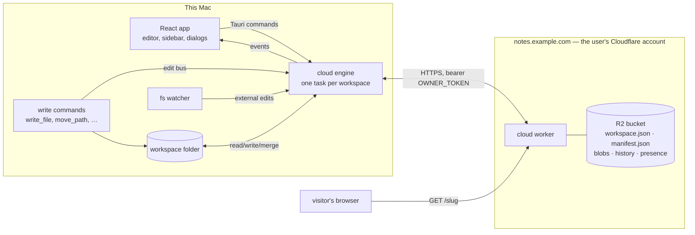

# Cloud — one domain per workspace

A workspace (the folder Doklin opens) connects to a domain of the user's own
— a Cloudflare Worker in front of an R2 bucket, on the user's account, set
up by an agent from a prompt the app writes. Connected means the whole
folder is backed up and kept in sync on every Mac that holds it, with
per-file history; publishing a note or a folder is one flag in the synced
manifest, and the worker renders the public page from the synced files on
request. This document is how it is built: the vocabulary, the invariants,
the worker, the engine, the app's surfaces, the room left for invites and
locking, and the decisions behind each. The wire contract on its own is
[cloud-worker/README.md](../cloud-worker/README.md); how to verify any of it
is `.claude/skills/verify/SKILL.md`.

## 1. The short version

- A **workspace** connects to exactly **one domain**, and a domain holds
  exactly **one workspace**. The binding is recorded in the cloud (the
  worker refuses a second workspace) and on disk (a hidden marker in the
  folder). Connecting means: the whole folder is backed up and kept in sync,
  on every machine that holds it.
- **One writer.** A single Rust engine per workspace owns every byte that
  goes to or comes from the cloud. It is fed by the app's own writes (an
  in-process edit bus), by the filesystem watcher (external tools), and by a
  poll. The frontend never speaks HTTP; it sends the engine commands and
  listens to its events.
- **Publishing is a flag, not a push.** Every file is already in the cloud,
  so "publish this page" is one record in the workspace manifest: *slug →
  file*. The worker renders public pages straight from the synced files —
  markdown, boards, properties, table widths, html renditions — with the
  same pure modules the desktop uses. Nothing is re-pushed, fingerprinted,
  or reconciled; a public page is exactly as fresh as the sync.
- **Public only.** A public page is a read-only page on your domain, with
  `noindex`, that says what the file says. There are no access codes, no
  roles, no web editor and no web comments.
- **Agent + wrangler is the only setup route.** The app mints the owner
  token, writes the prompt, the agent runs wrangler, one `ENDPOINT:` line
  comes back, the app verifies and connects. Same for updating the worker
  and for tearing it down.

---

## 2. Vocabulary

- **Workspace** — the folder Doklin opens (the sidebar's root). The unit of
  sync and of publishing. Drafts are not in a workspace.
- **Domain** — a hostname (`notes.example.com`, or a `workers.dev` address)
  serving one Cloudflare Worker in front of one R2 bucket. Called "domain"
  in the UI even when it is a subdomain. In this codebase "backend" means
  the Tauri (Rust) side of the app and nothing else.
- **Connected** — a workspace that has a domain. Connected ⇒ backed up and
  in sync. Not connected ⇒ purely local; nothing can be published.
- **Device** — one installation of Doklin (`cloud.json` mints an id and
  takes the Mac's name on first run). Several devices can hold one
  workspace.
- **Engine** — the Rust task that syncs one workspace with its domain.
- **Manifest** — the one mutable object in the bucket: every file's path,
  revision and content hash, plus the **public map**.
- **Public page** — an entry in the public map: a slug, and the file or
  folder it exposes at `https://<domain>/<slug>`.
- **Owner token** — the secret the app generates at setup and the worker
  holds as its `OWNER_TOKEN` secret. The only credential that exists today;
  invites (later, §8.1) mint per-person tokens beside it.

---

## 3. The rules

These are the invariants the code is built to keep. If a change breaks one,
the change is wrong.

1. **One domain ⇄ one workspace.** The worker's `workspace.json` is created
   with create-only semantics; a second create answers 409 and the app
   offers *join* (pull the existing workspace), never a second binding. The
   folder's hidden marker records the same pair.
2. **The engine is the only writer.** No frontend code holds the token after
   setup, no frontend code calls the worker. Publishing, history, wipe, the
   version probe — all engine commands.
3. **The manifest is the only truth about what is public.** The frontend's
   view of the public map is the engine's status event, nothing else. No
   `localStorage` registry.
4. **A public page is a rendering of synced files.** The worker never stores
   page content of its own; it reads blobs. Therefore a page can never be
   staler than the sync, and never fresher.
5. **Disk is the source of truth for content.** The engine merges, never
   clobbers; overlapping edits become a conflict copy beside the file;
   deletions go to the Trash.
6. **The API only grows; an old worker fails legibly.** One version integer,
   parsed from the worker's source at build time, probed behind auth; a
   too-old worker turns into an "update the worker" state, not an error.
7. **No accounts, no dashboard, no terminal for the user.** The app writes
   the prompt; an agent runs wrangler; the app verifies.

---

## 4. Architecture at a glance



Three parties, two contracts:

- **Engine ⇄ worker**: the sync API (manifest CAS, blobs, history, presence)
  plus three small admin routes (meta, bind, wipe). JSON over HTTPS, bearer
  auth. Written down in [cloud-worker/README.md](../cloud-worker/README.md).
- **UI ⇄ engine**: Tauri commands in, events out. Typed in one file
  (`src/cloud.ts`), mirrored by serde structs in Rust
  (`src-tauri/src/cloud/status.rs`).

The visitor's contract is just URLs (§5.3).

---

## 5. The cloud side — `cloud-worker/`

The worker is TypeScript (it imports the app's own pure modules, and vite
bundles it anyway), flattened by `scripts/bundle-worker.mjs` into one
readable file that people are asked to trust-deploy, and attached to every
release at

```
https://github.com/boat-builder/doklin/releases/latest/download/doklin-cloud-worker.js
```

### 5.1 Resources and names

One domain = one worker + one bucket + one secret, named from the domain so
two setups can never collide and a deploy can never land on a stack from
the previous design (`doklin-share-*`, which keeps serving its old links
until its owner deletes it):

| Domain | Worker | Bucket | Endpoint |
| --- | --- | --- | --- |
| `notes.example.com` (a zone on the same account) | `doklin-notes-example-com` | `doklin-notes-example-com` | `https://notes.example.com` |
| free `workers.dev`, chosen name `sherin-notes` | `doklin-sherin-notes` | `doklin-sherin-notes` | `https://doklin-sherin-notes.<account>.workers.dev` (the agent reports it) |

Secret: `OWNER_TOKEN` (32 random bytes, hex; the app mints it). R2 binding:
`DATA`. `wrangler.toml` is written verbatim into the prompt (§7.4);
`cloud-worker/wrangler.toml.example` is the same file for doing it by hand.
The naming rule is one function, `resourceName` in `src/cloudPrompts.ts`.

### 5.2 R2 layout

```
workspace.json              {id, name, createdAt, createdBy: {deviceId, deviceName}}
                            — the binding. Written once, create-only.
manifest.json               the workspace manifest (v2, §6.6) — CAS by etag
blobs/<fileId>/<hash>       immutable file content, addressed by (a prefix of) its sha256
history/<fileId>.json       deep revision archive (entries rolled out of the manifest's hist)
presence.json               {devices: {<deviceId>: {name, path?, ts}}} — TTL'd, best effort
auth/tokens/<sha256>.json   {id, name, email?, role, createdAt, lastSeenAt}   ← empty until invites exist
auth/invites/<sha256>.json  {email, role, createdAt, expiresAt}               ← empty until invites exist
```

Nothing public is stored here: public pages are *rendered* from `blobs/`.
The layout and the grammar of its ids live in `cloud-worker/src/layout.ts`.

### 5.3 API

All `/api/*` routes require `Authorization: Bearer <token>` and answer JSON.
The engine also sends `x-doklin-device: <deviceId>` (attribution: presence,
the binding's `createdBy`) and `x-doklin-client: <app version>` (for the
logs; nothing reads it). There is no CORS and no preflight — the engine is
the only caller.

```
GET    /api/meta                 {version, features, workspace: {id, name, createdAt, createdBy} | null}
                                 — liveness, the credential and "is this domain bound" in one call
POST   /api/workspace            owner; bind: body {name, deviceName?} → 201 {id, name, createdAt,
                                 createdBy, manifestEtag}; 409 {workspace} when already bound
GET    /api/workspace            {id, name, createdAt, createdBy, files, bytes}
GET    /api/poll                 {manifestEtag, presence} — the cheap 15 s poll
GET    /api/manifest[?since=e]   the manifest + x-manifest-etag (304 when unchanged)
PUT    /api/manifest             header x-base-etag required (428 without); 412 + current etag
                                 on a lost race; 400 on garbage; 426 on a newer schema; 413 past 4 MB
GET    /api/blobs/<fid>          {blobs: [{hash, size, uploaded}]} — the inventory GC diffs
GET    /api/blobs/<fid>/<hash>   the bytes (content-type as uploaded)
PUT    /api/blobs/<fid>/<hash>   store bytes (immutable: a re-PUT of a stored hash is a no-op,
                                 {existed: true}); 413 past 25 MB
DELETE /api/blobs/<fid>/<hash>   garbage-collect an unreferenced revision
GET    /api/history/<fid>        {version: 1, entries: [{r, h, s, t, b?}]}; 404 when there is none
PUT    /api/history/<fid>        replace the archive (advisory, ≤ 200 entries, ≤ 256 KB)
PUT    /api/presence             body {name?, path?} — "this device is here, editing path"
                                 (path absent or null: here, idle); needs x-doklin-device
DELETE /api/presence             this device left
POST   /api/admin/wipe           owner; body {"confirm":"wipe"} — erase everything, batched;
                                 repeat until remaining:false. Frees the domain for a new binding.
```

Not bound yet? `/api/poll`, `/api/manifest` and `/api/workspace` answer
`404 {"error":"not bound"}`. Reserved for invites (§8.1), not built:
`POST /api/auth/join`, `GET/POST/DELETE /api/auth/invites`,
`GET/DELETE /api/auth/tokens`.

Public (no auth, `GET`/`HEAD` only; anything else is a 405):

```
GET /                          the root page when the map names one (and its file exists),
                               else the landing page (the workspace's name, "Download Doklin")
GET /<slug>                    a published note: its html rendition, framed, when the workspace
                               holds <stem>.html beside it; the markdown otherwise
GET /<slug>?v=md               the markdown rendering explicitly (the MD/HTML pill)
GET /<slug>/raw                the html rendition verbatim, under Content-Security-Policy: sandbox
GET /<dirSlug>                 a published folder: every note under it, as a table of contents
GET /<dirSlug>/<rel/path>      a note inside it (markdown extension dropped, segments
                               percent-encoded, case-insensitive), its rendition at …/raw, or an
                               image / PDF / html file by its exact path (anything else 404s)
GET /og.png · /<slug>/og.png   the site's static Open Graph image
GET /robots.txt · /favicon.ico · /apple-touch-icon.png
GET /__web/<tag>/mermaid.js    the standalone mermaid module (immutable, content-tagged)
everything else                a 404 page — an unpublished path, a slug whose file is gone
```

Every page carries `<meta name="robots" content="noindex">` and the
`x-robots-tag` header.

### 5.4 Auth

- `OWNER_TOKEN` is compared by SHA-256 in constant time. Role `owner`.
- `auth/tokens/<sha256(token)>.json` — per-person tokens an invite will mint,
  role `member`. The set is empty today; the lookup exists so the invite
  feature is an addition, not a change. Members may sync and publish; only
  the owner may bind, wipe, invite, or revoke. Revocation is deleting the
  object.
- No cookies, no gate, no sessions, no rate limiter for visitors — there is
  nothing to unlock.

### 5.5 The binding

`POST /api/workspace` writes the empty manifest first and `workspace.json`
second, both with R2's create-only put (`onlyIf: {etagDoesNotMatch: "*"}`).
A bind that dies between its two writes therefore leaves a *free* domain
with an empty manifest for the next bind to adopt — never a bound domain
with no manifest. A second call gets `409 {workspace}`. That is the whole
cloud-side mapping: **a domain is bound iff `workspace.json` exists**, and
the only thing that removes it is `POST /api/admin/wipe`. `GET /api/meta`
reports the binding so the setup wizard can tell "fresh domain" from
"already holds *Notes*, created on Sherin's iMac" before doing anything.

### 5.6 Public rendering — from synced files

Five modules, each a question:

- **`workspace.ts` — what is in the synced tree.** `openWorkspace(env)` does
  one `head(manifest.json)` per request and fetches the body only when the
  etag moved past the isolate's memoized copy (the manifest is read
  tolerantly — an unknown field never breaks a page). A `Workspace` answers
  `fileAt(path)` (case-insensitively, like the disk the files live on),
  `file(fid)`, `noteAt(stem)`, `text(loc)` / `bytes(loc)` (a note over 4 MB
  is refused rather than rendered), `children(dir)` and `directNotes(dir)`
  (for tables of contents), `storeAt(dir)` (the folder's `store.jsonl` plus
  the first 16 KB of every card — one ranged get each, eight in flight — the
  way `read_store` reads it in the app) and `meta(stem)` (the
  `<stem>.meta.jsonl` sidecar).
- **`publicMap.ts` — where is this file public.** Which slug a file answers
  at, which folder page covers a path (deepest first), and `urlFor(path,
  prefer)`: inside the folder the page was reached through first, then the
  file's own slug, then the closest published folder. A note can be public
  two ways at once, on its own slug and inside a published folder; both
  answer, and the crumb on the nested one points at the folder.
- **`pages.ts` — a page from its files.** A note from its blob: comment
  markers stripped with the same `src/criticMarkup.ts` the desktop uses
  (bodies never leave the sidecar), the frontmatter split off with
  `src/store/frontmatter.ts` and shown as a properties table coloured by the
  folder's own `store.jsonl` (`rank` is never shown), each ` ```kanban ` /
  ` ```table ` fence found in the raw bytes (`storeFences`) and drawn from
  `storeAt(dir)` with `src/store/board.ts`'s `boardSnapshot` — the same
  derivation the tab and the embed use, so the three can't disagree —
  column widths from the sidecar under the app's own table identity
  (`tableSignature` + `deriveId`, pinned by both test suites), relative
  links rewritten (below), the html rendition framed by default and served
  verbatim at `…/raw` under `Content-Security-Policy: sandbox allow-scripts
  allow-popups`. A folder's table of contents (cards for a handful of notes,
  a collapsible tree past eight). Images, PDFs and html files inside a
  published folder by exact path, html and SVG sandboxed.
- **`render.ts` — the HTML.** `marked` with the app's own renderer
  overrides (`table` for the `<colgroup>`, `code` for boards and mermaid,
  `link` and `image` for the rewriting), the page chrome (`noindex`, the
  `og:*` and twitter meta, the MD/HTML pill, the "← Folder" crumb), the
  table-of-contents layouts, the mermaid hydrator (the diagram takes the
  page's palette in light and in dark, as in the app), and the stylesheet —
  ported from the desktop and inlined in every page.
- **`public.ts` — routing and the cache.** `caches.default` under the
  synthetic key `https://cache.doklin/<manifestEtag><pathname><search>`,
  filled with `ctx.waitUntil`; the cached copy is good for a day, the
  browser is told `no-cache`; 200s and 404s are cached alike, the static
  assets bypass. A manifest change gives every URL a new key, so a page is
  never served stale past one `head`; old entries age out. Steady state per
  public request: one `head`, one cache hit. `static.ts` holds the landing
  page, the 404 page, robots, the icons, the OG image (`og.ts`) and the
  mermaid module.

| Input | Where it comes from |
| --- | --- |
| Markdown | the note's blob; comment markers stripped with `criticMarkup.ts` |
| Frontmatter → properties table | split off by the worker with `store/frontmatter.ts`, coloured by the card's own `store.jsonl` |
| Boards / tables in ` ```kanban ` / ` ```table ` fences | derived on request from `storeAt(dir)` with `store/board.ts` (`boardSnapshot`); a board changing shows on the next view |
| Table column widths | the synced `<stem>.meta.jsonl`, read with `metaFile.ts` |
| Html rendition | the sibling `<stem>.html` blob, when the manifest has one |
| Folder table of contents | `children(dir)`, grouped by subfolder |
| OG image | one static PNG in the worker; `og:title` / `og:description` carry the page's words |

The pure modules the worker bundles from `src/` — `store/frontmatter.ts`,
`store/storeFile.ts`, `store/board.ts`, `store/embedConfig.ts`,
`store/rank.ts`, `metaFile.ts`, `criticMarkup.ts`, `tableWidths.ts`,
`docLinks.ts` — are exactly the ones `verify-harness/store.test.mjs`,
`metafile.test.mjs`, `tablewidths.test.mjs` and `doclinks.test.mjs` pin.
Nothing that touches Tauri or React enters the worker.

**A board reads at most 40 cards** and says how many more it holds ("N more
cards aren't shown here"). A Worker on the free plan may make 50
subrequests per request; a 200-card board would fail outright instead of
rendering.

**Slugs and paths.** A slug is `^[a-z0-9][a-z0-9-]{2,63}$`, not in
`{api, __web, raw, og.png, robots.txt, favicon.ico, apple-touch-icon.png,
join}`. Nested paths under a folder slug resolve `dir.path + "/" + rest +
".md"` (any markdown extension, case-insensitively), then the exact path
for the non-markdown files the folder holds, which serve with their content
type. A subfolder of a published folder is not a page of its own (404); its
notes are.

**Links between notes.** A relative link (`[plan](./plan.md)`) resolves
against the note's own folder (`..` may not escape the workspace). A public
target is rewritten to its public URL — inside the folder the page was
reached through first, then the target's own slug, then the closest
published folder; an unpublished target is dropped to its plain text; a
relative image becomes `` when it is reachable the same way and its alt
text otherwise; other schemes, `#anchors` and absolute paths are left
alone. A board's card links follow the same rule: a card inside a published
folder links to its nested page, a card outside any public folder is a
title, not a dead link.

**The root.** `root: true` on one entry serves it at `/`. If that entry's
file is gone from the manifest, `/` falls back to the landing page rather
than 404ing the site; the entry stays in the map until stopped (§9,
decision 7).

### 5.7 Version, update, wipe

- `cloud-worker/src/version.ts` is the one place the version lives — a
  separate file so the app's build can read the integer without bundling
  the worker (§7.1): `WORKER_VERSION` (2 — the sync API was 1; publishing
  made it 2), `WORKER_FEATURES` (`["sync", "wipe", "publish", "boards"]`; a
  feature name is a promise about behaviour, listed only once the behaviour
  exists), `MANIFEST_VERSION` (2) and `COMPATIBILITY_DATE` (the Workers
  runtime date `wrangler.toml` pins; moving it changes every new deploy's
  runtime, so it is moved on purpose).
- The engine probes `/api/meta` on start and on every poll and reports
  `workerVersion` in its status; the frontend compares with the bundled
  integer and shows the update badge. A worker that receives a manifest
  with a schema version it does not know answers `426`, which the engine
  reports as phase `worker-outdated` — the one case where sync pauses — and
  it resumes on its own the moment a newer version answers the probe.
- `POST /api/admin/wipe` is batched, owner-only, repeated until done; it is
  the erase step of teardown and the only way to free a domain.

### 5.8 Size and tests

The bundle is `marked` + the stylesheet + the store modules + the mermaid
module — about 7 MB raw and 1.4 MB gzipped, most of it mermaid, inside
Cloudflare's 3 MB compressed ceiling; `scripts/bundle-worker.mjs` prints
both numbers and fails past the ceiling. The checked-in `src/assets.ts` is
empty so the tests compile the worker without building mermaid; the bundle
script splices the module in.

`node cloud-worker/test/run.mjs` (plain node; an in-memory R2 and cache in
`test/fake-r2.mjs`; the worker compiled in-process through vite) covers
auth, meta, bind-once, the unbound 404s and the landing page, manifest CAS
(304 / 412 / 428), validation and the public map, 426 on a newer schema,
blobs, history, presence, the statics, and then loads a seed workspace
through the API (`test/seed.mjs` — a note, a note with an html rendition, a
folder, a store with cards, a card with properties, a note with tables and
widths, a note with comments, a diagram) and renders it: a note, a
rendition, a folder page and nested paths, boards / tables / a card's
properties, widths under the app's table identity, comment stripping, the
mermaid hydrator, link rewriting, the root page, the cache keyed by etag,
the landing fallback, and wipe freeing the domain last. `--bundle` runs the
same suite against the built file. `verify-harness/serve-worker.mjs` serves
the same seed over node http for `drive-public.mjs`, which walks the pages
in Chromium (§10).

---

## 6. The engine — `src-tauri/src/cloud/`

### 6.1 Responsibilities

One `Engine` task per connected workspace, owning:

1. sync (the cycle, §6.5),
2. the public map (queued ops folded into the manifest it publishes),
3. history reads and revision fetches (for the History panel),
4. presence,
5. the domain probe, and the flows that run before an engine exists (bind
   and upload, download, resume, wipe),
6. reporting: one status event that is the frontend's entire model.

And the **single-writer rule**: it is the only code that holds a token or
opens a connection to the worker.

### 6.2 Module layout

```
src-tauri/src/cloud/
  mod.rs        the manager (one engine per root), the Tauri commands, init at boot
  engine.rs     Engine<R>: the cycle, fold_public, presence, history, status
  manifest.rs   the wire types (manifest v2, the public map) + their grammar
  remote.rs     the Remote trait; HttpRemote (the real worker)
  flows.rs      bind + upload, download, wipe — generic over Remote, so the tests run them
  merge.rs      the three-way merge and conflict copies
  scan.rs       the local walk, hashing, atomic writes
  bus.rs        the edit bus (every write command → the engine)
  config.rs     cloud.json, the marker, endpoints and names
  status.rs     the status/event contract (mirrored by src/cloud.ts)
  tests.rs      the in-memory worker and the two-device matrix
```

`build.rs` parses `WORKER_VERSION` and `MANIFEST_VERSION` out of
`cloud-worker/src/version.ts` into `DOKLIN_WORKER_VERSION` /
`DOKLIN_MANIFEST_VERSION` — parsed, never mirrored.

### 6.3 Local files

`<app_data_dir>/cloud.json` — one machine-local file: the device identity
and, per connected workspace, the domain, the endpoint, the workspace id,
its name and the owner token.

```json
{
  "version": 1,
  "device": { "id": "d-7f3k…", "name": "Sherin's MacBook Pro" },
  "workspaces": [
    {
      "root": "/Users/sherin/Notes",
      "domain": "notes.example.com",
      "endpoint": "https://notes.example.com",
      "wsId": "w-9m2q…",
      "name": "Notes",
      "token": "<hex>"
    }
  ]
}
```

Rules: one entry per `root`, one per `domain`; parsed by shape (a malformed
file reads as "nothing connected"); the token lives here and nowhere else
(the Keychain is a later refinement of one file, §9).

`<root>/.doklin/cloud.json` — the marker, no secrets:

```json
{ "domain": "notes.example.com", "wsId": "w-9m2q…" }
```

It is hidden, so the tree walk, search and the sync scan ignore it. It makes
the folder self-describing: a machine that opens a folder carrying a marker
with no matching `cloud.json` entry is offered *resume* (§6.8), and a folder
that already carries a marker for domain A cannot be connected to domain B.

`<app_data_dir>/cloud/<wsId>/state.json` + `base/` — the engine's state
(last applied manifest and etag, per-file synced state, queued public ops)
and the merge bases.

### 6.4 Inputs: the edit bus, the watcher, the poll, commands

The engine wakes on four things and does one of two: a *cycle* (full
reconcile) or a *poll* (etag + presence).

1. **The edit bus.** Every write the app makes goes through a Rust command —
   `write_file`, `write_frontmatter`, `write_body`, `create_card`,
   `create_file`, `create_dir`, `move_path`, `copy_path`, `trash_file`,
   `restore_trashed` — and each ends with `edits::touched(&app, &path)`,
   which fans the hint out to the engine whose root contains the path and to
   that root's versioner ([versioning.md](versioning.md) §6.1). The engine
   keeps a dirty set and settles **1.5 s** after the last touch (autosave is
   already debounced 600 ms upstream), so an edit reaches the cloud about
   two seconds after the keystroke. Both halves filter the path the same
   way, through `scan::rel_for_touch`: a hidden segment or one of the
   engine's own temp files wakes neither.
2. **The filesystem watcher** (external editors, git, Finder): a recursive
   `notify` debouncer, settling **5 s**.
3. **The poll** — every 15 s: `GET /api/poll`; a changed etag triggers a
   cycle; presence rides along, and so does the version probe (§5.7).
4. **Commands** — `SyncNow`, `Probe`, `Touched`, `SetActivity`, `Pause`,
   `ConfirmDeletes`, `Publish` / `Unpublish` / `SetRoot`, `History` /
   `Revision`, `Shutdown`.

The dirty set is a *hint about when*, never a substitute for the scan: the
cycle still walks the whole tree and decides from content what changed
(that is what makes rename detection and external edits correct). A hint
only shortens the settle. Presence beats every 25 s — the edited path, or
idle — and leaves with `DELETE /api/presence` on shutdown.

### 6.5 The cycle

1. fetch the manifest since our etag;
2. `apply_remote` — downloads, renames, tombstoned deletions to the Trash,
   three-way merges where both sides moved, conflict copies (`Meeting notes
   (conflict — Alice, Jul 11 14.32).md`) where they overlap. Identical bytes
   on both sides are adopted as synced, never merged — which is what makes
   resume-in-place clean;
3. `scan_local` + `stage_local` — modified / new / moved / vanished, and the
   mass-delete valve: more than 30 % of the files (and at least five) gone
   at once ⇒ hold and ask (phase `pending-deletes`);
4. `build_manifest` (revisions, the inline history rolling into the archive
   past ten entries, tombstones expiring after 30 days, path dedupe) and
   `fold_public` (§6.6);
5. upload blobs (idempotent), then CAS the manifest; on a lost race, refetch
   and go again (four attempts).

Blob GC runs every twentieth cycle over revisions older than a day that
nothing references. `cargo test --lib cloud` runs all of it against the
in-memory worker in `tests.rs`, timings included (tokio's paused clock).

### 6.6 The manifest (v2) and the public map

```json
{
  "version": 2,
  "name": "Notes",
  "seq": 812,
  "files": {
    "f-3kq8…": { "path": "Projects/plan.md", "rev": 7, "hash": "9c1e…", "size": 4310,
                  "mtime": 1757000000000, "by": "Sherin's MacBook Pro",
                  "hist": [ { "r": 6, "h": "…", "s": 4211, "t": …, "b": "…" } ] }
  },
  "tombstones": { "f-old…": { "path": "Scratch.md", "rev": 3, "ts": …, "by": "…" } },
  "public": {
    "k7m2p9qx": { "kind": "file", "file": "f-3kq8…", "path": "Projects/plan.md",
                  "by": "Sherin's MacBook Pro", "at": 1757000000000 },
    "roadmap":  { "kind": "dir",  "path": "Projects/Roadmap", "title": "Roadmap",
                  "desc": "What we're building this quarter", "by": "…", "at": … },
    "home":     { "kind": "file", "file": "f-77a1…", "path": "Home.md", "root": true, "by": "…", "at": … }
  }
}
```

- Keyed by **slug**. A file entry references the **fileId** (so a rename
  carries the page for free) and keeps a `path` snapshot (so a deleted-and-
  recreated file at the same path can be re-bound). A folder entry is keyed
  by path (`""` is the workspace root); a folder rename is re-pointed by the
  engine when every file it held moved to one new prefix in one cycle.
- `root: true` on at most one entry makes it the page at `/`.
- **Publishing offline** works: the engine queues `public_ops` in its state
  and folds them into the next won CAS. `fold_public` has three passes —
  re-point renamed paths, re-bind dead entries, apply pending ops — plus the
  folder re-point.
- **A public entry outlives its file** (§9, decision 7): a deleted file's
  page 404s while the file is gone, comes back if the file does (restore
  from Trash, `git checkout`), and the Published list shows the entry as
  *file missing* with a *Stop* button. Stopping is explicit.
- **Slugs**: eight random characters from the unambiguous alphabet
  (`abcdefghjkmnpqrstuvwxyz23456789`) by default; a custom slug is
  validated locally and checked for uniqueness against the manifest —
  instantly, no network. Publishing a page again with a new slug re-keys it.
  Two devices racing the same custom slug resolve like path dedupe: the
  loser's entry gets a suffix and its device is told.
- The worker validates the map on `PUT` (slug grammar, reserved words,
  well-formed references — a file id and a relative path — titles and
  descriptions within their caps, and at most one root) so a corrupted
  device can never publish garbage. References are checked for shape, not
  existence: an entry outlives its file by design, and a folder entry may
  cover a folder that is empty right now.

### 6.7 Commands and events — the frontend contract

Commands (`src/cloud.ts` wraps each in a typed function; `mod.rs` implements
them):

```
cloud_status()                                    -> CloudStatus[]      one per connected workspace
cloud_mint_token()                                -> token              32 random bytes, hex, for the setup prompt
cloud_probe(endpoint, token)                      -> CloudProbe         {workerVersion, bundledVersion, features, workspace|null}
cloud_marker(root)                                -> CloudMarker|null   the folder's hidden marker
cloud_token(root)                                 -> {endpoint, token}  behind "Connect another Mac…"; never in a status
cloud_check_worker(root)                                                "Check again": an EngineCmd::Probe
cloud_connect(root, endpoint, token, name)        -> wsId               bind + initial upload (progress events)
cloud_join(endpoint, token, destParent)           -> root               download into a fresh folder
cloud_resume(root, endpoint, token)               -> wsId               marker matches: adopt this folder in place
cloud_disconnect(root)                                                  forget locally; files stay; cloud stays
cloud_sync_now(root) · cloud_pause(root, paused) · cloud_confirm_deletes(root)
cloud_set_activity(path | null)                                         presence ("editing Projects/plan.md")
cloud_publish(path, {slug?, title?, desc?})       -> slug               file or folder (decided by the path); queued op
cloud_unpublish(root, slug) · cloud_set_root(root, slug | null)        slugs are per domain, so the root comes first
cloud_history(path)                               -> CloudRevision[]    manifest tail + archive
cloud_revision(path, hash)                        -> string             one revision's text
cloud_wipe(root)                                  -> purged             owner; disconnects once the bucket is empty
```

Events:

```
cloud-status          CloudStatus[] (the whole model, on every change — a disconnect is an array without that workspace)
cloud-applied         {root, paths}       sync wrote these files — refresh the tree, reload open tabs
cloud-conflict        {root, path, by, conflictPath}
cloud-pending-deletes {root, count, total, paths}
cloud-progress        {root, kind: "upload"|"download", done, total}
```

`CloudStatus`:

```ts
type CloudStatus = {
  root: string; domain: string; endpoint: string; wsId: string; name: string;
  phase: "idle" | "syncing" | "offline" | "paused" | "pending-deletes"
       | "revoked" | "worker-outdated" | "error";
  lastSyncMs: number | null; error: string | null; pendingDeletes: number;
  workerVersion: number | null;                 // what /api/meta last reported
  public: { slug: string; kind: "file" | "dir"; path: string; title: string | null;
            desc: string | null; by: string; at: number; alive: boolean; root: boolean }[];
  presence: { deviceId: string; name: string; path: string | null; ts: number }[];
};
```

`public` is the map as the engine believes it — the manifest plus this
Mac's not-yet-synced ops — sorted folders first, then by path; `alive` is
false when the file is gone, or when no synced file lives under a folder
page. The frontend keeps the array in state and derives everything from it:
the sidebar's cloud dot and "Alice is editing" chips, the published dots on
files and folders, the Publish pill's state for the active document, the
Published pages list, the update badge, the pending-deletes prompt.

### 6.8 Flows

**Connect** (first machine):

```mermaid
sequenceDiagram
  participant U as User
  participant A as App (wizard)
  participant E as Engine
  participant W as Worker
  U->>A: Cloud… → Connect a domain; types notes.example.com
  A->>A: mint OWNER_TOKEN; build the setup prompt (§7.4)
  U->>U: runs the prompt in an agent; the agent deploys; prints ENDPOINT
  U->>A: pastes the endpoint
  A->>E: cloud_probe(endpoint, token)
  E->>W: GET /api/meta
  W-->>E: {version, workspace: null}
  E-->>A: fresh domain, worker v2
  U->>A: Connect & upload (N files)
  A->>E: cloud_connect(root, endpoint, token, name)
  E->>W: POST /api/workspace {name}
  W-->>E: 201 {id, manifestEtag}
  E->>W: PUT blobs… ; PUT /api/manifest (x-base-etag)
  E->>E: write cloud.json + <root>/.doklin/cloud.json; spawn the engine
  E-->>A: cloud-progress…, cloud-status(idle)
```

**Already bound** — the probe returns `workspace: {name, createdBy, …}` and
the wizard says so: *"notes.example.com already holds **Notes** (created on
Sherin's iMac, 12 days ago)."* The choices are **Download it here** (join
into a chosen parent folder — the second-Mac flow) or, when the open folder
carries a marker with that `wsId`, **Resume syncing this folder**. There is
no "bind anyway".

**Join** (second machine): endpoint + token → `cloud_join` downloads the
manifest and blobs into `<parent>/<name>` (four in flight, progress
events), writes the marker and `cloud.json`, spawns the engine, and the app
opens the folder as a workspace.

**Resume in place** — the marker's `wsId` matches; the engine starts with
empty state, so every local file reads as new and every remote file as new:
`stage_local` adopts a remote fileId for a path that exists in the
manifest, identical bytes are adopted as synced, and the merge machinery
owns any content difference on the next cycle. This is the recovery path
for "reinstalled Doklin" and "restored the folder from a backup".

**Disconnect** — stop the engine, drop the `cloud.json` entry and the
engine state; the folder and the marker stay (so resume is one click), the
cloud stays.

**Teardown** — `cloud_wipe` erases the bucket through the worker (which
frees the domain) and disconnects the workspace, marker included, so no
engine can re-upload into the freed domain; the panel then shows the
teardown prompt (`wrangler delete`, `r2 bucket delete`).

**Token rotation** — not built. When it is needed: `secret put
OWNER_TOKEN` via a prompt, then the new token pasted into the Cloud panel.

### 6.9 History

`cloud_history(path)` and `cloud_revision(path, hash)` read the manifest's
inline tail, the archive and the blob from inside the engine (it already
holds the manifest; the archive and the blob are one request each).
`HistoryPanel.tsx` lists the revisions and has two exits: restore in place,
or save as a new document.

---

## 7. The app

### 7.1 What the frontend holds

- `src/cloud.ts` — the types of §6.7, one `invoke` wrapper per command, the
  listeners, `BUNDLED_WORKER_VERSION` and `WORKER_COMPATIBILITY_DATE` from
  `virtual:cloud-worker-version` (a build-time virtual module in
  `vite.config.ts` that reads both out of `cloud-worker/src/version.ts` —
  parsed, never mirrored, and nothing of the worker rides in the app), and
  the pure derivations the surfaces share: the phase line, `workerBehind`,
  the slug grammar and reserved words, `pageUrl` / `nestedUrl`,
  `pageForPath`, `folderCovering`, `placesOf` (every address a file answers
  at), `publishedByPath`, `suggestSlug`. No `fetch` anywhere.
- `App.tsx` — a `cloudStatuses` state fed by `cloud-status`, a
  `cloudForWorkspace` memo, listeners for the five events, the dialogs'
  open-states, `stopPublishing` (with the toast's Undo re-publishing under
  the same slug, title and description), and the wiring below.
- `src/cloudPrompts.ts` — the three agent prompts and the naming rule, as
  pure functions of the target, the token, the version and the
  compatibility date (§7.4).

### 7.2 Surfaces

| Surface | Where | What it does |
| --- | --- | --- |
| **Cloud panel** (`CloudPanel.tsx`) | gear → *Cloud…*, and the dot beside the workspace name in the sidebar header | Not connected: *Connect a domain…* and *Open a workspace from a domain…*. Connected: the domain, the phase line ("Synced 2 min ago" / offline / paused / revoked / "this Mac's changes are waiting on the worker update"), who else is here, a held mass-deletion waiting for a word, *Sync now*, *Pause*, *Published pages (N)…*, *Update the worker…* (with the version it runs against this app's), *Connect another Mac…* (the endpoint and the owner token), *Disconnect this Mac* (confirmed inline), and the danger zone: *Delete everything on notes.example.com…* — the domain typed back, wipe, then the teardown prompt |
| **Setup wizard** (`CloudSetup.tsx`) | the panel's two entrances | Name the workspace; a domain of your own or a free workers.dev name (`doklin-<name>`); the setup prompt, copied with the token in it; paste the endpoint the agent printed (a workers.dev address is only known once wrangler prints it); the probe decides between *Connect & upload*, *Download it here* and *Resume syncing this folder*; the marker's `wsId` is what makes *Resume* appear |
| **Worker update** (`WorkerUpdate.tsx`) | the panel, and the gear's badge | One card (`v1 → v2`), one prompt with no secret that deploys over the same name, *Check again* — which sends the engine a probe; a `worker-outdated` pause resumes on it |
| **Publish pill** (`PublishMenu.tsx`) | the tab bar, for a note inside the workspace | *Publish* / *Published*. Not connected: one line and the door to the wizard. Connected: publish at a random or chosen address (a bad slug refused in place); once published, the link, *Copy* / *Open*, the address — editable, the engine re-keys the page — "Published by Alice · 3 days ago" when someone else did it, a quiet line while local edits are still on their way ("your latest changes appear once synced"), the nested address when the note is also inside a published folder, *Stop publishing* (confirmed inline), *All published pages…* |
| **Publish folder** (`PublishFolder.tsx`) | the sidebar's folder menu (*Publish folder…*, or *Publish the whole workspace…* on the root; *Edit publishing…* once published) | How many notes become public, the slug (suggested from the folder's name), a public title and a description, a preview of the address scheme; *Save changes* and *Stop publishing* on a published folder. No membership list: publishing a folder publishes every note in it (§9, decision 4) |
| **Published pages** (`PublishedPages.tsx`) | the Cloud panel, the popover | Folders above files; name · path · slug · by · when; *Home page* and *file missing* / *empty folder* badges; *Copy link*, *Open*, *Edit…* (folders), *Use as home page* / *Unset as home page*, *Stop* (confirmed inline); a live note opens in a tab |
| **Sidebar** (`Sidebar.tsx`) | rows and menus | The cloud dot in the header, presence chips on the rows people are editing, a published dot on files and folders with a page of their own; *Version history…*; *Copy public link*, *Stop publishing* (immediate, undoable from the toast) |
| **History panel** (`HistoryPanel.tsx`) | the sidebar's file menu | The revisions from the engine; restore in place, or save as a new document |
| **Toasts** (`CloudToasts.tsx`) | anywhere | `cloud-conflict` → *Open the copy*; `cloud-pending-deletes` → *Review…* (the panel); `cloud-applied` → the tree refreshes (open tabs reload through the file watcher) |

### 7.3 Gating

- The Publish pill renders only for a file tab inside the open workspace —
  not a draft, not a board tab, not a missing file, not a file opened from
  outside the workspace. When the workspace is not connected, the pill
  opens a one-line explanation with *Connect a domain…*.
- *Publish folder…* and *Stop publishing* appear only in a connected
  workspace; so does *Version history…*.
- The gear's badge lights for an app update or a worker behind the bundled
  version — one signal — and the *Cloud…* item carries a dot for the same
  reason.

### 7.4 The agent prompts

Three prompts, one skeleton: the goal in a sentence, fetch the artifact,
establish credentials, verify identity before mutating, the config file
verbatim, deploy with the failure named, verify and print one line back,
and the negative scope at the end. Setup carries the token — its copy point
says so; update and teardown carry no secret.
`verify-harness/cloudprompts.test.mjs` checks all three leave the agent
nothing to invent.

**Setup** (`buildSetupPrompt`): *one Worker in front of one R2 bucket,
serving Doklin's cloud for the workspace "Notes" at `notes.example.com`* (or
*at a free workers.dev address — the worker is named `doklin-<name>`, so it
will answer at …*). Then:

1. `mkdir doklin-cloud && cd doklin-cloud && curl -fsSL <release URL> -o
   doklin-cloud-worker.js` — and, should the download 404, clone the repo
   and `node scripts/bundle-worker.mjs`.
2. `npx -y wrangler@4 whoami`; if not logged in, `wrangler login` and *ask
   me to finish the sign-in in the browser*; note the account id.
3. Verify the names are free: `wrangler deployments list --name
   doklin-notes-example-com` must fail, `wrangler r2 bucket list` must not
   show the bucket. *If either exists, stop and ask me — a same-name deploy
   silently replaces the existing worker and a shared bucket serves two
   sites.*
4. `wrangler.toml`, verbatim, the account id the only fill-in:
   ```toml
   name = "doklin-notes-example-com"
   main = "doklin-cloud-worker.js"
   compatibility_date = "2025-05-05"
   account_id = "<from whoami>"
   workers_dev = false
   routes = [{ pattern = "notes.example.com", custom_domain = true }]
   [[r2_buckets]]
   binding = "DATA"
   bucket_name = "doklin-notes-example-com"
   ```
   (`workers_dev = true` and no `routes` for the free address.)
5. `wrangler r2 bucket create …` — with the pause for an account that has
   never enabled R2.
6. `wrangler secret put OWNER_TOKEN` with the token on the next line.
7. `wrangler deploy` — with the custom-domain pause (*if deploy says the
   zone isn't on this account, ask me to add the domain to Cloudflare and
   point the nameservers at it*) and the TLS-minute caveat.
8. Verify: `curl` `<endpoint>/api/meta` with the bearer must answer 200 with
   `"workspace": null` and a version at least the bundled one; on a custom
   domain, retry for up to five minutes while the certificate is issued.
9. Print exactly `ENDPOINT: https://…`. *Do not commit `wrangler.toml`
   anywhere; do not create or modify any other Cloudflare resources.*

**Update** (`buildUpdatePrompt`, no secret): fetch the bundle, `whoami`,
confirm the worker's name before touching anything (certain for a
workers.dev address — it is the hostname's first label; a convention to
verify for a custom domain — and never a name the agent invented), the
config verbatim, `deploy` over the same name (a "created" message or a
fresh URL means a second worker appeared: delete it and go back), verify
that `/api/meta` now answers `401` (the new worker is up and asking for the
token the agent doesn't have; the app checks the version itself), print
`UPDATED: <endpoint>`.

**Teardown** (`buildTeardownPrompt`, no secret; run only after the app's
wipe emptied the bucket): `whoami`, confirm the names, `wrangler delete
--name …`, `wrangler r2 bucket delete …` (*if it refuses because the bucket
isn't empty, STOP — never force it*), verify the endpoint no longer answers
200, print `TORN DOWN: <endpoint>`.

---

## 8. Room to grow

Neither feature is built; both are shaped for.

### 8.1 Invites — email + code

- The owner mints an invite in the Cloud panel: an email and a code the app
  generates (`amber-canyon-lantern-42`). The worker stores
  `auth/invites/<sha256(email + code)>.json` `{email, role: "member",
  expiresAt}`. The owner shares the code however they like — no email is
  sent, no web page is involved.
- The invitee installs Doklin, chooses *Open a workspace from a domain…*,
  and enters the domain, their email and the code. `POST /api/auth/join`
  {email, code, device} → a per-person token stored hashed under
  `auth/tokens/`, role `member`. The app then runs the **join** flow of
  §6.8 exactly as the owner's second Mac does; `cloud.json` gets the same
  shape of entry with that token.
- Revocation = deleting the token record (the engine reports `revoked` on
  its next request). Members sync and publish; the owner alone binds,
  wipes, invites, revokes.
- What is already there for it: the token lookup in `authenticate` beside
  the owner secret, the `by` attribution on every revision, the join flow
  as an engine command, and a `cloud.json` entry that does not care which
  kind of token it holds.

### 8.2 Locking — leases on files

- A *lease* is a presence entry with a `lock`: `{deviceId, name, path,
  until}`. The engine acquires one when a document gains editing focus (it
  already reports activity per path), renews it on each presence beat, and
  drops it on blur/close. A lease that stops being renewed expires.
- Other devices see `lockedBy` on that path in `cloud-status`; the editor
  opens read-only with a banner ("Alice is editing — view only") and a
  *Take over* that waits for the lease to lapse or breaks a stale one. The
  three-way merge stays as the fallback for the window a lease can't cover.
- What is already there for it: presence keyed by device with a path and a
  timestamp, the activity command on focus, and a status event the editor
  can gate on. The lease table is either a field in `presence.json` or its
  own `locks.json` — a worker-side detail.

---

## 9. Decisions, and what was rejected

1. **Keep the sync algorithm, replace its edges.** The previous design's
   engine — manifest CAS + content-addressed blobs + three-way text merge —
   was ported, not rewritten, and its two-device test matrix came with it.
   Rejected: a from-scratch engine (nothing about that shape is wrong for
   plain files); CRDTs / Yjs (markdown on disk must stay the truth, and a
   CRDT would make every external editor a second-class writer); per-file
   objects without a manifest (loses atomic multi-file commits, cheap
   rename tracking and history for free).
2. **The worker renders from synced files; the app pushes nothing.**
   Rejected: a page-push pipeline (it needs a registry of what was pushed
   where, and a reconcile pass to keep the copies agreeing); pre-rendering
   at manifest commit (needs dependency tracking from boards to pages —
   on-demand render + a manifest-keyed cache is correct by construction and
   cheap at this scale).
3. **The public map lives in the manifest.** Rejected: a separate
   `public.json` (two CAS'd objects that must agree, and publishing offline
   would need its own queue anyway).
4. **Publishing a folder publishes every note in it, at nested URLs.**
   Rejected: an explicit membership list (a second registry to keep, and
   not what "publish this folder" means anywhere else). The dialog says
   plainly what will be public. Individual notes can still be published on
   their own.
5. **Agent + wrangler only.** Rejected: a dashboard paste (the route that
   would have embedded the worker in the app), a terminal script.
6. **New resource names (`doklin-<domain>`), a new secret name
   (`OWNER_TOKEN`), a new binding (`DATA`), the version counter restarted
   at 1.** So a deploy can never land on a stack from the previous design,
   and an old app can never mistake a new worker for its own.
7. **A public entry outlives its file** (404 while missing, re-bind on
   recreate, stop is explicit) — because delete-and-recreate is what
   external tools do and what "restore from Trash" means. The one softening:
   the domain root falls back to the landing page while the root page's
   file is gone, rather than 404ing the site.
8. **The owner token is the only credential for now**, stored in
   `cloud.json`. Rejected for now: minting per-device tokens at connect
   (that is the invite feature's job, §8.1), the Keychain (a later
   refinement of one file, not a design question).
9. **Static OG image.** Rejected: rendering one in the worker (no canvas
   there) or in the engine (it would be the one thing the engine pushes
   that isn't a file). `og:title` carries the words that matter.
10. **Html renditions and the entity meta sidecar are files** — they sync,
    the worker serves and reads them. Web comments and their merge pool are
    gone with the web sessions; the desktop's comment threads stay in the
    sidecar and never leave it.
11. **The marker file is hidden and secret-free.** Rejected: no marker (a
    folder restored from a backup would have no idea what it was); a marker
    with the token (a copied folder must not carry a credential).
12. **The engine's full scan stays the arbiter; the edit bus only decides
    when.** Rejected: trusting hints (a hint can't see external edits or
    renames).
13. **Custom slugs from the first cut** — they cost nothing once uniqueness
    is a manifest check.
14. **The landing page at `/` when no root page is set** is the workspace's
    name and a *Download Doklin* button; there is no site-branding config.
15. **Images, PDFs and html files inside a published folder serve by exact
    path** — one `blob()`, and it makes pictures in notes work. Anything
    else under a folder 404s.
16. **A board reads at most 40 cards on a public page.** The free plan's
    50-subrequest budget would fail a large board outright; a counted
    remainder is the honest rendering.
17. **Members (once invites exist) may publish**, Notion-style; only the
    owner administers.

---

## 10. Verifying it

`.claude/skills/verify/SKILL.md` has the full list with what each suite
walks. The cloud's own checks:

```sh
pnpm typecheck:worker                      # the worker against the Workers runtime types
pnpm test:worker                           # cloud-worker/test/run.mjs — every route + the renderer (23 cases)
pnpm bundle:worker                         # the release file, size printed, fails past 3 MB gzipped
node cloud-worker/test/run.mjs --bundle cloud-worker/dist/doklin-cloud-worker.js
cd src-tauri && cargo test --lib cloud     # the engine against the in-memory worker (38 tests)
node verify-harness/cloudprompts.test.mjs  # the three prompts (112 checks)
node verify-harness/drive-cloud.mjs        # the app's cloud and publishing surfaces over a scripted engine (29 steps)
node verify-harness/serve-worker.mjs &     # the bundled worker over the seed, on :8787
node verify-harness/drive-public.mjs       # the public pages in Chromium, JavaScript off for the board (8 steps)
```

The one thing a Linux runner cannot do is the real thing: the wizard
against a deployed worker, an edit reaching the bucket, a second Mac
joining. That is a manual pass on macOS with `pnpm tauri dev`.

---

## 11. Where it came from

The previous cloud grew by accretion — a way to share one file became a way
to share a folder, then a place visitors could comment and edit, then a
private sync target, then a thing several domains could be at once — until
"what is published where" lived in four places, the cloud had two write
paths, and the worker embedded the whole editor. The rewrite kept the sync
algorithm and replaced everything around it, in five pull-request-sized
steps on one branch: the demolition, the worker, the engine, the
connect / update / teardown surfaces, and publishing. The design document
that planned it, with the reasoning for each choice and an as-built note
per step, is in the git history as `docs/cloud-redesign.md`; this file is
that document settled into how it is.
