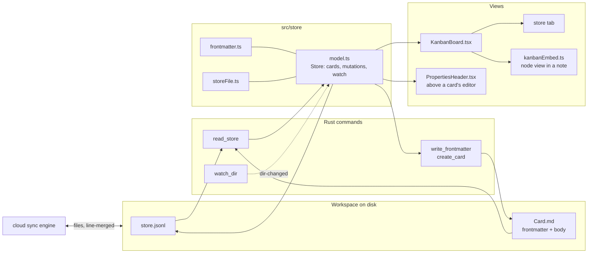

# Datastores & kanban boards — design

Doklin's founding promise is "files stay as plain `.md` on disk — no lock-in".
A kanban board is the first feature whose data is not prose, so the question
this document answers is: **where does structured data live so that it stays
plain files, syncs and merges like everything else, and can be looked at as a
board today and as a table tomorrow?**

The short version:

- A **datastore** is a folder. It holds one **card per markdown file**, and a
  small definition file (`store.jsonl`) that names the fields, the select
  options (= the board's columns), and the saved views.
- A card's properties are **YAML-style frontmatter** at the top of its note.
  The note body is the card's page — an ordinary Doklin document with
  everything that already works for notes: the editor, comments, links,
  search, sync, history, sharing.
- A **view** is how a store is shown. The only view for now is **kanban**: it
  opens as its own tab from the sidebar, and it can be **embedded in any note**
  with a ` ```kanban ` fenced block that names the store — the same trick the
  ` ```mermaid ` block plays for diagrams.
- Nothing binary, nothing that needs the app to read: every file is text that
  a person can open in vim, Obsidian, or GitHub, and that cloud sync merges
  line by line.

Everything below is the reasoning, the exact formats, how it threads through
the existing code, what changes on the Rust side, and a phased plan.

## Goals and non-goals

Goals:

- Notion's board, with Notion's separation of *data* from *view*, on plain
  files.
- Zero new lock-in: a store must be readable and editable without Doklin.
- Fit the machinery that exists — sync's three-way text merge, per-file
  history, the share worker, the entity meta sidecar, the tab/draft model —
  rather than build a parallel world.
- One data model that a table, list, or calendar view can be added to later
  without touching the files on disk.

Non-goals (for now):

- Relations between stores, rollups, formulas.
- Boards inside html renditions or PDF exports.
- Views other than kanban (the design leaves room; the plan doesn't build them).

## The choice: what is a datastore on disk?

The candidates were the ones you listed — a Parquet file, a JSON file, a text
file, markdown (inline or a separate file) — plus the one the codebase itself
suggests (JSON Lines, like `<stem>.meta.jsonl`). Four properties of Doklin
decide it:

1. **Cloud sync merges files as text, line by line.** `sync.rs`'s
   `merge_texts` runs `diffy::merge(base, ours, theirs)`; anything that isn't
   valid UTF-8 is a conflict on the spot, and a conflicting text file becomes
   a `<stem> (conflict — Alice, Sep 2 14.32).<ext>` copy next to the original.
   Sync tracks *every* non-hidden file under 25 MB, no extension filter.
2. **The editor is markdown-first.** A card that has a "page" — a body you
   write in — is only free if that body is a `.md` file the existing editor
   opens.
3. **The app already has a precedent for non-prose state:** the entity meta
   file is JSONL with one sorted record per line, fixed key order, tolerant
   parsing, and unknown records preserved verbatim — chosen exactly so two
   devices converge on the same bytes and concurrent additions merge cleanly
   (`src/metaFile.ts`, header comment).
4. **"No lock-in" is a product feature**, not a nicety.

| Format | Sync merge | Card has a page? | Readable without Doklin | Verdict |
| --- | --- | --- | --- | --- |
| Parquet | binary → every concurrent edit is a whole-file conflict; needs a Rust/WASM reader; no history diff | no | no | rejected |
| One JSON file | one line or a nested tree — both collapse to whole-file conflicts; key-order churn | body escaped inside JSON | barely | rejected |
| CSV | one record per line merges; but no nesting, and multi-line bodies fight the quoting rules | no | in a spreadsheet, yes | export format later, not storage |
| One JSONL per store | one card per line merges; *but* a conflict duplicates the **whole board**, and bodies are JSON-escaped strings the editor can't open | escaped | mostly | runner-up (see below) |
| Inline in the note (` ```kanban ` block holding all the cards) | the board's data is one region of prose; concurrent card moves conflict within the note | no | yes | rejected as *storage*, kept as the *embed* syntax |
| **Folder of markdown cards + `store.jsonl`** | one file per card: concurrent moves of different cards merge trivially, a real conflict duplicates one card, not the board | **yes — it's a note** | yes, in any editor; Obsidian reads the same frontmatter | **chosen** |

The folder wins on every axis that matters here, and it wins a fifth one for
free: a card is a note, so links to it (`[the bug](./Projects/Fix login.md)`),
workspace search, comment threads, version history, sharing, the Trash, and
"Reveal in Finder" all already work.

**Why not the one-JSONL-per-store runner-up.** It is the better shape for a
store whose rows have *no* page — a plain list of things with properties. Its
failure mode under sync is the deal-breaker for a board: two people touching
the same card line produce `Projects.store (conflict — Alice, …).jsonl`, a
second copy of the entire board that the app would then have to explain. With
a folder the same event produces `Fix login (conflict — Alice, …).md`, which
simply appears on the board as a second, clearly labelled card — the existing
conflict story, at card granularity. The `Store` interface below is written so
a JSONL-backed store *kind* could be added later without touching the views;
it is deliberately not built now.

**On "inline markdown needs special parsers".** It does — the app would have
to own a block of the note's prose and keep Milkdown from normalising it. The
folder design needs exactly one parser, for frontmatter, and frontmatter is
the de-facto standard other tools already agree on. It is also a parser the
app needs anyway: today a note that starts with a `---` frontmatter block is
not understood by the editor at all — it reads the block as ordinary
markdown (a rule, paragraphs, and a setext heading under the closing fence)
and re-serializes it in its own style. Fixing that is step one of this plan
and useful on its own.

## Vocabulary

| Term | Meaning | Notion's word |
| --- | --- | --- |
| **Datastore** (store) | a folder containing `store.jsonl` and any number of card notes | database |
| **Card** | one `.md` file directly inside a store folder; its frontmatter holds the properties, its body is the card's page | database page |
| **Field** | a named, typed property every card may carry (`status: select`, `due: date`, …), declared in `store.jsonl` | property |
| **Option** | one allowed value of a `select` / `multi_select` field; for the group-by field of a board, one option = one column | select option |
| **View** | a saved way of showing a store — for now always `kanban` with a `groupBy` field | view |
| **Board** | the kanban view, as the user sees it: a tab, or an embed inside a note | board view |
| **Embed** | a ` ```kanban ` block in a note that shows a view of a store | linked database |

User-facing, the whole thing is called a **board** in phase 1 ("New board…",
a board icon in the sidebar). "Datastore" is the name of the concept in code
and in this document; it becomes a user-facing word only once a second view
exists and "board" stops being the whole story.

## On disk

```
notes/
  Roadmap.md                       ← a note; embeds the board with a ```kanban block
  Projects/                        ← the datastore: a folder with a definition file
    store.jsonl                    ← fields, options (= columns), views
    Fix login redirect.md          ← one card = one note with frontmatter
    Ship dark mode.md
    Write onboarding docs.md
    Ship dark mode.meta.jsonl      ← a card's comment threads, exactly as for any note
```

### A card

`Projects/Fix login redirect.md`:

```markdown
---
status: In progress
tags: [bug, auth]
due: 2026-09-12
rank: a1
---
Repro: sign in from a deep link, land on the home page instead.

- [ ] find where the redirect is dropped
- [ ] add a test
```

- **The title is the file name** (`Fix login redirect`), the same rule notes
  already follow in the sidebar and tab bar. Spaces are fine — file names
  hold them, and Doklin's notes already do; what a name can't hold is `/`
  and `:`, which the board's title input turns into a dash (Obsidian's rule
  for note names). Renaming a card renames the file through the existing
  `move_path`, and sync's rename detection carries it. Two cards can't share
  a title inside one store; the app uniquifies (`Title 2`) the way
  `uniquePastePath` already does for pastes.
- **Properties are frontmatter keys** whose names are field ids from
  `store.jsonl`. Keys the store doesn't declare are kept verbatim and never
  written differently — a file that came from Obsidian keeps its
  `aliases:` line.
- **`rank`** is the card's position inside its column: a fractional-index
  string (`a0` < `a0V` < `a1` …) so that moving one card rewrites exactly
  one line in one file. Cards without a rank sort after the ranked ones, by
  title. (Storing an ordered list of cards in `store.jsonl` instead would
  make every drag a write to one shared line — the one thing that makes two
  people's concurrent drags conflict.)
- **The body is ordinary markdown.** The editor never sees the frontmatter
  (see *The frontmatter boundary* below), so it can't mangle it, and a
  properties-only change leaves the body byte-identical — the same
  discipline `tcols` follows for table widths.

### The frontmatter dialect

Full YAML is a large dependency and a large attack surface for a format that
here only ever holds flat properties. The app reads and writes a strict,
documented subset, and passes through what it doesn't understand:

```
---
key: value                # a string (quotes optional; "…" or '…' with escapes when needed)
number: 3                 # number
flag: true                # boolean
when: 2026-09-12          # date (ISO, written as-is)
list: [a, b, "c d"]       # list of strings (flow style)
also:                     # list of strings (block style, accepted on read)
  - a
  - b
empty:                    # null
---
```

- A file has a frontmatter block only if its very first line is exactly
  `---` and a closing `---` line follows — the rule every other tool uses.
- Lines that don't parse (nested maps, multi-line scalars, anything else)
  are kept as **opaque lines**, re-emitted in place, untouched. The app never
  turns a file it can't fully read into a file it broke.
- The serializer is canonical: declared fields in the store's field order,
  then unknown keys alphabetically, then opaque lines as they were; lists
  are written flow-style. Equal state ⇒ equal bytes on every device, which
  is what keeps a concurrent rewrite from conflicting (the `metaFile.ts`
  argument, applied to a different file).
- Lives in `src/store/frontmatter.ts` as pure functions
  (`parseFrontmatter(text) → { props, opaque, body }` and
  `serializeFrontmatter(props, opaque, fieldOrder)`), unit-tested the way
  `metafile.test.mjs` tests the meta file.

### The store definition — `store.jsonl`

`Projects/store.jsonl`:

```jsonl
{"doklin":"store","v":1,"name":"Projects"}
{"t":"field","id":"status","name":"Status","type":"select"}
{"t":"field","id":"tags","name":"Tags","type":"multi_select"}
{"t":"field","id":"due","name":"Due","type":"date"}
{"t":"option","field":"status","name":"Backlog","rank":"a0"}
{"t":"option","field":"status","name":"In progress","rank":"a1","color":"blue"}
{"t":"option","field":"status","name":"Done","rank":"a2","color":"green"}
{"t":"option","field":"tags","name":"auth","rank":"a0"}
{"t":"option","field":"tags","name":"bug","rank":"a1","color":"red"}
{"t":"view","id":"board","kind":"kanban","name":"Board","groupBy":"status"}
```

Same shape and same rules as the entity meta file, for the same reason:

- **A header line** (`{"doklin":"store","v":1,"name":…}`) is what makes a
  folder a store — not the file name alone. It also gives two otherwise
  identical fresh stores different bytes, which matters because sync's
  rename detection pairs vanished and appeared files by content hash.
- **One record per line**, so concurrent edits to *different* records merge.
  Options are their own records rather than an array inside the field —
  two people adding a column at the same time then merge instead of
  conflicting.
- **Sorted by `(t, field, id|name)` with a fixed key order**, so equal state
  serializes to equal bytes.
- **Tolerant parse**: skip malformed lines, first duplicate wins, unknown
  record types survive a rewrite as foreign records.
- **Column order is option order** (`rank`, same fractional index as cards);
  a column's colour is the option's `color`. Renaming an option rewrites the
  value in every card that uses it — honest and visible (N small writes,
  one per card), and the price of storing human-readable values instead of
  opaque ids in the frontmatter. Deleting an option deletes no data: the
  cards keep their value and appear in the trailing "unknown value" column
  described below.
- **Views** hold what is view-specific: `groupBy`, later `hide`, `filter`,
  `sort`, `show` (which fields the card face shows). A store can have
  several; the embed and the sidebar tab pick one by `id`.

Field types in phase 1: `select`, `multi_select`, `text`, `number`, `date`,
`checkbox`. The group-by field of a kanban view must be a `select`.

Why not a directory-level *hidden* file (`.doklin-store.json`)? Hidden names
are excluded by `is_hidden_or_ignored`, which both the sidebar walk and the
sync scan apply — a hidden definition would never sync. Why `.jsonl` and not
`.json`? For the merge argument above; a pretty-printed JSON object merges
acceptably most of the time and badly at the worst time.

## How it shows up

### 1. The board tab (sidebar)

`list_md_tree`'s `Dir` node grows a `store: bool` flag (a `store.jsonl` with
the header exists directly inside) and, for such a folder, returns **no
children**: a board is one row in the sidebar, drawn with a board icon, with
no disclosure triangle. A board can hold hundreds of cards and the tree is
not the place to list them — they are reached from the board itself, from
search, and from links. Leaving them out also keeps a big board from eating
the tree's 5000-entry budget. `store.jsonl` itself joins `is_app_sidecar`
and is never listed, like `.meta.jsonl`. The **Show all files** mode, whose
job is to show the real filesystem, lists the cards as ordinary openable
notes.

Because a card has no row of its own, the sidebar highlights the **board
row** as active while a card's tab is focused, and the row is a **drop
target**: dragging notes onto it moves them into the folder, which makes
them cards (with no status until someone gives them one) — the quickest way
to promote existing notes onto a board. The inline *New File…* is not
offered inside a board; cards are created from the board.

A new **tab kind** `store` (today `TabKind` is `"draft" | "file"`) keyed on
the folder path renders `<KanbanBoard>` instead of the editor, with the app's
document machinery (autosave, watcher, comments, share) standing down the
way it does for an html-only document. Session restore treats it like any
tab; a folder that vanished becomes a ghost tab.

Context menu: **New board…** on a folder or empty space creates
`<Name>/store.jsonl` with the default field set (`status` with
Backlog / In progress / Done) and opens it. **Turn into board** on an
existing folder of notes adds the definition file; every note becomes a
card with no status. Neither touches any existing file's content.

### 2. The embed — a ` ```kanban ` block in a note

````markdown
# Roadmap

Where things stand this quarter:

```kanban
store: ./Projects
```
````

Optional keys, same `key: value` dialect as frontmatter: `view: <id>` (a
saved view; default the store's first kanban view), `group: <field>` and
`hide: [Done]` (override the view for this embed only). The path resolves
relative to the note through `linkTargetPath` in `src/docLinks.ts`, exactly
as a link between notes does — so an unsaved draft can't embed a relative
store and says so in place.

Why a fenced block: it is the one construct every markdown tool agrees to
leave alone. GitHub, Obsidian, `marked` on a published page all show it as a
small code block that says what it is; nothing is mangled, nothing pretends
to be prose. It is also the precedent the app already has — mermaid diagrams
ride a ` ```mermaid ` fence.

Unlike mermaid it is **not** rendered through Crepe's code-block preview
hook: that panel is sanitized `innerHTML`, fine for an SVG, wrong for a
component with drag-and-drop and inputs. Instead, `src/kanbanEmbed.ts`
registers its own block node:

- a `$remark` transform (the pattern `criticRemark` uses) rewrites a `code`
  mdast node with `lang === "kanban"` into a `kanbanEmbed` node at parse
  time and back into a `code` node at serialize time — so the code block
  schema never sees it and the markdown round-trips byte-for-byte;
- a `$nodeSchema` for `kanbanEmbed` (attrs: the raw config text), an atom;
- a `$view` node view (the mechanism `resizableTableView` uses) that mounts
  a React root with `<KanbanBoard>` inside a `contenteditable=false` frame,
  answers `stopEvent` for everything inside it and `ignoreMutation` always,
  so ProseMirror neither eats the board's pointer events nor re-parses its
  DOM;
- a **Source** chip on the frame, like the diagram's, flips the block to a
  small editor for the config text; leaving it flips back. The block is
  selectable as a node, so Backspace deletes it and Crepe's block handle
  drags it. Dragging is allowed to start only from the frame's bar: a node
  ProseMirror marks `draggable` will otherwise begin a native HTML5 drag
  from anywhere inside it, and that drag swallows the pointer events the
  board's own card drag is built on.
- a **Board** item in the slash menu's *advanced* group next to *Diagram*.
  It inserts an embed with an empty config, and the frame asks which board
  in place — the workspace's boards, or a new one beside this note — rather
  than opening a modal to ask first.

### 3. The card page — a properties header

A card opened in a tab is the ordinary editor for its body, with a
**properties header** above it: the title, then one pill per declared field
(a select popover, a tag picker, a date, a checkbox, plain text). Changing a
pill writes the frontmatter and nothing else. In phase 1 the header shows
only inside stores; for any other note frontmatter is preserved untouched
but not shown. ("Properties on any page" is then a small follow-up: the same
header, with an *Add property* affordance.)

### The frontmatter boundary

The rule that keeps the editor honest: **Milkdown never sees frontmatter.**
Like `expandMarkdown` / `extractMarkdown` for comment bodies, the split
happens at the IO boundary in `App.tsx`:

- **load** — `parseFrontmatter(disk)` → `propsRef` (+ opaque lines) and the
  body, which is what `expandMarkdown` and the editor get;
- **save** — `writeToDisk` prepends `serializeFrontmatter(propsRef, …)` to
  the extracted body. `lastSavedRef` compares bodies, so a properties-only
  change from elsewhere never looks like a body edit.

Two writers can touch a card: its tab (body, and pills in the header) and
any board showing it (a drag changes `status` and `rank`). Both go through
the backend's snapshot-guarded write, so the losing write fails with the
existing `conflict` error rather than clobbering. What is new is that a
**properties-only** external change resolves itself instead of surfacing:
when the tab's `file-externally-changed` handler (or a failed guarded write)
finds the disk body equal to the body it last saved, it adopts the disk
properties into `propsRef`, refreshes the header, takes the new snapshot,
and leaves the editor alone — the same shape as the meta-only refresh that
swaps comment bodies without touching the caret. Only a body change from
outside still goes through the reload / conflict path it goes through today.

The board never writes a body: `write_frontmatter` (below) splices a new
header onto whatever body is on disk *at that moment*, under the same
snapshot guard, so a drag can't lose a keystroke that an open tab hasn't
flushed yet.

## The kanban view

`src/KanbanBoard.tsx`, one component for both hosts:

- **Columns** are the group-by field's options in rank order, plus two
  synthetic ones: **No status** (cards whose field is empty; dropping a card
  here clears the field) at the front, and one trailing column per value
  that isn't a declared option (a typo, a value written in another tool),
  each offering *Add as option*. Columns can be empty and stay — they are
  options, not derived from data.
- **Cards** show the title and a chip per non-empty field the view lists
  (all of them, by default). Click opens the card's note in a tab; in an
  embed, the tab opens beside the note the way a followed link does.
- **Drag** is pointer-based, like the sidebar's row drag (Tauri intercepts
  HTML5 drag events; `Sidebar.tsx` explains). Dropping writes one card's
  `status` + `rank`. Column headers drag to reorder (rewrites option ranks
  in `store.jsonl`).
- **Add card** at a column's foot: inline title → `create_card` with the
  column's value and a rank after the column's last card. **Add column**
  after the last one; column header menu: rename, colour, delete (cards
  keep their value; see above), hide (a view setting).
- **Read-only** boards (a published page's shell, the unfocused split pane's
  mirror) render the same DOM with drag and inputs off, like `readOnly` on
  the editor.
- Themed from the `--app-*` tokens in `App.css`, all four themes; option
  colours are a small named palette mapped per theme, never raw hex in the
  files.

## Data flow and code layout



- `src/store/frontmatter.ts` — the dialect; pure.
- `src/store/storeFile.ts` — `store.jsonl` parse / canonical serialize;
  pure; mirrors `metaFile.ts`.
- `src/store/rank.ts` — fractional indexing (`between(a, b)`), pure.
- `src/store/model.ts` — the `Store` object: `load()`, `cards`, `fields`,
  `views`, mutations (`setProp`, `moveCard`, `createCard`, `renameCard`,
  `addOption`, `renameOption`, `reorderOptions`, …), a `subscribe()`, and a
  **registry keyed by folder path** so a board tab and an embed of the same
  store in one window share one instance and one watcher. Every mutation is
  a disk write followed by the watcher's rescan; the model is a cache of
  disk, not a second truth — the posture tabs already take.
- `src/KanbanBoard.tsx`, `src/PropertiesHeader.tsx`, `src/kanbanEmbed.ts`.
- `App.tsx`: the `store` tab kind, the frontmatter boundary in
  `loadActiveContent` / `writeToDisk`, the properties-only branch of the
  external-change handler, `followDocLink` accepting a store folder, the
  sidebar wiring, and `store.jsonl` in the companion lists that the trash /
  rename / paste flows already keep for sidecars.

### Backend (Rust) additions

| Command | Does |
| --- | --- |
| `read_store(path)` | one round-trip for a whole board: `store.jsonl` raw text plus, for every direct-child `.md`, its name, snapshot, and the **frontmatter block only** (first few KB, fences located by line scan — Rust never parses the dialect). Hundreds of cards are one IPC call. |
| `write_frontmatter(path, head, expected)` | replaces the file's leading frontmatter block (or inserts one) keeping the body bytes identical, under the same `expected` snapshot guard as `write_file`; same `conflict` error. |
| `create_card(path, head)` | new file with a frontmatter block and empty body; refuses to clobber (`create_file`'s rule). |
| `watch_dir(path)` / `unwatch_dir` | a recursive, debounced `notify` watcher on the store folder emitting `dir-changed {root, paths}`; the model rescans through `read_store`. (The existing `watch_file` is one non-recursive watcher for the active document; a board needs the folder.) |
| `list_md_tree` | `Dir` gains `store: bool`; `is_app_sidecar` gains `store.jsonl`. |

Frontmatter *parsing* lives only in TypeScript; Rust finds fences and splices
bytes. One implementation of the dialect, one test suite.

## Sync, history, conflicts

Nothing in the sync engine changes; the design is shaped to it:

- Every card and `store.jsonl` is an ordinary synced file with its own
  revision history (restorable from the History panel like any note) and a
  `hist` entry in the manifest.
- Concurrent moves of *different* cards are edits to different files: no
  merge at all. Concurrent edits to one card's *different* lines (a status
  change on one device, body typing on another) three-way-merge line-wise.
  Concurrent edits to the *same* line (two people move the same card) make
  a `(conflict — …)` copy that shows up on the board as a second card with
  that suffix, resolved like any conflict copy: keep one, trash the other.
- `store.jsonl` merges line-wise, so concurrent column additions merge; a
  true collision on one option line yields `store (conflict — …).jsonl`,
  which the board surfaces in its header ("this board's definition has a
  conflict copy") rather than hiding — the same wart the meta sidecar has
  today, made visible instead of leaving a greyed file in "show all files".
- Limits worth knowing: the workspace-wide 5000-entry and 4 MB-manifest caps
  count every card as one file. A thousand-card board is fine; a workspace
  is not the place for a ticketing system's history.

## Sharing and publishing (phase 3)

A published note that embeds a board shows the board. The worker renders
markdown with `marked` and knows nothing about the workspace, so the board's
data **travels with the page**, the way `tcols` do:

- `readShareParts` collects, for each ` ```kanban ` block in the page, a
  **snapshot** of the view: `{fence, name, columns: [{name, color, cards:
  [{title, chips, page?}], more?}]}`; `pushPage` sends it as a `boards`
  field beside `tcols`; the worker validates it record by record and stores
  it on the page. The fences are found by scanning the file's bytes
  (`kanbanFences`) — a push has no parsed document — and each snapshot is
  keyed by the fence's own config text, so it keeps finding its fence when
  the document around it moves.
- The public page renders the snapshot **server-side as static HTML** in
  place of the fence (a `marked` `code` renderer override, beside the
  table-width `table` one) — no JavaScript needed, honest in light and dark,
  and identical for a visitor with scripting off. Card titles link to their
  pages when the card is part of the same folder share (`page` is the member
  page id the share registry already knows), and are plain text otherwise.
  A fence with no snapshot — an older page, or a board deleted since — keeps
  the code block it has always been: the fence stays, nothing is rewritten.
- The app shell (comment / edit roles) gets the same snapshot in its boot
  payload and draws it with `BoardSnapshot.tsx`, inside the same embed frame
  the desktop uses. It is deliberately not `<KanbanBoard>` with a flag:
  KanbanBoard is built on the store model and writes files, and there is
  nothing here to write to. Editing a board from the web is out of scope —
  the web editor can only write the page's own markdown.
- A shared *card* page renders its properties as a small table above the
  body. That needs the frontmatter as its own field, not just a nicer
  render: `marked` reads a `---` block followed by text as a **setext
  heading**, so a web edit could round-trip a card's fields into
  `## status: Done`. The push splits the block off the markdown — exactly as
  the editor splits it off the document — and sends the readable pairs as
  `props`, named and coloured by the card's own board. `pullWebEdit` was
  already putting the block back from disk, so a web edit now returns only a
  body, which is all it ever saw.

Every autosave of the note re-pushes the page already. A board change that
doesn't touch the note is caught twice: the store's watcher fires
`onStoreChanged`, and the registry remembers which pages read which folders
(`ShareEntry.boardDirs`), so the embedding notes are scheduled without
scanning anything; and because the snapshot is fingerprinted alongside the
markdown, reconciliation re-derives it for any page that carried a fence and
pushes when it differs — which catches a card that arrived by sync while the
board was closed.

Worth saying plainly: sharing a note that embeds a board **publishes what
the board says**, whether or not the board's folder is part of any share.
That is the point of the feature, and it is the same bargain a table in the
note makes.

## Edge cases, decided

- **A card whose `status` isn't an option** → its own trailing column with
  *Add as option*. Never silently normalised.
- **A card in a subfolder of the store** → not a card (direct children
  only); the sidebar still shows the subfolder. Nested stores are allowed
  and independent.
- **Deleting a card** → the Trash, with its `.meta.jsonl`, like a note.
  **Deleting a store folder** → the Trash; open board tabs go ghost.
- **A store's `store.jsonl` disappears** (deleted in another tool) → the
  folder is a folder again; the board tab goes ghost; the cards are intact
  notes with frontmatter.
- **A note embeds a store that doesn't exist** → the block renders a quiet
  card ("no board at ./Projects — create it?") with the same posture as an
  unparsed diagram: the fence stays, nothing is rewritten.
- **A draft embeds `./Projects`** → "save this note first" — the draft has
  no folder to resolve against, exactly as with links.
- **Frontmatter the dialect can't read** → opaque lines, preserved; the
  properties header shows the fields it can, and a small "n lines this app
  doesn't edit" note.
- **Renaming an option used by 300 cards** → 300 guarded writes, batched in
  one backend command later if it ever feels slow; each is a one-line
  change, so sync and history stay legible.
- **Two boards of one store in one window** → one model instance; the
  drag lands in both.
- **Search** → cards are notes: workspace search already finds their
  bodies (and their frontmatter lines, which is fine). A card opened from a
  search hit or a link is a tab like any note; the sidebar marks its board
  row.
- **Html rendition / PDF** → the fence shows as its config text. Out of
  scope, documented. (A *published* page is different: it draws the board,
  because the push sends one.)
- **A shared page** → the shell mounts the same editor with no host behind
  it, and draws the board from the snapshot the page was published with
  (read-only: there is no folder here to write to). A page published before
  phase 3, or one whose fence names a board that was already gone, still
  draws the frame and says the board isn't available. Either way a comment-
  or edit-role save re-serializes the document and the fence comes back out
  unchanged.

## Plan

**Phase 1 — a board from a folder. Built.**
`frontmatter.ts` + boundary in `App.tsx` (every note preserves frontmatter
from this point on; cards get the properties header); `storeFile.ts`,
`rank.ts`, `model.ts`; the four Rust commands and the tree flag; the sidebar
row, *New Board…*, *Turn into Board*; `KanbanBoard.tsx` with drag, add card,
columns; the `store` tab kind; companion handling on trash / rename / paste.
Verification: `verify-harness/store.test.mjs` for the dialect, the store file,
and rank; `verify-harness/drive-kanban.mjs`, 36 steps in Chromium booting
the real `<App/>` over an in-memory fs stub, walking open board → drag
between columns → add card → add column → open card → change a pill → type
→ reload;
`cargo test --lib store` for the fence splice and `--lib tree_tests` for the
one-row board.

Three things the build settled that the design left implicit:

- **A board tab never splits.** It has no second rendition to show beside
  itself and none of the split's document machinery applies, so `⌘⇧\` is off
  for one.
- **Deleting a folder closes the board tabs inside it**, and undo reopens them
  as boards (the restore asks disk whether a restored path carries a
  definition file). Cards need nothing new: a card is a note, so the existing
  sidecar handling on trash / rename / paste already covers it, and a store
  folder moves whole.
- **Renaming a card from the board** goes through a plain prompt rather than
  an inline field — the one rough edge left in phase 1. Renaming from the
  sidebar (in *Show all files*) or from the tab is unchanged.

**Phase 2 — boards inside notes. Built.**
`kanbanEmbed.ts` (the remark transform, the node schema, the node view) and
`KanbanEmbed.tsx` (the frame: the Source chip, the store picker, and what to
say when there is no board at the end of the path); `store/embedConfig.ts`
for the config dialect and the fence text; the slash menu's *Board* item;
embed-level `group` / `hide` in `KanbanBoard`. Verification:
`verify-harness/store.test.mjs` covers the config and the fence,
`verify-harness/doclinks.test.mjs` the relative path the picker writes, and
`verify-harness/drive-kanban-embed.mjs` walks 37 steps in Chromium over the
real editor — the fence rendering as a board, a card composed inside it
never reaching ProseMirror, a drag writing one card and not the note, an
ordinary edit re-serializing the note with the fence byte-identical, the
Source chip, ⌫ and undo, the slash menu and its picker, and a split pane's
board going read-only. `drive-web.mjs` covers the shared page, where the
frame says the board isn't available and an edit-role save still keeps the
fence byte for byte.

Four things the build settled that the design left implicit:

- **The frame's bar is the block's handle.** ProseMirror marks a draggable
  node's DOM `draggable=true`, and a native HTML5 drag started anywhere
  inside the frame swallows the pointer events the board's own drag is built
  on — the same interception that made the sidebar's row drag pointer-based.
  So the node view cancels `dragstart` everywhere except the bar, where a
  drag moves the whole embed and a click selects the block for ⌫.
- **The picker is in the block, not in a modal.** `/board` inserts an embed
  with an empty config; the frame then lists the workspace's boards and
  offers a new one beside the note. Picking writes `store: ./Projects` —
  relative, through the same `docLinks` rules a link between notes follows
  (`relativeLinkPath` is the new inverse of `linkTargetPath`).
- **The embed shows the store's name, not a heading.** A board tab's title is
  an `<h1>` because the board is the page; inside a note the same line is a
  plain `<div>`, so it never joins the document's outline.
- **A shared page draws the frame and says so.** The web shell mounts the
  same editor with no host, so the embed renders as a frame naming the store
  with its config below it. That keeps the one property that matters on the
  web — a comment- or edit-role save re-serializes the whole document, and
  the fence has to come back out unchanged.

**Phase 3 — boards on published pages. Built.**
`store/board.ts` (the pure derivation, split out of `model.ts`, plus the
snapshot it freezes into) and `store/publish.ts` (reading a workspace to
build one); `boards` and `props` on `ShareParts` and on the page record;
the worker's sanitizers, its `code` renderer override and the board's page
CSS; `BoardSnapshot.tsx` for the shell; `kanbanFences` for finding the
fences in a file's bytes. Verification: `verify-harness/store.test.mjs`
covers the fence scan and the snapshot (2178 checks);
`share-worker/test/run.mjs` covers the wire contract and both renderers (47
tests); `drive-kanban-embed.mjs` walks the reading half against the stubbed
filesystem; `drive-web.mjs` drives the shell's board, the static page with
JavaScript **off**, and a shared card's properties.

Five things the build settled that the design left implicit:

- **A snapshot is keyed by the fence's own text, not by its position.** The
  design said "keyed on the fence's position", which breaks the moment a
  paragraph is added above. The config text is the natural key: two embeds
  writing the same config show the same board and share one snapshot, and an
  embed that narrows the view (`group:`, `hide:`) writes different config
  and gets its own. Both sides normalize line endings and trailing
  whitespace before matching (`fenceKeyOf` here, `fenceKey` in the worker).
- **The push splits frontmatter off the markdown.** The design asked for a
  properties table on a shared card page; the reason it has to be a separate
  field rather than a nicer render of the block is that `marked` reads
  `---` / `status: Done` / `---` as a setext heading — so an edit-role save
  used to round-trip a card's fields into `## status: Done`. Splitting the
  block off before the push (exactly as the editor splits it off the
  document) is what makes that impossible, and `pullWebEdit` already put the
  block back from disk. The published markdown is the body; the block
  travels as `props`.
- **One derivation, in a pure module.** `boardColumns` and `cardChips` moved
  out of `KanbanBoard.tsx` into `store/board.ts`, so the board tab, a note's
  embed and the published snapshot all read the same columns and a published
  board can't quietly disagree with the board it was published from. It also
  puts the whole derivation in the fast unit suite.
- **What a published board leaves out.** An empty column that an option
  DECLARES still shows — it is part of the board's shape. An empty "No
  status" column, or an empty column for a value nothing declares, doesn't:
  those exist on the desktop so you can drag into them, and nobody drags on
  a published page. Cards beyond 200 in a column are counted (`+12 more`),
  never silently dropped; the same goes for 60 columns and 20 boards.
- **Staleness is caught twice.** The store's watcher tells the app that a
  board changed (`onStoreChanged`), and the registry remembers which pages
  read which folders (`ShareEntry.boardDirs`), so a drag in a board tab
  re-pushes the notes that embed it without scanning anything. That only
  covers boards this app is watching, so the pushed snapshot is also
  fingerprinted: reconciliation re-derives it for pages that carried a fence
  and pushes when it differs, which catches a card that arrived by sync
  while the board was closed.

One thing publishing a note now does that is worth saying out loud: **a
board embedded in a shared note is published with it.** The card titles and
chips go out with the page, whether or not the board's own folder is part of
any share. That is the feature — a note that shows a board should show it —
but it means "share this note" is also "share what this board says", the
same way it is for a table in the note.

**Phase 4 — the second view, and properties everywhere.**
A `table` view over the same store (one fenced language per view, as
`kanban` is), per-view `filter` / `sort` / `show` and a saved `hide` (the
embed-level one shipped in phase 2), the properties header with *Add
property* on any note, group-by `multi_select` and `date`, a card *peek*
panel instead of a tab, CSV export of a store. Two gaps phases 1–3 leave
behind belong here too: there is no way to add a FIELD from the app (only
options on a field), and nothing creates or switches views, so a second
view can only be written by hand.

## Decisions

Three choices were open in the first draft; all three are settled.

1. **Title = file name.** It is what notes do, it keeps links and search
   working, and a rename is one `move_path`. Spaces are fine — the worry
   that a file name can't hold them doesn't apply; Doklin's notes already
   do — and `/` and `:` become a dash on creation. No `title:` property, so
   no second identity to keep in step.
2. **`store.jsonl` is the definition file**: one per board, inside the
   board's folder, never shown in the sidebar. It holds what isn't any one
   card's business — the list of fields, the columns (as select options,
   with their order and colour), and the saved views. It exists so that an
   empty column persists, a column has a colour, and the board knows which
   field to group by; none of that can live in a card file. The only
   question was its name: a fixed name, with the header line as the real
   marker, wins over a suffix-named file (`Projects.store.jsonl`) that
   would drift whenever the folder is renamed in another tool.
3. **The board row hides its cards.** A board with hundreds of tasks would
   make the tree noise. The row opens the board; cards are reached from the
   board, search, and links, and *Show all files* still lists them.
