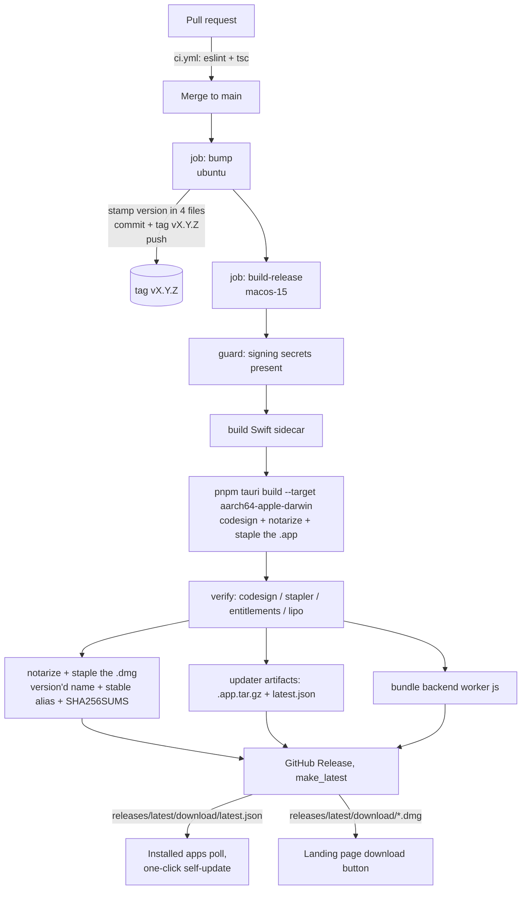

# Release pipeline — build, sign, notarize, publish, auto-update

How a commit on `main` becomes a signed, notarized, downloadable app that
existing installs update themselves to. Written from Doklin's actual pipeline
(`.github/workflows/release.yml`), but structured so it can be lifted into any
future Tauri desktop app — the per-app knobs are collected in
[Reusing this for a new app](#8-reusing-this-for-a-new-app).

**Scope: macOS, Apple Silicon.** That's what Doklin ships and what this pipeline
builds — the Rust backend has macOS-only call sites (grep `macOS-only`) and the
dictation sidecar is Swift/Metal.

---

## 1. The shape of it



Two workflows, no more:

| Workflow | Trigger | Runner | Job |
| --- | --- | --- | --- |
| [`ci.yml`](../.github/workflows/ci.yml) | `pull_request` | `ubuntu-latest`, 10 min | `pnpm lint` (eslint `react-hooks/rules-of-hooks`) + `pnpm exec tsc --noEmit` |
| [`release.yml`](../.github/workflows/release.yml) | push to `main`, or `workflow_dispatch` | `ubuntu-latest` → `macos-15`, 360 min | `bump` then `build-release` |

Rust is deliberately **not** built in the PR gate — it would dominate CI time
and the release build covers it. The PR gate exists for what a compile can't
catch: a hook-order bug shipped in v0.1.24 and made the app unbootable for four
releases, which is why eslint is a merge blocker.

**Every push to `main` cuts a release.** There is no manual "publish" step and
no release branch.

---

## 2. Storage: where the bits actually land

The "storage" for built artifacts is the **GitHub Release for the tag**, marked
`make_latest`. That gives permanently stable URLs under
`releases/latest/download/…`, which is what everything downstream points at —
no S3/R2 bucket, no CDN config, no credentials for consumers.

Every release carries six assets, staged in `release-assets/` (never `dist/` —
that's Vite's frontend output, and publishing `dist/*` would sweep `index.html`
and the web assets into the release; see commit `4d8f2e8`):

| Asset | Purpose | Consumer |
| --- | --- | --- |
| `Doklin-<version>-macos-arm64.dmg` | The versioned installer, notarized + stapled | Humans, archival |
| `Doklin-macos-arm64.dmg` | Byte-identical alias, copied **after** stapling | `releases/latest/download/…` — the landing page's download button (`DEFAULT_DOWNLOAD_URL` in `share-worker/src/index.js`) |
| `SHA256SUMS` | Checksums for both DMGs | Verification |
| `Doklin.app.tar.gz` | The signed bundle the updater swaps in | `tauri-plugin-updater` |
| `latest.json` | Update manifest: version, notes, pub_date, per-platform `{signature, url}` | The updater endpoint in `tauri.conf.json` |
| `doklin-worker.js` | One-file backend worker build (`scripts/bundle-worker.mjs`) | Setup/update instructions — an agent or person deploys a backend without cloning or building |

Note the `.sig` file is **not** published: its contents are inlined into
`latest.json` as the `signature` field.

Because the alias names are version-less, the share worker's landing page and
the app's own setup instructions hardcode `releases/latest/download/…` and never
need updating per release. The flip side: **renaming an alias breaks the
deployed worker until it's redeployed** (this bit us when
`Doklin-macos-universal.dmg` became `Doklin-macos-arm64.dmg`).

---

## 3. Job 1 — `bump`: version, commit, tag

Runs on `ubuntu-latest`. Owns versioning entirely; nothing is versioned by hand.

1. **Checkout `ref: main`** (the branch head, *not* the triggering SHA) with
   `fetch-depth: 0` so all tags are visible.
2. **Compute the next version.** Patch-bump the latest `v*` tag by default. If
   `src-tauri/tauri.conf.json` carries a version *higher* than the latest tag
   (compared with `sort -V`), that file version wins verbatim — that's how you
   cut a minor or major: raise it in your feature commit. First-ever release
   ships the committed version as-is. If the computed tag already exists, the
   job fails loudly rather than clobbering.
3. **Stamp the version into four places** — `package.json`,
   `src-tauri/tauri.conf.json`, `src-tauri/Cargo.toml`, and the `doklin` entry
   in `src-tauri/Cargo.lock`. It uses `sed`/`awk` (first match only) rather than
   `jq` so JSON formatting stays untouched, then asserts all of them agree.
   `Cargo.lock` matters: a stale lock version makes the build dirty the lock and
   drift from the tag.
4. **Commit `chore: release vX.Y.Z [skip ci]`, tag, push** both in one
   `git push origin HEAD:main refs/tags/vX.Y.Z`.

Two structural decisions worth carrying forward:

- **The release builds in the same run, not in a separate `on: push: tags`
  workflow.** GitHub never fires workflows from pushes made with `GITHUB_TOKEN`,
  so an on-tag workflow would simply never run. (The `[skip ci]` is
  belt-and-braces; the token rule is what actually prevents a bump loop.)
- **`concurrency: {group: release-main, cancel-in-progress: false}`** serializes
  runs. A second push during a release waits, then checks out the *just-bumped*
  head, so its bump lands on top and the push is never non-fast-forward.

Requires `permissions: contents: write` at the workflow level.

---

## 4. Job 2 — `build-release`: the macOS build

`runs-on: macos-15` — arm64 runner, Xcode 16.x. `macos-14`'s default Xcode is
too old for the sidecar's Swift dependencies (mlx-swift, WhisperKit 1.x).
`timeout-minutes: 360` is GitHub's hard per-job ceiling, chosen because Apple's
notarization queue is the one unbounded wait in the pipeline.

### 4.1 Fail fast on missing secrets

The very first step checks all eight secrets are non-empty and exits with
`::error::` listing what's missing. **There is no unsigned fallback** — a
missing secret must not silently produce a build that Gatekeeper rejects on
users' machines. Doing it before checkout means the failure costs seconds, not
the ~20 minutes a full build would.

### 4.2 Toolchain and caches

```
actions/checkout@v5           ref: <the tag from bump>   # the exact stamped commit
dtolnay/rust-toolchain@stable targets: aarch64-apple-darwin
Swatinem/rust-cache@v2        workspaces: src-tauri
pnpm/action-setup@v4          version: 10
actions/setup-node@v5         node-version: 22, cache: pnpm
pnpm install --frozen-lockfile
```

Then the **Swift sidecar cache**, which is the interesting one:

```yaml
key: stt-${{ xcode-version }}-${{ hashFiles('src-tauri/stt-helper/Package.resolved') }}
restore-keys: stt-${{ xcode-version }}-
path: src-tauri/stt-helper/.xcbuild
```

Cold-compiling MLX's C++/Metal core plus WhisperKit and swift-transformers is
~10 minutes; with DerivedData restored and `Package.resolved` unchanged,
`xcodebuild` is a near-no-op. **The Xcode version is part of the key on
purpose** — DerivedData reused across toolchains invites module-cache
corruption. `restore-keys` still lets a dependency bump start from the previous
DerivedData and rebuild only what changed.

### 4.3 Build the sidecar before Tauri

`./scripts/build-stt.sh Release` must run before `tauri build`: `tauri-build`
fails fast if an `externalBin` file is missing. The script stages
`src-tauri/binaries/doklin-stt-aarch64-apple-darwin` (Tauri's `externalBin`
target-triple naming — the bundler strips the triple inside the `.app`) plus the
SPM `.bundle` resources holding the Metal kernels.

It uses `xcodebuild`, not `swift build`, because SwiftPM's CLI can't compile
Metal shaders and MLX dies at runtime with "Failed to load the default
metallib". It also guards `lipo -archs == arm64`.

*(Generic lesson: any sidecar, helper binary, or native resource has to be
produced and staged as a pre-step, and it will be signed as part of the app —
so its entitlements matter.)*

### 4.4 Build, sign, notarize — one command

```yaml
- run: pnpm tauri build --target aarch64-apple-darwin
  env:
    APPLE_CERTIFICATE:          ${{ secrets.MACOS_CERTIFICATE }}       # base64 .p12
    APPLE_CERTIFICATE_PASSWORD: ${{ secrets.MACOS_CERTIFICATE_PWD }}
    APPLE_SIGNING_IDENTITY:     ${{ secrets.MACOS_SIGNING_IDENTITY }}  # "Developer ID Application: … (TEAMID)"
    APPLE_ID:                   ${{ secrets.APPLE_ID }}
    APPLE_PASSWORD:             ${{ secrets.APPLE_PASSWORD }}          # app-specific password
    APPLE_TEAM_ID:              ${{ secrets.APPLE_TEAM_ID }}
    TAURI_SIGNING_PRIVATE_KEY:          ${{ secrets.TAURI_SIGNING_PRIVATE_KEY }}
    TAURI_SIGNING_PRIVATE_KEY_PASSWORD: ${{ secrets.TAURI_SIGNING_PRIVATE_KEY_PASSWORD }}
```

Tauri's bundler does the whole Apple story from those env vars, with no
keychain scripting on our side:

1. imports the `.p12` into an **ephemeral keychain** it creates and destroys
   (this is why no `KEYCHAIN_PWD` secret is needed);
2. `codesign`s the app and every nested binary with the **hardened runtime** and
   the entitlements from `bundle.macOS.entitlements`;
3. `notarytool submit --wait` on the `.app`, using APPLE_ID / APPLE_PASSWORD /
   APPLE_TEAM_ID;
4. `stapler staple`s the ticket onto the `.app`;
5. builds and signs the `.dmg`;
6. because `createUpdaterArtifacts: true`, also produces `Doklin.app.tar.gz` and
   signs it with `TAURI_SIGNING_PRIVATE_KEY`, emitting a `.sig`.

`beforeBuildCommand: pnpm build` (= `tsc && vite build`) runs the frontend build
inside this same command.

### 4.5 Verify — don't trust, check

Tauri can silently skip notarization if an env var isn't recognized, and the
result looks like a successful build. So:

```sh
codesign --verify --deep --strict --verbose=2 "$APP"
xcrun stapler validate "$APP"
codesign -d --entitlements - "$APP/Contents/MacOS/doklin-stt" | grep -q "device.audio-input"
for bin in "$APP"/Contents/MacOS/*; do [ "$(lipo -archs "$bin")" = arm64 ] || fail; done
```

The entitlement check exists because under the hardened runtime a sidecar
missing `com.apple.security.device.audio-input` fails microphone capture
*silently*. The `lipo` loop enforces the arm64-only invariant — an x86_64 slice
sneaking back would double build time unnoticed.

### 4.6 Notarize the DMG too

Tauri only notarizes the `.app`. A downloaded `.dmg` should also pass Gatekeeper
offline, so CI submits and staples the disk image itself:

```sh
mkdir -p release-assets
DMG="release-assets/Doklin-${VERSION}-macos-arm64.dmg"
cp src-tauri/target/aarch64-apple-darwin/release/bundle/dmg/*.dmg "$DMG"
xcrun notarytool submit "$DMG" --wait --apple-id … --password … --team-id …
xcrun stapler staple "$DMG"
cp "$DMG" release-assets/Doklin-macos-arm64.dmg     # alias AFTER stapling
(cd release-assets && shasum -a 256 *.dmg > SHA256SUMS)
```

Order matters: the alias is copied after stapling so both files carry the
ticket.

### 4.7 Updater manifest

The `.app.tar.gz` from the build is copied as-is; its `.sig` contents go into a
hand-built `latest.json`:

```json
{
  "version": "0.1.60",
  "notes": "Automatic update to Doklin v0.1.60. …",
  "pub_date": "<UTC ISO8601>",
  "platforms": {
    "darwin-aarch64": { "signature": "<contents of .sig>", "url": "https://github.com/…/releases/download/v0.1.60/Doklin.app.tar.gz" }
  }
}
```

The `url` is pinned to the **tag**, not to `latest` — the manifest is fetched
from `latest`, but the payload it names is immutable. Only `darwin-aarch64` is
listed; Intel installs of old universal builds simply stop seeing updates
(accepted trade-off).

### 4.8 Publish

```yaml
uses: softprops/action-gh-release@v2
with:
  tag_name: ${{ needs.bump.outputs.tag }}
  files: release-assets/*
  make_latest: 'true'
  generate_release_notes: true
  fail_on_unmatched_files: true
```

`fail_on_unmatched_files` turns a staging mistake into a red build instead of a
half-empty release.

---

## 5. The auto-update loop

```
tauri.conf.json  plugins.updater.endpoints = [ …/releases/latest/download/latest.json ]
                 plugins.updater.pubkey    = <minisign public key>
                    │
app boot ──► src/updater.ts: check() ──► fetch latest.json ──► newer? show "Update available"
                    │
     user clicks ──► download Doklin.app.tar.gz ──► verify signature against pubkey
                 ──► swap bundle in place ──► tauri-plugin-process relaunch()
```

Pieces that must line up, or the update silently never happens:

- `plugins.updater.pubkey` in `tauri.conf.json` ↔ `TAURI_SIGNING_PRIVATE_KEY`
  secret. Generated once per app with `pnpm tauri signer generate`. Losing the
  private key means shipped installs can never auto-update again — they'd need
  a manual re-download.
- `updater:default` in `src-tauri/capabilities/default.json`.
- `tauri_plugin_updater` registered in `lib.rs`, `tauri-plugin-process` for the
  relaunch.
- `createUpdaterArtifacts: true` in `bundle`.
- The `tauri-plugin-updater` dep is **desktop-gated** in `src-tauri/Cargo.toml`
  (a `[target.'cfg(…)'.dependencies]` block), per Tauri's plugin guidance.

Frontend contract lives in [`src/updater.ts`](../src/updater.ts): a quiet check
on mount, a manual re-check from Settings, and a
download→verify→install→relaunch action, with `RELEASES_PAGE` as the
manual-download fallback when any of it fails.

The consumer side of this — the client state machine, the Settings UI, the
security model, and a portable checklist for adding one-click updates to another
Tauri app — is written up in [auto-update.md](auto-update.md).

---

## 6. Secrets

Eight repository secrets. **Six are Apple account/team-level, not per-app** —
the same values are reused verbatim across every app on the same Apple
Developer account, so a new repo just copies them:

| Secret | What it is | Scope |
| --- | --- | --- |
| `MACOS_CERTIFICATE` | Developer ID Application `.p12`, base64-encoded (`base64 -i cert.p12 \| pbcopy`) | Team |
| `MACOS_CERTIFICATE_PWD` | Export password for that `.p12` | Team |
| `MACOS_SIGNING_IDENTITY` | `Developer ID Application: Name (TEAMID)` | Team |
| `APPLE_ID` | Apple Developer account email | Team |
| `APPLE_PASSWORD` | App-specific password (per *tool*, i.e. notarytool — not per product) | Team |
| `APPLE_TEAM_ID` | 10-char team ID | Team |
| `TAURI_SIGNING_PRIVATE_KEY` | minisign private key from `tauri signer generate` | **Per app** |
| `TAURI_SIGNING_PRIVATE_KEY_PASSWORD` | its password | **Per app** |

The only per-app Apple-side item is the bundle identifier in `tauri.conf.json`.
Developer ID distribution requires **no Apple-side app registration** — no App
Store Connect record, no provisioning profile.

**Notarization latency:** the account's first-ever submission took ~3 days while
Apple warmed up to the account; every submission since returns in seconds to
minutes. That warm-up is per developer *account*, not per app — a new app on an
established account notarizes fast from day one. No CI timeout covers a
multi-day hold (6h ceiling); recovery is re-running the failed job.

---

## 7. Failure playbook

| Symptom | Cause | Fix |
| --- | --- | --- |
| `missing signing secrets: …` in the first step | Secret not set on this repo | Copy the six Apple values from a sibling repo; generate a fresh updater keypair |
| Job times out at 6h in notarization | Apple holding the submission | **Re-run failed jobs** — reuses `bump`'s tag and just resubmits. Never re-push. |
| `tag vX.Y.Z already exists` | Aborted earlier run left the tag | Delete the tag, or raise the version in `tauri.conf.json` |
| `stapler validate` fails but build was green | Tauri skipped notarization (unrecognized env var) | Check env var names — Tauri wants `APPLE_CERTIFICATE`, not `MACOS_CERTIFICATE` |
| Release contains `index.html` and JS assets | Something staged into `dist/` | Stage only into `release-assets/` |
| Users see "app is damaged" / Gatekeeper prompt | Unsigned or unstapled artifact | Verify locally: `spctl -a -vvv -t install Doklin.app` |
| Landing-page download 404s | Alias filename changed | Redeploy the share worker (`DEFAULT_DOWNLOAD_URL`) |
| Installed app never offers an update | pubkey/private-key mismatch, or `latest.json` platform key wrong | Compare `latest.json` `platforms` key against the app's target triple |
| Sidecar can't reach the mic in the release build only | Entitlement missing under hardened runtime | The `codesign -d --entitlements` assertion should have caught it — check it still names the right binary |

---

## 8. Reusing this for a new app

Copy `.github/workflows/release.yml` and `ci.yml` verbatim, then change:

**Repo settings**
- [ ] Add the six Apple secrets (same values, same names, copied from any sibling app).
- [ ] `pnpm tauri signer generate -w ~/.tauri/<app>.key` → add
      `TAURI_SIGNING_PRIVATE_KEY` + `…_PASSWORD` secrets, put the **public** key
      in `tauri.conf.json`.
- [ ] Workflow needs `permissions: contents: write`.

**`src-tauri/tauri.conf.json`**
- [ ] `productName`, `version`, `identifier` (`com.<you>.<app>`)
- [ ] `plugins.updater.endpoints` → your repo's `releases/latest/download/latest.json`
- [ ] `plugins.updater.pubkey`
- [ ] `bundle.createUpdaterArtifacts: true`, `bundle.targets: "all"`
- [ ] `bundle.macOS.minimumSystemVersion` + `entitlements` path
- [ ] `bundle.icon` list, `fileAssociations` if the app owns a file type
- [ ] `externalBin` / `resources` only if you ship sidecars

**`release.yml` edits**
- [ ] `Cargo.lock` stamp: the `awk` matches `name = "doklin"` — change the crate name
- [ ] All `Doklin.app` / `Doklin-macos-arm64.dmg` / `Doklin.app.tar.gz` names
- [ ] The `.app` path (`target/<triple>/release/bundle/…`)
- [ ] Drop the **Build dictation sidecar**, **Xcode/Swift cache**, and
      **entitlements assertion** steps if there's no sidecar
- [ ] Drop the **Bundle backend worker** step if there's no worker
- [ ] Keep: secret guard, `codesign --verify`, `stapler validate`, `lipo` arch
      check, DMG notarize+staple, alias copy, `SHA256SUMS`, `latest.json`

**App code**
- [ ] `tauri-plugin-updater` (desktop-gated in `Cargo.toml`) +
      `tauri-plugin-process`, registered in `lib.rs`
- [ ] `updater:default` in `capabilities/default.json`
- [ ] Port `src/updater.ts` and its Settings entry point

**Sanity check before the first push to main:** run `pnpm tauri build` locally
unsigned, confirm the bundle paths in the workflow match what you get, then let
CI do the first signed run.
