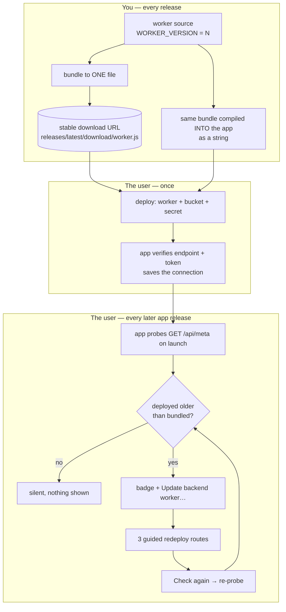
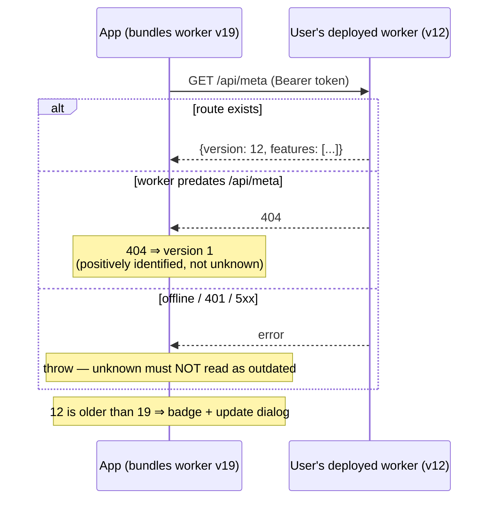
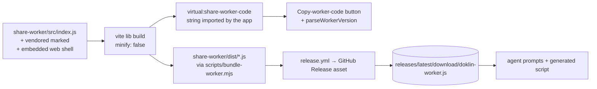

# User-deployed backends — spec & porting guide

How an app can ship a backend it does **not** run: the user deploys one
Cloudflare Worker + R2 bucket on *their own* account in a few minutes, the app
connects to it, and every later app release can push that deployment forward
without you ever holding the user's cloud credentials.

Written from Doklin's actual implementation (the `share-worker/` folder, the
setup/update/teardown dialogs in `src/`, and the bundle step in `release.yml`),
but structured so the *flow* can be lifted into any other app that wants the
same shape. Part 1 is the generic spec, Part 2 is Doklin's concrete wiring,
Part 3 is a copy-paste checklist for a new app.

**Companion docs.** This is about the backend *users* deploy. The app's own
release + self-update story is separate and lives in
[release-pipeline.md](release-pipeline.md) (producer) and
[auto-update.md](auto-update.md) (consumer). The backend's feature set, storage
layout and HTTP contract are in
[../share-worker/README.md](../share-worker/README.md) — this doc deliberately
does not repeat them, because none of them are part of the flow.

---

## Part 1 — The generic spec

### 1. The problem this shape solves

You want a backend feature (publishing, sync, anything with a server side), but
you don't want to run servers for your users: no accounts, no per-user storage
bill, no data custody, no scaling. So the backend ships as **code**, and each
user deploys a private instance on their own free-tier cloud account.

That trade buys a lot and costs exactly one thing: **you can never deploy
anything again.** Every constraint below falls out of that.

| Constraint | Consequence for the design |
| --- | --- |
| The app holds the backend's *data* token, never the user's *cloud account* credentials | An update can only be **guided**, never pushed. Every update path is instructions + verification, not an API call |
| Users span "never opened a terminal" → "lives in one" | You need more than one deploy route, and at least one with **no toolchain at all** |
| Deployments drift: v1 of the worker stays live while the app reaches v19 | The app must *detect* the drift, and old backends must degrade legibly, never crash |
| The user is trusting you with shell access on their machine (agent route) or a paste into their cloud account (dashboard route) | Everything handed over must be readable, minimal-scope, and honest about what it touches |

### 2. The shape of it



Read it as one loop: **the version number is the whole protocol.** Everything
else is delivery.

### 3. The five invariants

Get these right and the flow works; break any one and it silently rots.

#### 3.1 One version number, and the app *parses* it — never mirrors it

The worker source owns a single integer constant. The app does **not** declare
"the latest worker is 19" anywhere; it bundles the worker source at build time
and reads the constant back out of that string with a regex. App and worker
therefore cannot drift apart silently — a worker bump ships to the app in the
same commit, automatically.

```js
// worker source — the only place the number exists
const WORKER_VERSION = 19;
```

```ts
// app — derived, never declared
const BUNDLED_WORKER_VERSION = parseWorkerVersion(workerCode);
```

An unparseable version (0) must **disable** the nag rather than invent one.

#### 3.2 The worker is one file, at a stable URL

Every release publishes the whole backend as a single ready-to-deploy
JavaScript file, attached to the GitHub Release, reachable at a permanent alias:

```
https://github.com/<owner>/<repo>/releases/latest/download/<app>-worker.js
```

That one URL is what makes both "no clone, no build" routes possible. Point at
`latest` deliberately: a newer worker is always compatible with an older app
(see 3.5), so a user who deploys today and updates the app next month is fine.

Bundling matters even in a checkout: if the worker embeds assets (a compiled
frontend, vendored libraries, icons), deploying the raw entry file gives a
worker with stub assets that fails at runtime in a way nothing catches.

The bundle is also where a real ceiling lives — Cloudflare's free plan caps a
worker at **3 MB gzipped**. If your worker embeds a frontend, watch that number
in CI; it is the constraint that decides what can be inlined.

#### 3.3 Three deploy routes, one artifact

The same worker, three ways to get it deployed. Not redundancy — three
different users.

| Route | Who it's for | Needs | The artifact it uses |
| --- | --- | --- | --- |
| **Dashboard paste** | Anyone. No dev tools at all | A browser | The worker code **bundled into the app** — a "Copy worker code" button |
| **AI agent** | Anyone with Claude Code / similar | An agent with shell access | A generated prompt that `curl`s the release URL |
| **Terminal** | Developers | Node + wrangler | The release URL, plus commands (or a generated script) |

The dashboard route is the important one and the easy one to skip. It is the
only route that works for a user with nothing installed, and it is the *fastest*
route for everyone: paste, Deploy, done in about a minute.

Two properties make it safe, and both are worth engineering for:

- **A code-only swap preserves everything else.** Pasting new code over an
  existing worker in the dashboard keeps its bucket binding, its secrets, and
  its custom domain. That is what turns "update the backend" into one paste
  with no re-configuration and no re-keying.
- **The pasted code must be readable.** Don't minify the worker bundle. You are
  asking a user to trust-paste it into their own cloud account; leave it
  legible. (Embedded *assets* can be minified — they're data.)

#### 3.4 The app never holds cloud credentials — so honesty is the interface

The app holds exactly one secret per backend: the bearer token the worker
checks. It cannot list the user's workers, cannot deploy, cannot see the
account. Every route is therefore instructions plus **verification from the
app's own side**:

- Setup ends with the app calling the backend with the endpoint + token and
  refusing to save unless the answer looks right.
- Update ends with **"Check again"** — re-probing `/api/meta` and reporting the
  live version, not trusting a claim that the deploy worked.

The corresponding rule for the update path: **carry no secret**. The token
survives a same-name redeploy untouched, so the update prompt/script contains
nothing sensitive and can be pasted anywhere. Setup's prompt *does* carry the
freshly generated token — say so, loudly, at the copy point.

#### 3.5 The API only grows, and old backends fail legibly

A user's deployment can be arbitrarily old. That is normal, not an error state.

- **New worker + old app** must always work. Never repurpose a field; add.
- **Old worker + new app** must produce a *typed* error the UI can route on, not
  a stack trace. Doklin throws `ShareWorkerOutdatedError` when a feature route
  404s or a new field 400s, and the UI turns it into "redeploy your worker" with
  a button to the update dialog.
- Features that need a floor declare it as a constant next to the call site
  (`const WIPE_MIN_VERSION = 6`), so the UI can disable rather than fail.
- Ship a `features: [...]` array alongside the version in the meta response. The
  integer answers "is this outdated"; the array answers "can it do X" without
  the app having to memorize version history.

**Bump the version even when only embedded assets changed.** If the worker
serves a compiled frontend, a pure frontend fix is invisible to the API but
still needs to reach deployed backends — the version bump *is* the rollout
mechanism. Doklin's v11, v13–v17 and v19 are all shell-only bumps; each one's
comment says so explicitly.

### 4. The version handshake



Three states, and the third is the one people get wrong: **unknown is not
outdated.** A failed probe must leave the connection unjudged, or every user on
a plane gets nagged to redeploy a worker that's perfectly current.

Put `/api/meta` **behind auth**, in the same authenticated block as the rest of
the API. It then doubles as a liveness + credential check, and it can't be used
to fingerprint deployments from outside.

### 5. Update detection and the nag surface

Where the "you're behind" signal shows up matters as much as the detection:

| Surface | Behavior |
| --- | --- |
| Launch probe | One `/api/meta` per configured backend, per connection-set change. Failures swallowed |
| Settings gear | A dot on the icon when any backend is behind — the same dot the app's own self-update uses, so users learn one signal |
| Settings menu | An `Update backend worker…` item, only present when count > 0, pluralized with a count |
| Backends list | Per-connection "outdated" mark, so a user with several knows which |
| Update dialog | Per-backend card: `v12 → v19` and its own **Check again**, which flips to "Updated ✓" instead of vanishing |

That last detail is worth copying: when a recheck succeeds, **keep the card and
change its face**. A row that disappears the moment it succeeds reads as a bug.
Snapshot the outdated list when the dialog opens; don't drive the dialog off
live state.

Nothing about this should block the app. The wording throughout is "everything
keeps working meanwhile" — because it does, and because a modal that implies
breakage over a backend that's merely behind is a lie that costs trust.

### 6. Writing the hand-offs

The instructions **are** the product here. Three rules, learned the hard way,
that apply to the agent prompt and the generated script equally:

**Verify before you mutate.** The endpoint tells you the worker's name only
when it's a `workers.dev` URL (the name is the first hostname label). Behind a
custom domain, the app is *guessing* from a naming convention. So:

- Mark guessed names as guesses, in the UI and in the prompt.
- The agent prompt tells the agent to confirm the name against the account
  first, and to **ask rather than invent** if the check fails.
- The script can't ask, so it **refuses**: it checks each guessed name and skips
  that backend with an explanation of which line to correct, rather than risk
  the mutation.

**Name the specific failure, not "be careful".** The hazard here is asymmetric
and non-obvious: a deploy under a *wrong* name doesn't error — it silently
creates a **second** worker, while the real one keeps serving the old code. And
a deploy under a name that belongs to a *different* backend silently overwrites
it (and, after a `secret put`, re-keys it, cutting that backend off). Both
prompts say exactly this, and the agent prompt includes the cleanup command for
the wrong-name case.

**One value comes back.** Setup's prompt ends by telling the agent to print
exactly `ENDPOINT: <url>` — one line the user copies into a form the app then
verifies. Don't ask a user to transcribe several values out of an agent
transcript.

Two more that follow from the same instinct:

- **Batch by what's actually per-backend.** The worker code is byte-identical
  for every deployment; only the name/bucket/routing differ. So build the
  instructions **once for all outdated backends** and let the per-backend cards
  carry only the version and the recheck. The terminal route leans on this
  hardest: one generated script covering N backends beats N × 5 pasted commands.
- **Write the script to disk, next to the app's own config — not to a temp
  dir.** The user may need to open it and correct a guessed name, and a path
  that survives a reboot is one they can re-run. Write it lazily (only when the
  terminal tab is opened) so the other two routes leave nothing behind, and
  overwrite unconditionally so a stale file from an older app version can't
  deploy the wrong worker version.

### 7. Deployment identity: one stack per domain

If the app supports several backends at once, treat each as a **complete
separate stack** — its own worker, bucket, and token — and derive every name
from the domain so collisions can't happen:

```
notes.example.com → worker "app-share-notes-example-com"
                    bucket "app-pages-notes-example-com"
```

Worker and bucket names are unique per cloud account, and the two ways to get
this wrong both fail *silently*: a duplicate worker name overwrites the other
stack, and two workers pointed at one bucket publish everything on both
domains. Setup asks the agent to pause and confirm when a bucket already
exists, rather than reusing it.

### 8. Owner vs member, and the end of the lifecycle

If the backend can be shared with other people (invited members holding their
own scoped tokens), then **only the owner can redeploy** — nobody else has the
cloud account. Probe the caller's role and show members a "ask whoever runs
`<host>` to update it" note instead of instructions they can't follow. Resolve
that role **lazily**, only for backends already known to be outdated: in the
steady state it costs zero requests.

Two guardrails on that check: an unresolved probe should read as **owner** (an
owner offline for a moment must not lose access to the steps), and members still
get "Check again" so they can see when the owner has done it.

Teardown deserves the same care as setup, in the only order that works:

1. **Erase the data** — the app *can* do this: it holds the token, and object
   stores refuse to delete a non-empty bucket while neither the CLI nor the
   dashboard bulk-deletes objects. So expose an owner-only, batched
   `POST /api/admin/wipe` and drive it from the app.
2. **Remove the worker + bucket** — guided, same three routes as setup.
3. **Disconnect locally** — forget the endpoint + token.

### 9. What the app stores locally

One machine-local file, outside any repo, holding every connection:

```json
{
  "version": 2,
  "connections": [
    { "id": "c-xxxxxxxxxx", "endpoint": "https://notes.example.com", "token": "<hex>" }
  ],
  "defaultId": "c-xxxxxxxxxx"
}
```

Stamp a version from day one — this file grows as the feature does. Parse it by
**shape**, not by trusting the stamp: a missing, malformed or hand-truncated
file should read as "unconfigured", never as an error, and an empty connection
list should delete the file rather than persist a husk. Keep credentials in
exactly this one file, and have every other subsystem (including the native
side) resolve a `connectionId` against it rather than caching its own copy.

---

## Part 2 — Doklin's wiring

### File map

| Concern | File |
| --- | --- |
| Worker source + version constant | [`share-worker/src/index.js`](../share-worker/src/index.js) — `WORKER_VERSION` / `WORKER_FEATURES` (~line 210), `/api/meta` handler (~line 460) |
| Backend contract & self-hosting guide | [`share-worker/README.md`](../share-worker/README.md) |
| One-file bundle (CI + local) | [`scripts/bundle-worker.mjs`](../scripts/bundle-worker.mjs) |
| Same bundle, compiled into the app | [`vite.config.ts`](../vite.config.ts) — the `virtual:share-worker-code` plugin |
| Release asset | [`.github/workflows/release.yml`](../.github/workflows/release.yml) — "Bundle backend worker (release asset)" |
| Version parse + probe + stable URL | [`src/share.ts`](../src/share.ts) — `WORKER_BUNDLE_URL:363`, `parseWorkerVersion:694`, `fetchWorkerVersion:702`, `ShareWorkerOutdatedError:678` |
| Detection, badge, role probe | [`src/App.tsx`](../src/App.tsx) — `BUNDLED_WORKER_VERSION:158`, probe effect ~1061, `outdatedWorkers` ~1087, role probe ~1105 |
| Update dialog (3 routes) | [`src/WorkerUpdate.tsx`](../src/WorkerUpdate.tsx) |
| Setup wizard (3 routes) | [`src/ShareSetup.tsx`](../src/ShareSetup.tsx) |
| Connection hub / join / teardown | [`src/Backends.tsx`](../src/Backends.tsx), [`src/ConnectBackend.tsx`](../src/ConnectBackend.tsx), [`src/BackendTeardown.tsx`](../src/BackendTeardown.tsx) |
| Credentials on disk | `<app_data_dir>/share.json` (v2) — written by `saveConnections` (`src/share.ts:305`), read Rust-side in `src-tauri/src/sync.rs` |

### The build pipeline



The two outputs come from **the same vite lib build** with the same plugin, one
written to disk and one returned as a JS string. That's the mechanism behind
invariant 3.1: the string the app parses its version from is the same bytes the
dashboard route pastes.

### Concrete numbers

- `WORKER_VERSION` is currently **19**; version 1 is inferred from a 404 on
  `/api/meta` (it predates the route).
- The bundle is ~2.6 MB gzipped, against Cloudflare's 3 MB free-plan limit —
  most of it the embedded browser build of the app's editor.
- The stable URL is
  `https://github.com/boat-builder/doklin/releases/latest/download/doklin-worker.js`.
- Feature floors in the app: `WIPE_MIN_VERSION = 6` (`BackendTeardown.tsx:34`);
  `/api/site` and folder shares raise `ShareWorkerOutdatedError` on 404/400.

---

## Part 3 — Porting this to a new app

The flow is app-agnostic. Work through it in this order — each step is testable
before the next one exists.

**1. Worker side**
- [ ] Put the backend in one folder with a single entry file and a
      `wrangler.toml.example` (tracked; the real `wrangler.toml` is gitignored)
- [ ] Add `const WORKER_VERSION = 1;` and a `WORKER_FEATURES` array, with a
      running comment log of what each bump added
- [ ] Add `GET /api/meta` → `{version, features}`, **inside** the authenticated
      block
- [ ] Add an owner-only, batched `POST /api/admin/wipe` (teardown needs it)
- [ ] Write a contract README: routes, storage layout, and a from-scratch
      self-hosting walkthrough

**2. Build & distribution**
- [ ] Port `scripts/bundle-worker.mjs` — one file out, `minify: false`, print
      the size and the parsed version
- [ ] Port the `virtual:*-worker-code` vite plugin so the app compiles the same
      bundle in as a string; declare it in `src/vite-env.d.ts`
- [ ] Add the bundle step to the release workflow and attach the file to the
      release; confirm `releases/latest/download/<name>.js` resolves
- [ ] Define `WORKER_BUNDLE_URL` in one place in the app and use it in every
      generated instruction

**3. Detection**
- [ ] `parseWorkerVersion(code)` — regex the constant out of the bundled string;
      return 0 on failure and treat 0 as "disable the nag"
- [ ] `fetchWorkerVersion(config)` — 404 ⇒ 1, non-ok ⇒ **throw**, ok ⇒ the number
- [ ] Probe each connection on launch; store `Record<connId, version>`; swallow
      failures
- [ ] Derive `outdated = deployed < bundled`; light the settings badge and add
      the menu item only when the count is > 0

**4. Setup wizard** (three tabs, in this priority order)
- [ ] **Browser**: numbered dashboard steps, a "Copy worker code" button, an
      app-generated token shown once, ending in the endpoint + token form
- [ ] **Agent**: one prompt containing the generated token, the naming
      convention, the config file verbatim, the pause points (cloud sign-in,
      object-store enablement, nameservers), a verification step, and a single
      `ENDPOINT: …` line to copy back
- [ ] **Terminal**: the same steps as commands, fetching the release URL
- [ ] All three end at **one verify-and-save**: call the backend, refuse to save
      on a bad answer, with distinct messages for unreachable / 401 / wrong-shape

**5. Update dialog**
- [ ] Same three tabs, built **once for all outdated backends**
- [ ] Browser tab: the copy button + a list of which worker to paste into,
      flagging guessed names
- [ ] Agent tab: a prompt with **no secret**, that verifies names before
      deploying and cleans up a wrong-name deploy
- [ ] Terminal tab: generate one script into the app's data dir, lazily; refuse
      guessed names; expose an `ACCOUNT_ID` knob at the top for multi-account
      logins
- [ ] Per-backend cards with `vX → vY` and their own **Check again** that flips
      to "Updated ✓"

**6. Multi-backend & lifecycle** (only if you support more than one)
- [ ] Derive worker/bucket names from the domain; warn about the two silent
      collisions
- [ ] Probe role; hide instructions from members, keep their recheck
- [ ] Teardown: erase-through-the-app → guided worker/bucket removal →
      disconnect

### Per-app knobs

Everything you must change, in one list: the worker/bucket **naming
convention**, the **binding name** the worker expects (`PAGES`), the **secret
name** (`SHARE_TOKEN`), the **bundle asset filename**, the repo in
`WORKER_BUNDLE_URL`, the `compatibility_date` in every generated
`wrangler.toml`, the **verification request** the setup form makes, and the
local **credentials filename**.

---

## Failure modes worth designing against

| Failure | Why it happens | The design answer |
| --- | --- | --- |
| A second worker appears; the real one still serves old code | Deployed under a name that doesn't exist — this does not error | Verify names first; agent asks, script refuses; both name the hazard |
| A working backend goes dark right after another is set up | Same-name deploy overwrote it, and `secret put` re-keyed it | Domain-derived names; explicit warning in setup for the second backend |
| Every page publishes on two domains | Two workers sharing one bucket | Bucket per stack; prompt pauses when the bucket already exists |
| Users nagged to redeploy a current worker | A failed probe read as "outdated" | Probe failure throws and leaves the version unknown |
| The version badge never clears after a successful redeploy | Dialog driven off live state; the row vanished mid-flow | Snapshot on open; recheck flips the card to "Updated ✓" |
| Comment/edit sessions get a broken shell | Deployed the entry file instead of the bundle, so embedded assets are stubs | Bundle is the only supported artifact; README says so at the deploy step |
| A frontend-only fix never reaches deployed backends | No API change, so no version bump | Bump for shell-only changes too — the version *is* the rollout |
| Setup succeeds but nothing works | Trusted the agent's "done" | Verify from the app before saving; verify again on "Check again" |

---

## Appendix — the agent prompt, generically

Both of Doklin's prompts (setup, update) are the same seven-part skeleton. Fill
it in for a new app and you have a working hand-off:

1. **The goal, in one sentence**, naming the target ("one Worker in front of one
   bucket, serving at `<domain>`") and what must survive untouched.
2. **Fetch the artifact** — one `curl` of the stable URL, with a fallback
   ("if that 404s, clone `<repo>` and use `<folder>/` with `main = …`").
3. **Establish credentials** — `whoami`, and if not logged in, `login` plus
   *"ask me to complete the sign-in in the browser window it opens"*.
4. **Verify identity before mutating** — check the name / bucket against the
   account; where the app guessed, say it guessed and say *"ask me rather than
   substituting a name you invented."*
5. **The config file, verbatim**, with the fill-ins marked — never described in
   prose.
6. **Deploy, with the failure named** — what a wrong outcome looks like
   concretely, and the exact cleanup command for it.
7. **Verify + one line back** — an HTTP check the agent can run itself, then
   *"print exactly this line, filled in"*.

Close every prompt with the negative scope: *"Do not commit `wrangler.toml`
anywhere, and do not create or modify any other resources."* And at the copy
point in the UI, say plainly whether the prompt carries a secret — setup's does,
update's doesn't, and the user deserves to know which one they're pasting.

### Other stacks

Nothing above is Cloudflare-specific except the resource nouns. The flow —
version constant → meta route → bundled-code comparison → three guided routes →
verify-from-the-app — ports unchanged to any deploy target with a CLI and a
dashboard. What you'd rewrite is the generated config file, the CLI invocations
inside the prompts and script, and the name-inference rule that maps an endpoint
back to a deployment identity.
