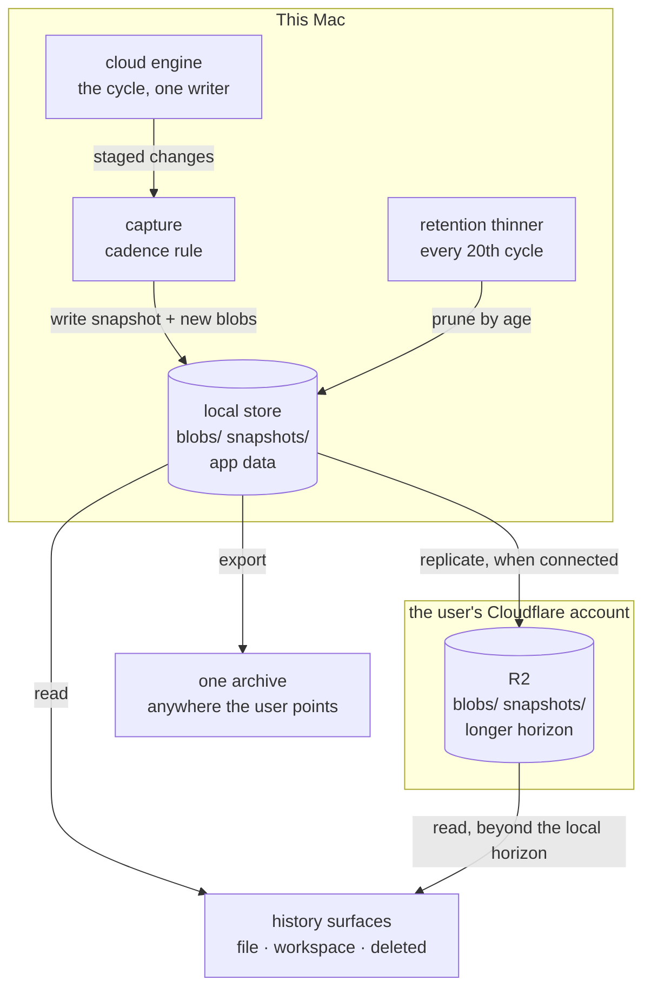

# Versioning — history the user owns

Doklin's promise about a note is that it cannot be lost. Today that promise
rests on ~210 revisions per file, minted per keystroke-pause, kept only for
connected workspaces — which reaches back hours, not weeks, and not at all
before a domain is connected. This document is the design that replaces it:
what exists, what Notion does, the model both point at (keep old manifests;
thin them on a ladder), the stores, the arithmetic, and the decisions behind
each. The sync engine it builds on is [docs/cloud.md](cloud.md).

## 1. The short version

- **A snapshot is a retained past manifest.** The manifest already describes
  the whole workspace at an instant — every path, every content hash. Keeping
  old ones gives per-file history, whole-workspace restore, and deleted-file
  recovery out of one object. Blobs are already immutable and
  content-addressed; the trees are the only thing being thrown away.
- **Capture is time-bounded, not per-change.** At most one snapshot per
  10 minutes of continuous editing, plus one when editing goes quiet for
  2 minutes, so the end state of every session is always a version. An hour
  with no edits has no snapshot.
- **Retention is a ladder, not a count.** Every version for an hour, hourly
  for a day, daily for a month, weekly for a year, monthly forever. A file
  edited daily for two years keeps ~140 versions — *fewer* than today's 210,
  spanning two years instead of an afternoon.
- **Local first.** The store lives in app data, works with no cloud, no
  account and no domain. When a workspace is connected the engine replicates
  the same structure into R2 with its own longer horizon.
- **Append-only.** Nothing in the write path ever deletes a snapshot or a
  blob. Only the retention thinner does, and only on age — never because a
  file was deleted. That is what makes history survive the sync replicating
  a mistake.
- **One mechanism, not two.** Version history, deleted-file recovery and
  backup are the same bytes under different retention. The only separate
  thing is a one-button export, for the day the user's Cloudflare account
  goes away.

---

## 2. What exists today

| | Value | Where |
| --- | --- | --- |
| Revisions inline in the manifest | 10 | `engine.rs:55` (`MANIFEST_HIST_MAX`) |
| Revisions in the deep archive | 200 | `engine.rs:57`, `cloud-worker/src/layout.ts:55` |
| **Reachable per file** | **~210** | |
| A revision is minted | every cycle whose bytes changed | `engine.rs:906–930` |
| Cycle settles | 1.5 s after an edit-bus touch, 5 s after a watcher event | [cloud.md](cloud.md) §6.4 |
| Blob lifetime past that | deleted when unreferenced and >24 h old, every 20th cycle | `engine.rs:82,85,1252` |
| Archive caps | 200 entries, 256 KB | `engine.rs:57`, `layout.ts:55,56` |
| Manifest caps | 4 MB, 5000 files | `layout.ts:49,50` |
| Tombstone TTL | 30 days | `engine.rs:75` |
| Scope | one file, cloud-connected only | `Sidebar.tsx:857` |

**The depth is a count, not a duration.** Autosave debounces 600 ms and the
cycle settles 1.5 s after the last touch, so a revision is minted roughly
every two seconds of paused typing. At one revision per ten seconds of active
writing, 210 revisions is about 35 minutes; at a generous one per minute, 3.5
hours. Then `gc_blobs` deletes the blob and the content is gone for good. The
reach is shortest on exactly the documents edited most.

Four consequences, each a gap this design closes:

1. **No cloud, no history.** `Sidebar.tsx:857` gates *Version history…* on a
   `cloud` status being present, and `cloud_history` is an engine command —
   engines exist only for connected workspaces. Since connecting needs a
   Cloudflare account, a domain and an agent-run `wrangler deploy`, every
   workspace has zero versioning on day one. Drafts have none ever.
2. **Deleted files are unreachable.** `gc_blobs` returns early when the fid
   is absent from `manifest.files` (`engine.rs:1257`), so a deleted file's
   blobs and `history/<fid>.json` survive in R2 indefinitely — but
   `file_id_at` (`engine.rs:1276`) resolves paths only against live files, so
   nothing in the UI can find them. The bytes are there with no way back;
   recovery depends on the macOS Trash.
3. **No workspace scope.** History is strictly per-file. *Undo the reorganise
   I did on Tuesday* and *what did this folder hold last month* have no
   answer, because no object describes a past workspace.
4. **Inline history is paid for on the hot path.** Ten hist entries (~75 B
   each) on top of a ~150 B file entry is ~900 B per file. Against
   `MAX_MANIFEST_BYTES` that is ~4,600 files versus the `MAX_MANIFEST_FILES`
   cap of 5000 — the two nearly collide. And the whole manifest is re-PUT on
   every changed cycle, so that history is re-uploaded on every pause, for
   every file, forever.

There is one more hazard worth naming: because capture is per-cycle, an
external tool that rewrites a file in a loop burns all 210 revisions in a few
minutes and permanently destroys that file's history. Nothing bounds it.

---

## 3. Prior art: Notion

Notion is the closest thing to a reference implementation for "notes people
trust", so it is worth being precise about what it actually does. Its own
help pages are unreachable from this environment; the cadence below comes
from consistent third-party documentation rather than Notion's own words, so
treat the two-minute and ten-minute figures as well-attested but not
first-party.

**Capture — time and session, not per-change.** A new version is recorded
roughly every 10 minutes while a page is being actively edited, plus one
about 2 minutes after the last edit. Many edits inside a capture window
collapse into a single version; Notion's engineering writing describes
snapshots as scheduled in the background according to the kind of change in a
transaction. There is no manual "save a version".

**Retention — a flat window, priced by tier.** 7 days on Free, 30 on Plus, 90
on Business, unlimited (and configurable) on Enterprise. Granularity does not
coarsen as versions age; a version simply expires when it falls out of the
window. On Free, an eight-day-old version is gone regardless of how
significant it was.

**Scope — one page.** There is no workspace-level restore. Restoring a
database restores its pages and their properties but *not* the body content
of those pages — each page must be restored individually. Read-only
properties (rollup, formula, button, unique id, created/last-edited by/time,
status) cannot be restored at all.

**Deletion — a separate system on its own clock.** Version history does not
cover a deleted page; Trash does, for 30 days on all plans, followed by a
further roughly 30-day window in which only Notion support can recover.
Enterprise can extend both to as much as 10 years.

**Backup — manual, separate, lossy.** The sanctioned route is *Export all
workspace content* to HTML/Markdown/CSV. Download links expire after 7 days,
large workspaces take hours, and the export drops relations (flattened to
title text), formula and rollup logic (frozen to computed values), views,
filters, comments, edit history and permissions. Notion's own guidance is
that version history is not a backup — and a small industry of third-party
Notion backup vendors exists precisely because of the gaps above.

### 3.1 What to take, and what we do better

| | Notion | This design |
| --- | --- | --- |
| Capture | ~10 min while active + one ~2 min after the last edit | **the same rule** |
| Retention shape | flat window, expires by age | thinning ladder: hour → day → month → year → forever |
| Reach | 7 / 30 / 90 days by plan | months to years, user-configured, at a lower entry count |
| Scope | one page; no workspace restore | file *and* whole workspace, from the same object |
| Deleted items | separate Trash, separate clock, history doesn't cover it | a fid absent from the newest snapshot — same mechanism |
| Backup | manual, lossy export | the files are already plain markdown on disk; export is a copy |
| Ownership | dies with the account | the user's disk and the user's own bucket |
| Retention limits set by | the price tier | the user's disk and bucket |

**Take the capture rule.** It is the strongest borrow, and it validates the
bucketing instinct that prompted this document. Doklin currently mints a
revision every ~2 seconds of paused typing — some 300× denser than Notion at
a similar retained count, which is the whole reason its reach is measured in
hours. Adopting session coalescing alone multiplies the reach by that factor
at zero storage cost.

**Take the session-closing snapshot in particular.** A pure hourly bucket has
a flaw that Notion's rule does not: if the bucket boundary falls mid-session,
the version kept for 20:00–21:00 might be the state at 20:05 while the
writer actually stopped at 20:58. Notion's "one snapshot after you stop"
guarantees the end state of every editing session is a version. That is the
detail to steal.

**Do not take the retention shape.** A flat window cannot answer "a few weeks
or a few months, maybe all the way back" without keeping everything at full
granularity — which is why Notion sells the window by tier. It is a pricing
lever, not an engineering optimum. Thinning reaches years at a *lower* count
than Notion's 30-day window needs, and since the user pays for their own R2,
retention here should be a setting bounded by their disk and bucket, never a
product tier.

**Press the scope advantage.** No workspace restore is Notion's most-felt
gap. Doklin gets it nearly free, because the manifest already is a
description of the workspace. Same for deletion: one mechanism instead of a
bolted-on Trash with its own clock.

**And be honest about the floor.** Notion's worst tier — 7 days, free —
comfortably beats what Doklin ships today, which is a few hours when
connected and nothing at all when not. Two further things Notion has that
Doklin should copy: a diff between versions (the panel currently lists
revisions with no indication of what changed), and clear per-edit
attribution, which `by` already carries.

---

## 4. Vocabulary

- **Snapshot** — a retained past manifest: every file's path, hash and size at
  one instant, plus when it was taken and by which device. Independently
  readable; not a delta.
- **Capture** — writing a snapshot. Governed by the cadence rule (§6.1).
- **Retention** — deciding which snapshots survive. The thinner (§6.2).
- **Version** (of a file) — a distinct content hash for one fid across the
  retained snapshots. Derived, never stored as its own record.
- **Version store** — `blobs/` + `snapshots/`, in app data locally and in R2
  when connected. The same shape in both places.
- **Horizon** — how far back a store keeps snapshots. Local and cloud each
  have their own; both are user-configurable.
- **Export** — a single archive of the current tree plus the version store,
  written wherever the user points it. The only thing outside the store.

---

## 5. The rules

These are the invariants. If a change breaks one, the change is wrong.

1. **Snapshots and blobs are append-only.** No write path deletes either.
   Only the retention thinner removes anything, and only on age — never
   because a file was deleted, moved, or trashed, and never because a
   remote manifest said so. This is the invariant that makes history survive
   the sync faithfully replicating a mistake.
2. **A snapshot is independently readable.** Any single snapshot is a
   complete workspace description. No snapshot depends on another, so
   corruption is bounded to what that one snapshot covered.
3. **Restore is a write, never a rewrite.** Restoring an old version makes
   it the file's new current content and pushes it as a new revision.
   History is never edited, reordered or truncated by a restore — and a
   snapshot is captured immediately *before* any restore, so the restore
   itself is undoable.
   *As planned* ([versioning-plan.md](versioning-plan.md) §12.3, item 8): a
   second snapshot is captured after the write, naming its source
   (`restoredFrom`), so the timeline reads "restored from 1 Sep"; the
   toast's *Undo* is itself a restore; the timeline is a sequence of states,
   never a graph — the only fork is *Make a copy*, a second file.
4. **History does not require the cloud.** The local store is the primary;
   the cloud store is replication with a longer horizon. Every history
   surface works with no domain connected.
5. **The version store is never inside the workspace.** It lives in app
   data, so `scan_local`, the sidebar, search and the sync never see it —
   and so nothing in it can be synced as ordinary files.
6. **Disk stays the source of truth for current content.** The version
   store is derived from what the engine already staged; it never becomes a
   second writer to the workspace except through an explicit restore.
7. **Capture is bounded by wall-clock, not by change count.** No sequence of
   external writes, however fast, can mint more than one snapshot per
   capture interval.

---

## 6. The design

The pieces already in place: blobs are immutable, content-addressed and
deduplicated (`blobs/<fid>/<hash>`); the manifest is a complete description
of the workspace at an instant; the engine is the single writer and already
computes exactly which files changed each cycle. In git's terms Doklin has
the object store and builds a tree on every commit — and then keeps only the
latest tree. Keeping old trees is the whole feature.



### 6.1 Capture — the cadence rule

A snapshot is written at the end of a cycle that staged any change, subject
to two bounds:

```
CAPTURE_MIN_INTERVAL = 10 min   at most one snapshot per interval of continuous activity
SESSION_IDLE         =  2 min   a closing snapshot once edits go quiet
```

So an hour of steady writing yields about six snapshots plus a closing one;
an hour with no edits yields none. That is the "only if there were changes in
that unit" behaviour, and it needs no scheduler — capture is driven by the
cycle that already runs, and the idle timer is one `tokio` sleep next to the
existing settle.

Two properties worth having explicitly:

- **The end of every session is always a version.** The closing snapshot
  guarantees it regardless of where interval boundaries fell.
- **Runaway writes cannot destroy history.** `CAPTURE_MIN_INTERVAL` bounds
  capture by wall-clock, so an external tool rewriting a file in a loop
  produces one snapshot per ten minutes, not thousands. The current design
  has no such bound.

A snapshot costs one small object plus the blobs for content that changed —
and those blobs are already being uploaded by the cycle. Capture adds no
blob writes at all; it adds one object.

### 6.2 Retention — the ladder

The thinner keeps, per store:

| Age of the snapshot | Keep |
| --- | --- |
| under 1 hour | every one |
| 1–24 hours | the last in each hour |
| 1–30 days | the last in each day |
| 30 days – 12 months | the last in each week |
| over 12 months | the last in each month |

Everything else is dropped, and then blobs no longer referenced by any
retained snapshot are dropped with it. For a file edited every day for two
years that is roughly 24 hourly + 30 daily + 52 weekly + 24 monthly ≈ 130
entries, plus the sub-hour ones — call it 140. **Fewer than the 210 kept
today, spanning two years instead of an afternoon.** The same budget, spent
on reach instead of density.

The horizons are the two user-facing settings: a local one (default 90 days,
bounded by disk) and a cloud one (default forever, bounded by the bucket).
Past its horizon a store drops the rest of the ladder. Nothing else about
retention is configurable — the ladder's shape is a design decision, not a
preference.

The thinner is one pure function — *which snapshots survive at this
instant* — followed by a sweep that deletes the dropped snapshot files and
then every blob no retained snapshot references (with an hour's grace, so a
capture in flight is never collected). It runs against the local store on
its own clock and against the cloud store through the engine (§6.3). The
sync's own blob store and its `gc_blobs` are not touched: the version store
is a separate thing with a separate reachability rule, which is what keeps
a device on an older build from ever deleting a blob a snapshot needs.

*As planned* ([versioning-plan.md](versioning-plan.md) §2, decisions 3–4):
the sync GC keeps its predicate; the version store has its own.

### 6.3 The stores

Local, per workspace, outside the folder:

```
<app_data>/versions/<key>/
  blobs/<hh>/<hash>.gz      gzip of the content, keyed by its full sha256 (global dedupe)
  snapshots/<ts>.json.gz    a retained snapshot: path → {hash, size, mtime}
  index.json                the retained set, the horizon, sweep bookkeeping
```

`key` is derived from the folder's path (a prefix of the sha256 of its
canonical path), so no marker is written into a folder that is not
connected; the drafts directory is a root of its own under the key
`drafts`. A snapshot is keyed by *path*, not by the sync's file ids — it is
produced by scanning the disk, which is what lets it exist for a folder no
engine has ever seen. Renames are followed by content: a path that vanished
and a path that appeared with the same hash between two snapshots is one
file, the rule the engine's own scan already uses.

Cloud, in the existing bucket, under a prefix of its own:

```
versions/index.json                          the retained set and the cloud horizon — CAS by etag
versions/snapshots/<ts>-<deviceId>.json.gz   a snapshot, bytes as the device wrote it
versions/blobs/<hash>                        gzip of the content, keyed by its full sha256
```

The cloud store is a mirror of the local one, byte for byte, written by the
engine (the only code that holds a token) after each cycle and hourly. It
does **not** point at the sync's `blobs/<fileId>/<hash>`: that would let a
device still running an older build — whose `gc_blobs` knows nothing about
snapshots — delete a blob a snapshot references. The second copy of the
current content costs a few megabytes (§7) and buys freedom from every
mixed-version hazard. Several devices mirror into the same prefix; the
index is CAS'd like the manifest, snapshot ids carry the device, and a
snapshot whose content another device already captured is skipped by
digest.

The routes are `GET/PUT /api/versions/index`, `GET/PUT/DELETE
/api/versions/snapshots/<id>`, `GET/PUT/DELETE /api/versions/blobs/<hash>`
and a paged blob listing, owner and member, with the same caps and
validation discipline as the manifest route. All additions, so
`WORKER_VERSION` goes to 3 and `versions` joins `WORKER_FEATURES` once the
behaviour exists — an old worker keeps syncing and simply has no cloud
history, which the app reports (the existing update badge) rather than
treating as an error.

*As planned* ([versioning-plan.md](versioning-plan.md) §2, decisions 1, 2,
4, 5, 7): the store key is the path, not a `wsId`; snapshots carry no fids;
the cloud prefix is independent; gzip rather than zstd, because `flate2` is
already in the build and zstd is not; a moved folder starts a fresh store
and the old one is listed as orphaned in Settings. Adopting a connected
folder's marker `wsId` as the key is a later refinement.

### 6.4 What history is, once snapshots exist

Every surface is a read over the retained snapshots — no new records, no
second index to keep agreeing with the first.

- **A file's versions** — walk snapshots newest-first, emit an entry each
  time the path's hash differs from the next-older one, following a rename
  backwards where a vanished path and an appeared path share a hash.
- **A diff between two versions** — two blobs and `diffy`, which the engine
  already depends on for the three-way merge.
- **The workspace as it was** — one snapshot, diffed against the current
  scan: which files differ, which are missing, which are new since. Restore
  writes the differing blobs and trashes the ones the snapshot did not have,
  through the ordinary write commands so the edit bus and the sync see it as
  a normal change.
- **Deleted files** — fids present in some retained snapshot and absent from
  the newest. Closing gap 2 needs no new storage at all; the blobs are
  already surviving in R2 today, just unreachable.
- **Drafts** — capture them into the same store under a reserved id, so the
  one thing with no versioning today gets it for free.

### 6.5 What this removes

- `hist` leaves the manifest, and `history/<fid>.json` and its archive
  rollover (`roll_archives`, `engine.rs:1233`) go with it. The snapshot chain
  is the archive.
- The manifest drops from ~900 B to ~150 B per file — about six times
  smaller. The 4 MB / 5000-file collision goes away, and every changed cycle
  re-uploads six times less. **The feature that buys years of history also
  makes the hot path cheaper**, which is the strongest argument for doing it
  this way.
- `MANIFEST_HIST_MAX`, `ARCHIVE_HIST_MAX`, `MAX_HISTORY_ENTRIES` and
  `MAX_HISTORY_BYTES` all retire.

`MANIFEST_VERSION` does not move: an empty `hist` is a valid v2 manifest
to every worker and app that exists, so the change is invisible on the
wire and forces no worker update. Nothing is seeded from the old `hist`
either — it is retired last ([versioning-plan.md](versioning-plan.md)
phase 6), by which time the snapshots reach far past the hours it ever
held; until then the History panel keeps reading it beside the store.

*As planned* (plan §2, decision 8).

---

## 7. The arithmetic

A 500-note workspace, notes averaging 4 KB — about 2 MB of current content.

| | Raw | Compressed |
| --- | --- | --- |
| One snapshot (500 files, no `hist`) | ~65 KB | ~15 KB |
| Daily snapshots, 2 years | ~47 MB | **~11 MB** |
| New content, 50 notes/day changed | 200 KB/day | ~55 KB/day |
| That content, 2 years | ~146 MB | **~40 MB** |
| **Total, two years of daily history** | | **~50 MB** |

R2's free tier is 10 GB, so two years of history for such a workspace uses
about half a percent of it. Operations matter more than bytes on Cloudflare's
pricing, and capture adds roughly one Class A write per snapshot — a handful
a day against a 1M/month allowance, orders of magnitude below the per-cycle
manifest PUT that already dominates.

The honest conclusion: **thinning is about local disk politeness and keeping
the manifest small, not about affordability.** Even keeping every snapshot
forever would be affordable for a workspace of this size. The ladder exists
so a 5000-file workspace on a small SSD stays polite, and so listing a
file's versions stays a short read.

---

## 8. The surfaces

- **Version history** (a file) — the existing `HistoryPanel.tsx`, fed from
  the local store instead of `cloud_history`, ungated on the cloud
  (`Sidebar.tsx:857` drops its `cloud &&`). Gains a diff against the current
  content, and keeps both existing exits: *Restore* and *Save as new doc*.
- **Workspace history** — a date picker over retained snapshots, showing what
  differs from disk, with *Restore all* and per-file restore. Reached from
  the Cloud panel and from the workspace's context menu.
- **Recently deleted** — deleted fids with their last content, restorable to
  their old path. This is the surface for the case the macOS Trash misses:
  a file deleted on another Mac, or a mass-delete confirmed at the
  `pending-deletes` prompt.
- **Settings** — the two horizons, the space each store is using, and
  *Export…*.
- **Export** — one archive of the current tree plus the version store,
  written wherever the user points it. No schedule, no daemon. This is the
  answer to *what if my Cloudflare account goes away*, which the sync
  genuinely does not answer.

The status event gains what the surfaces need — the local and cloud horizons,
the retained snapshot count, the bytes each store holds — and stays, as
today, the frontend's entire model.

*As planned* ([versioning-plan.md](versioning-plan.md) §12): a document's
history is a right rail with the version shown **in place**, read-only, in
the editor itself (Google Docs' model, not a modal); *Show changes* is a
toggle; versions can be named and are then never thinned; *Recently
deleted* is a row at the foot of the sidebar (Apple Notes' model); the
workspace timeline is a modal that states what a restore will do
(Dropbox Rewind's model). `HistoryPanel.tsx` is replaced, not fed.

---

## 9. Build order

Six phases, each releasable on its own, specified for hand-over in
[versioning-plan.md](versioning-plan.md): the local store, capture and the
thinner (history starts accruing, no UI); file history ungated; the cloud
mirror; workspace history and deleted files; settings and export; and,
last, retiring the manifest's `hist`. Phase 1 alone takes the reach from
"an afternoon, if connected" to "90 days, always"; the cloud mirror extends
it past what a laptop should hold; the surfaces are where the promise
becomes visible.

---

## 10. Decisions, and what was rejected

1. **Snapshots are kept manifests.** The manifest is already a complete,
   content-addressed workspace description, so history costs one retained
   object per capture. Rejected: a per-file revision log (what exists today —
   it cannot answer a workspace question, and it duplicates in every file
   what one manifest says once); a separate revisions table (a second index
   that must agree with the manifest).
2. **Full snapshots, not deltas.** Deltas would save perhaps 10× on an
   already-tiny object and would make every snapshot depend on its
   predecessors, so one lost object breaks the chain behind it. Independently
   readable snapshots bound corruption to one capture — the right trade for a
   data-safety feature.
3. **Retention thins; it does not expire.** A flat window (Notion's shape)
   cannot reach months without keeping everything at full density. The ladder
   reaches years at a lower count. Rejected: a count cap (today's design —
   its reach depends on how hard the user works, which is exactly backwards);
   a flat window per tier (Doklin has no tiers, and the user pays for their
   own storage).
4. **Notion's capture rule, unchanged.** ~10 minutes while active plus a
   closing snapshot ~2 minutes after the last edit. It is well proven, it
   coalesces a session into one legible version, and the closing snapshot
   fixes the one real flaw in pure time-bucketing. Rejected: a snapshot per
   cycle (today — 300× denser than Notion for no benefit, and unbounded
   under external writes); bucket boundaries alone (can miss where a session
   actually ended); an explicit "save a version" button as the *only* route
   (people forget; it can come later as an addition, with a label).
5. **Local first, cloud as replication.** History is the data-safety promise
   and cannot be gated on a Cloudflare account, a domain and a `wrangler`
   deploy. Rejected: cloud-only (today's design, which leaves every new
   workspace with nothing).
6. **The store lives in app data, never in the workspace.** Keeps it out of
   `scan_local`, the sidebar and search; makes it impossible to sync as
   ordinary files. This is the same reasoning that ruled out syncing a `.git`
   directory: a version store inside the synced tree is a directory of small
   mutable files being replicated by a system with no transactions.
   Rejected: `<root>/.doklin/versions/` (hidden, but one ignore-rule slip
   from being synced, and it makes a workspace folder heavy to copy).
7. **Append-only, thinned only by age.** A deletion — a file, a folder, or a
   confirmed mass-delete — never removes history. Continuous sync replicates
   mistakes faithfully and within seconds, so the store must be something the
   live system cannot damage. Rejected: a separate scheduled backup job (a
   second mechanism, a second failure mode, and its own "did it run?"
   question, over the same bytes the sync already holds); GC keyed to live
   files (today's behaviour, and the reason deleted history is unreachable).
8. **One mechanism for history, deletion and backup.** They are the same
   bytes under different retention. Rejected: a Trash with its own clock
   beside history (Notion's shape, and the source of its sharpest gap —
   history that cannot recover a deleted page).
9. **Restore is a forward write, and is itself snapshotted first.** Keeps
   [cloud.md](cloud.md) §3's "disk is the source of truth" and rule 5 intact,
   and makes an unwanted restore recoverable by the same machinery.
   Rejected: rewriting history on restore; restoring behind the engine's back.
10. **Retention horizons are user settings, not tiers.** The user pays for
    their own disk and their own bucket, so the limit should be theirs. The
    ladder's *shape* stays a design decision — it is not a preference, and
    exposing it would be a support burden with no upside.
11. **Export is a single archive, on demand.** Rejected: a scheduled export
    (a daemon, a "where did it go" problem, and a stale copy that looks
    current); a second cloud target (another vendor dependency, which is the
    thing this whole design exists to avoid).
12. **`WORKER_VERSION` 3 with a `versions` feature name, additive routes.**
    An old worker keeps syncing and simply has no cloud history — reported,
    not an error, per [cloud.md](cloud.md) §3's rule 6.

---

## 11. Verifying it

The engine's existing in-memory worker (`src-tauri/src/cloud/tests.rs`) and
tokio's paused clock are what this needs; the cadence rule and the ladder are
both pure functions of time and are the two things most worth pinning.

```sh
cd src-tauri && cargo test --lib versions   # capture cadence, the ladder, dedupe, restore
cd src-tauri && cargo test --lib cloud      # the existing matrix, with hist gone from the manifest
pnpm test:worker                            # the snapshot routes beside the manifest route
```

What each suite must cover:

- **Cadence** — a burst of edits inside one interval yields one snapshot; a
  quiet hour yields none; a session's last state is always captured; a write
  loop yields one snapshot per interval and no more.
- **The ladder** — a synthetic two-year edit history thins to the expected
  count per band; a thinned run is idempotent; blobs go exactly when their
  last referencing snapshot does, and never while one remains.
- **Append-only** — deleting a file, trashing a folder and confirming a
  mass-delete each leave every snapshot and blob intact.
- **Restore** — a file restore pushes a new revision and leaves history
  whole; a workspace restore is snapshotted first and is itself undoable.
- **Migration** — a v2 manifest's `hist` seeds snapshots once, and a v2
  worker degrades to "no cloud history" rather than an error.
- **Local-only** — every surface works for a workspace that has never been
  connected.

The one thing a Linux runner cannot do is the real thing: months of real
editing on a real Mac, and a second Mac reading history the first one wrote.
That is a manual pass, and the local store's small size makes a synthetic
two-year store cheap to generate for it.
