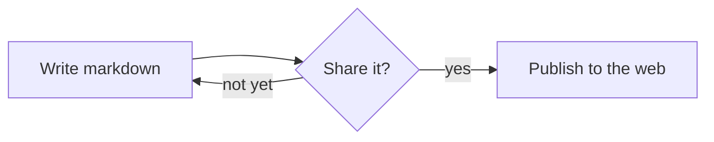

# Welcome to Doklin

A minimalist markdown editor.

## Features

- **Notion-style** WYSIWYG editing
- Round-trip safe markdown — what you save is what you wrote
- Open via Finder or `doklin sample.md` from the terminal

## Try the slash menu

Press `/` on a new line to insert headings, lists, code blocks, tables, etc.

```js
function hello(name) {
  return `hi, ${name}`;
}
```

## Diagrams

A ```` ```mermaid ```` code block (or `/diagram`) renders live as you type:



> Quote a thought, edit it inline, save with ⌘S.

- [ ] Try a checkbox
- [x] Toggle it off
